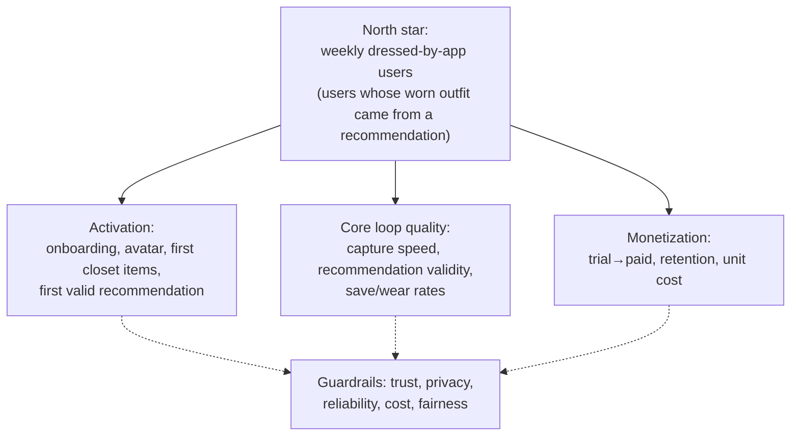

# 00 — Product Vision and Scope

**Status:** Ratified for planning · **Date:** 2026-08-24
**Amended:** 2026-09-13 ([r7](research/r7-third-party-services-and-self-hosting-audit-2026-09-13.md), ADR-0003 — pg-boss metrics, try-on eval arm).
**Conforms to:** [SPINE.md](SPINE.md) (canonical decisions). Requirement IDs live in [01-requirements-and-traceability.md](01-requirements-and-traceability.md). Risks, assumptions, and open questions referenced here are tracked in [16-risks-open-questions-and-decision-log.md](16-risks-open-questions-and-decision-log.md).

---

## 1. Product summary

**Working name:** "AI Stylist" (final brand name TBD — [OQ-01](16-risks-open-questions-and-decision-log.md#open-questions)).

A premium, personalized AI stylist for iOS and Android. Users create a parametric 3D avatar adjusted from their real measurements (capability **A1**), digitize their actual wardrobe — clothing, shoes, and accessories — and receive **explainable outfit recommendations built only from items they own**, driven by weather, forecast, holidays, occasion, and learned preferences. Premium tiers add generative photo try-on (**G2**) and personalized fashion intelligence.

This is not a random outfit generator. Every suggestion is grounded in known user data, actual closet inventory, explicit context, and versioned recommendation rules; when data is missing, the system exposes the uncertainty rather than inventing it.

## 2. Target users

| Segment | Who | Primary need |
|---|---|---|
| **Wardrobe organizers** | People with substantial closets who lose track of what they own | Digitized, searchable, always-organized closet; wear history; "stop rebuying duplicates" |
| **Decision-fatigued daily dressers** | Professionals who dress for weather + dress codes daily | Fast, trustworthy "what do I wear today/tomorrow" with reasons |
| **Style developers** | Users actively building a style identity, following trends | Personalized inspiration tied to what they actually own; try-before-buy visualization |
| **Fit-sensitive shoppers** | Users whose bodies are underserved by standard sizing imagery | Avatar that reflects *their* measurements; honest fit context, no idealized mannequin |

Global, English-first at launch; USD pricing modeled with store regional tiers ([SPINE §1](SPINE.md)). Age policy (minors) is an open compliance question — [OQ-03](16-risks-open-questions-and-decision-log.md#open-questions).

## 3. Value proposition

1. **Recommendations from your real closet, never a catalog dump.** Hard constraints (weather safety, availability, hard exclusions) are enforced before any preference or trend ranking; every recommendation carries reason codes, confidence, and alternatives.
2. **An avatar that is honestly yours.** A1 parametric avatar adjusted from validated measurements, with an optional consented stylized face (A2). We never claim an "exact digital twin" ([SPINE §10.5](SPINE.md)).
3. **A closet that organizes itself and stays organized.** Automatic classification with user confirmation, extensible taxonomy, availability/laundry state, wear history, dedup.
4. **Premium visualization without research-project risk.** G0 collage always works; G2 generative photo try-on is entitlement-gated, provenance-marked, and cost-metered. Advanced 3D garment reconstruction is a gated research bet, not a launch dependency.
5. **Privacy as a feature.** On-device processing where practical, explicit consent per sensitive capability, export/deletion always available, no provider training on customer data by default.

## 4. Goals

| # | Goal | Measured by (see §8) |
|---|---|---|
| G-1 | A user reaches first value (first valid recommendation from their own items) in a single onboarding session | Time-to-first-value; onboarding completion |
| G-2 | Recommendations are practically valid and trusted | Practical-validity rate; hard-constraint violation rate = 0; save/wear rates |
| G-3 | Closet capture is fast and accurate enough to digitize a real wardrobe | Time per item; processing success; correction rate |
| G-4 | The avatar is recognized by its owner as "shaped like me" | Avatar satisfaction/correction metrics |
| G-5 | The product sustains itself: trial → paid conversion covers variable cost with margin | Conversion, retention, cost per active/paid user |
| G-6 | AI spend stays bounded and measured | AI cost per user/month vs anchors in [12-pricing-entitlements-and-unit-economics.md](12-pricing-entitlements-and-unit-economics.md) |
| G-7 | The codebase stays maintainable by 2–3 devs + AI agents across many sessions | Module-boundary CI checks green; phase DoD discipline in [PROGRESS.md](PROGRESS.md) |

## 5. Non-goals (explicit)

- **A3 scan-grade digital twin** — explicit non-goal per [SPINE §4](SPINE.md); "exact digital twin" claims are forbidden.
- **G4 reconstructed 3D garments + cloth simulation in v1** — research bet only (§9, RB-2/RB-3); never a launch dependency.
- **Body shaming, attractiveness scoring, health diagnosis, or inference of protected traits from appearance** — prohibited product-wide (brief §3.6).
- **Commerce/shopping integration in v1** — budget/shopping preference fields are deferred until a commerce feature exists.
- **Calendar access in v1** — the context-provider seam ships (P08); the calendar provider itself is P15+.
- **AI stylist chat in v1** — architectural seams only ([SPINE §3](SPINE.md) `assistant` module); implementation gated on post-launch metrics (P15).
- **Social network / sharing feed** — not planned; single-user product at launch.
- **Localization at launch** — English-first; localization deferred post-launch ([SPINE §1](SPINE.md)).
- **Unauthorized scraping as a content source** — fashion intelligence uses licensed/authorized sources only (P12).
- **Microservices, dedicated vector DB, Kubernetes, event-streaming platforms** — modular monolith + workers until measured need ([SPINE §2](SPINE.md)).

## 6. Assumptions and constraints

Full assumptions register with validation plan: [16 §Assumptions](16-risks-open-questions-and-decision-log.md#assumptions-register). Key ones:

**Constraints (fixed):**
- Team of 2–3 developers on Linux plus one Mac for iOS (since 2026-09-22, DEC-51), heavy Claude Code usage; native Swift/SwiftUI and Kotlin/Compose clients (DEC-49); GitHub Actions macOS for iOS CI ([SPINE §1](SPINE.md)). *(Originally: no Mac owned, hosted macOS CI only — research/r1.)*
- Store compliance: Apple App Store + Google Play billing rules bound the trial/paywall design (P13).
- Budget reality: infra ≈ $25–45/mo at launch (owned server ~$10–25/mo per OQ-14, R2/PostHog/Grafana free tiers — [r7](research/r7-third-party-services-and-self-hosting-audit-2026-09-13.md), ADR-0003), ≈ $370–450/mo at 5k MAU as the upper-bound hypothesis until re-baselined at P02 ([r6](research/r6-pricing-verification-2026-09-09.md), verified 2026-09-09); AI cost anchors per [SPINE §6](SPINE.md); all pricing figures are hypotheses.

**Load-bearing assumptions (labeled, tracked as ASM-NN in doc 16):**
- ~~`react-native-filament` is production-viable for our avatar workload (ASM-01)~~ — **retired 2026-09-22** (DEC-50). The 3D path is Filament's C++ engine used directly on both platforms, validated by the re-scoped P01 native spike when 3D resumes.
- Anny (Apache 2.0) base meshes + morphs are production-quality after our own asset pipeline pass (ASM-02).
- G2 generative try-on quality at $0.075/image (FASHN/Kling on fal.ai; $0.021/MP FLUX 2 LoRA if it passes eval; self-hosted FASHN VTON v1.5 is a further P11 gate arm — DEC-47) clears user-satisfaction and unit-cost gates under weighted credits (ASM-03, DEC-34, gated P11).
- Fashion content can be licensed at viable cost (ASM-04, validated by P12 and OQ-05).
- The 3-day server-granted trial model passes App Store / Play review (ASM-05, validated P13).

## 7. MVP definition

Per [SPINE §4](SPINE.md): **MVP = A1 + G0 + G2** (G2 entitlement-gated).

The production MVP is the vertical slice completed through **P14** (see [SPINE §5](SPINE.md) phases):

| Capability | Level in MVP | Notes |
|---|---|---|
| Avatar | **A1** parametric, adjusted from measurements; 3–4 poses, rotate/zoom; A0 generic fallback; accessibility alternative (non-3D view) | A2 selfie face ships as beta (§9) |
| Closet | Full capture (clothing, shoes, accessories), front-photo minimum, classification + manual correction, taxonomy, availability/laundry, search/filter, offline sync | P06–P07 |
| Recommendations | Deterministic engine v1: weather/forecast/holiday/occasion context, hard-before-soft constraints, reason codes, alternatives, feedback | P08–P09 |
| Outfit visualization | **G0** collage always; outfit-on-avatar presentation with graceful fallback | P10 |
| Try-on | **G2** generative photo try-on, entitlement-gated, provenance-marked, eval+cost gated | P11 |
| Fashion intelligence | Licensed, personalized, explained feed | P12 |
| Monetization | 3-day full-access Pro trial → Free + 3 paid tiers ([SPINE §6](SPINE.md), all prices hypotheses) | P13 |

**MVP holds value even if gated capabilities fail:** if G2 fails its P11 gate, the product still ships closet organization + deterministic recommendations + G0/avatar presentation — the fallback demanded by brief §11.

## 8. Success metrics summary (metric tree)

Owner roles: **PO** = product owner, **MOB** = mobile lead, **BE** = backend/platform lead, **ML** = AI/media pipeline owner. Privacy classes (defined in [11-security-privacy-and-compliance.md](11-security-privacy-and-compliance.md)): **C0** anonymous/aggregate · **C1** pseudonymous behavioral event · **C2** sensitive-adjacent (consent-gated, no raw payloads) · **C3** highly sensitive (never leaves server-side audit scope; no analytics payloads). Event taxonomy and instrumentation are owned by [14-observability-operations-and-analytics.md](14-observability-operations-and-analytics.md); unit-economics math by [12-pricing-entitlements-and-unit-economics.md](12-pricing-entitlements-and-unit-economics.md). All targets are **hypotheses until baselined**; "baseline first" means measure before setting a target.

### 8.1 Activation

| Metric | Owner | Source | Privacy | Target / baseline | Decision it informs |
|---|---|---|---|---|---|
| Onboarding completion rate | PO | PostHog funnel | C1 | Baseline first; hypothesis ≥ 70% | Cut/reorder onboarding steps (P03) |
| Time-to-first-value (signup → first valid recommendation) | PO | PostHog funnel | C1 | Hypothesis: ≤ 1 session / ≤ 20 min | Whether sparse-closet recommendations must ship earlier |
| Avatar completion rate & abandonment point | MOB | PostHog funnel | C1 | Baseline first | Simplify calibration screen (P04) |
| Avatar correction rate (params changed after auto-mapping) | ML | app events | C1 | Baseline first; falling trend expected | Retune measurement→morph mapping (P04) |
| Avatar satisfaction ("looks like my shape" prompt) | PO | in-app survey | C1 | Hypothesis ≥ 90% recognize their shape (r5 gate) | P04 accept vs rework; A2 investment |

### 8.2 Core loop quality

| Metric | Owner | Source | Privacy | Target / baseline | Decision it informs |
|---|---|---|---|---|---|
| Closet items captured per active user; median time per item | MOB | PostHog | C1 | Hypothesis: ≤ 45 s/item single, faster in batch | Capture-flow investment (P06) |
| Item processing success rate (no manual rescue needed) | ML | pipeline metrics | C0 | Baseline first; hypothesis ≥ 85% | Model escalation ladder ([10-ai-usage-cost-and-evaluation.md](10-ai-usage-cost-and-evaluation.md)) |
| Classification correction rate & duplicate-detection precision | ML | pipeline + app events | C1 | Baseline first | Whether to escalate to specialist tagging provider |
| Recommendation practical-validity rate (user-judged wearable) | PO | feedback events | C1 | Baseline first; hypothesis ≥ 80% | Engine rule/weight tuning (P09) |
| **Hard-constraint violation rate** | BE | engine simulation + prod traces | C0 | **0 — hard target, release gate** | Blocks release if > 0 ([13-testing-quality-and-performance.md](13-testing-quality-and-performance.md)) |
| Outfit save / wear / replace-one-item / reject / repeat rates | PO | app events | C1 | Baseline first | Ranking weights; diversity controls |
| Cold-start & sparse-closet success (valid rec with < 15 items) | PO | app events | C1 | Baseline first | Sparse-closet strategy priority (P09) |
| Trend-feed relevance (open/save vs hide/unfollow) | PO | PostHog | C1 | Baseline first; hide rate is a kill signal per source | Content source curation (P12) |

### 8.3 Monetization and cost

| Metric | Owner | Source | Privacy | Target / baseline | Decision it informs |
|---|---|---|---|---|---|
| Trial→paid conversion; plan mix | PO | RevenueCat + entitlements table | C1 | Baseline first (all prices hypotheses, [SPINE §6](SPINE.md)) | Tier/packaging experiments (P13) |
| D7/D30 retention (free vs paid) | PO | PostHog | C1 | Baseline first | Roadmap priority after launch (P15) |
| Restore-purchase success; refund rate | BE | RevenueCat webhooks | C1 | Restore success hypothesis ≥ 99% | Billing reliability work |
| Variable cost per active user / per paid user per month | BE | provider billing + usage_meters | C0 | Anchors: $0.02–0.15/user/mo steady (SPINE §6, as of Aug 2026) | Pricing floor; credit limits |
| AI calls, tokens/GPU-s, cache hit rate, cost per processed item, failure/fallback rate | ML | provider metering + job metadata | C0 | Cache hit baseline first; cost per item vs doc 10 budgets | Provider/model migration ([10](10-ai-usage-cost-and-evaluation.md)) |

### 8.4 Guardrails (never traded for engagement)

| Metric | Owner | Source | Privacy | Target / baseline | Decision it informs |
|---|---|---|---|---|---|
| Crash-free sessions | MOB | PostHog/Sentry | C1 | Hypothesis ≥ 99.5% | Release gate (P14) |
| Recommendation latency; 3D first-render; frame rate on device tiers | MOB | perf monitoring + device lab | C0 | Budgets set in [13](13-testing-quality-and-performance.md); P01 gate: 60 fps iPhone 13-class / 50 fps Galaxy A52-class (r2) | P01 go/no-go; perf work priority |
| Asset/job pipeline reliability (job age, DLQ depth) | BE | pg-boss queue metrics | C0 | Budgets in [14](14-observability-operations-and-analytics.md) | Ops/alerting investment |
| Consent coverage (sensitive processing without valid consent) | BE | audit trail | C3 | **0 — hard target** | Immediate incident (11) |
| Deletion completion within SLA (incl. derived assets) | BE | audit trail | C3 | **100% within stated SLA** | Compliance gate (P14) |
| Sensitive-data logging incidents; unauthorized access events | BE | log audits + security tests | C3 | **0 — hard target** | Incident response ([11](11-security-privacy-and-compliance.md)) |
| Fairness/inclusivity slices (capture + avatar quality across skin tones/body shapes, consent-safe eval sets only) | ML | offline eval suites | C2 | No slice materially worse than aggregate; thresholds in doc 10 evals | Model acceptance gates; no irresponsible protected-trait inference |
| Battery/thermal signals during 3D + capture sessions | MOB | device lab + OS signals | C0 | Baseline first at P01 | LOD/quality-tier defaults |

## 9. Release ladder: MVP / beta / later / research bets / non-goals

Per brief §11. Capability codes per [SPINE §4](SPINE.md).

- **Production MVP:** everything in §7 (A1 + G0 + G2, P03–P14 scope).
- **Beta / experimental (shipped behind flags + entitlements, may regress to fallback):**
  - **A2 selfie→stylized face** (P05) — optional, consented, deletable; generic face default.
  - **Missing-view synthesis** for closet items (P11) — only for views the user did not supply; provenance-marked; replaceable by a real photo later.
  - Wardrobe analytics (Plus tier) — deterministic, low risk.
- **Later (planned, not started until justified):**
  - **G3 template 3D garments + texture projection** — gated behind P11 evals and asset-production cost review.
  - **Calendar/schedule context provider** — P15; the provider port ships in P08 so this adds without redesign.
  - **AI stylist chat** — P15; must call the same application services as every client ([SPINE §3](SPINE.md) `assistant`).
  - Localization; commerce/shopping features.
- **Research bets:** §9.1 below.
- **Explicit non-goals:** §5 above.

### 9.1 Research bets

Each bet carries the full brief-§11 contract. Costs limits are planning caps, not commitments; kill decisions are logged as DEC entries in [doc 16](16-risks-open-questions-and-decision-log.md).

#### RB-1 — Single-selfie face reconstruction beyond stylized likeness
- **User problem:** Users want the avatar's face to look like them, not a generic head.
- **Hypothesis:** A 360° head reconstruction (FaceLift-class, cloud) can beat the A2 stylized likeness in user-rated resemblance without violating cost or privacy budgets.
- **Prototype:** Cloud reconstruction of 20–30 consenting internal/beta testers' selfies; side-by-side preference test vs A2 output.
- **Dataset:** Consented internal/beta selfies only; no scraped faces; retention ≤ 30 days, deletable on demand.
- **Target devices:** Rendering result on iPhone 13-class and Galaxy A52-class (mesh budget must fit A1 pipeline).
- **Success metric:** ≥ 70% of testers prefer reconstruction over A2 *and* per-head cost within doc 10 budget.
- **Cost limit:** ≤ $1,500 total spike spend; ≤ $0.25/head inference at scale or no-go.
- **Privacy review:** Required before any upload — biometric/face-data review per [11](11-security-privacy-and-compliance.md); provider must pass no-training/retention policy ([SPINE §2](SPINE.md) AI data policy).
- **Fallback:** A2 stylized likeness (already beta) or A0 generic face.
- **Kill decision:** No-go if success metric missed after one spike iteration, or privacy review fails → log DEC, revisit only on new SOTA evidence.

#### RB-2 — Arbitrary-garment 3D reconstruction from a single photo
- **User problem:** Users want their actual garments as 3D objects on the avatar, not collages or photos.
- **Hypothesis (weak — research stage per r5 §4D):** Single-image garment reconstruction cannot yet reach production quality; template fitting (G3) is the viable path.
- **Prototype:** Evaluate best available reconstruction models on 30 representative closet items across categories; blind quality rating.
- **Dataset:** Team-owned garment photos + consented beta items.
- **Target devices:** Output meshes must render within P01-established GPU/memory budgets.
- **Success metric:** ≥ 60% of reconstructions rated "acceptable on avatar" by blind raters; artifact rate below threshold set in doc 10.
- **Cost limit:** ≤ $1,000 spike; ≤ $0.10/garment at scale.
- **Privacy review:** Low sensitivity (garment photos), standard media consent applies.
- **Fallback:** G2 generative try-on + G0 collage (MVP path); G3 templates later.
- **Kill decision:** Expected outcome is kill-for-now; re-open only when a new model class demonstrably changes r5's conclusion.

#### RB-3 — Realistic cloth fit / simulation on mobile (G4)
- **User problem:** Users want to see how fabric actually drapes and fits on their body.
- **Hypothesis (weak):** Mobile GPUs cannot run useful cloth simulation for our garment variety in 2026 (r5 §4E: 72 fps at 32×32 cloth on Quest 3 only).
- **Prototype:** Only if G3 ships and A/B tests prove 3D preview value first; then PBD spike on one garment template on high-tier devices.
- **Dataset:** G3 template garments.
- **Target devices:** High tier only (iPhone 15-class+) for the spike.
- **Success metric:** ≥ 30 fps with visually plausible drape on 2 garment templates; no thermal throttling within a 3-minute session.
- **Cost limit:** ≤ 2 engineer-weeks; no paid infra beyond dev devices.
- **Privacy review:** None beyond existing avatar data handling.
- **Fallback:** Static fit-revealing pose (A1 pose set) + G2 imagery.
- **Kill decision:** Do not start before 2027 hardware review; auto-kill if G3 A/B gate fails.

#### RB-4 — Single-view missing-side synthesis quality (pre-P11 gate)
- **User problem:** Users capture only the front of a garment but want complete catalog views.
- **Hypothesis:** fal.ai-class generation can synthesize back/side views that users find useful when clearly provenance-marked, at ≤ $0.012/image (FLUX.2 dev; $0.04 Kontext escalation ceiling).
- **Prototype:** P11 pre-gate eval: 100 items across categories/materials; user-facing usefulness rating + artifact review.
- **Dataset:** Team + consented beta closet photos; versioned eval set per doc 10.
- **Target devices:** N/A (server-side generation); display on all tiers.
- **Success metric:** ≥ 75% "useful" rating; visible-artifact rate ≤ 10%; unit cost within credit economics ([12](12-pricing-entitlements-and-unit-economics.md)).
- **Cost limit:** ≤ $500 eval spend.
- **Privacy review:** Garment photos only; provenance marker mandatory on every generated view; a real captured view is never replaced ([SPINE §4](SPINE.md)).
- **Fallback:** Front-only catalog entries (fully supported baseline).
- **Kill decision:** Fail → ship P11 with try-on only (or nothing), keep feature flag off; log DEC.

#### RB-5 — Embedded shared 3D engine within size/battery budgets
- **User problem:** The whole avatar experience depends on a 3D engine that must not bloat the app or drain batteries.
- **Hypothesis:** Filament (C++ engine, used natively on iOS and Android) stays within ≤ 100 MB install size and acceptable battery/thermal load (r2 prototype-gate numbers). *(Restated 2026-09-22, DEC-50; originally RN + `react-native-filament`.)*
- **Prototype:** This *is* the P01 gate — morphing avatar, 3–4 poses, rotate/zoom, camera→upload on real devices; it is scheduled work, listed here because it is also a falsifiable bet.
- **Dataset:** Draco/KTX2-compressed Anny-derived avatar assets.
- **Target devices:** iPhone 13-class, Galaxy A52-class (mid-tier baseline), plus one low-tier Android.
- **Success metric:** P01 gate criteria — 60/50 fps, < 300 MB memory, < 100 MB app size, touch response < 50 ms (r2).
- **Cost limit:** P01 phase budget; no extra spend.
- **Privacy review:** None (no user data in prototype).
- **Fallback:** Asset diet / LOD per device tier, then a non-3D (A0/G0) experience below a documented device floor (RISK-09). *(The RN-era JSI-bridge rung is moot since 2026-09-22.)*
- **Kill decision:** P01 is a formal go/no-go gate; failure triggers the fallback and a DEC entry — it does not kill the product (RISK-06/RISK-09 in [doc 16](16-risks-open-questions-and-decision-log.md); RISK-01 retired 2026-09-22).

## 10. Related documents

- Requirements & coverage: [01-requirements-and-traceability.md](01-requirements-and-traceability.md)
- Journeys/IA: [02-user-journeys-and-information-architecture.md](02-user-journeys-and-information-architecture.md)
- Architecture & modules: [04-architecture.md](04-architecture.md) · decisions: [05-technology-decisions.md](05-technology-decisions.md)
- Pricing & unit economics (owns all cost tables): [12-pricing-entitlements-and-unit-economics.md](12-pricing-entitlements-and-unit-economics.md)
- Risks/assumptions/open questions/decision log: [16-risks-open-questions-and-decision-log.md](16-risks-open-questions-and-decision-log.md)
- Phase map & status: [SPINE §5](SPINE.md) · [PROGRESS.md](PROGRESS.md)
