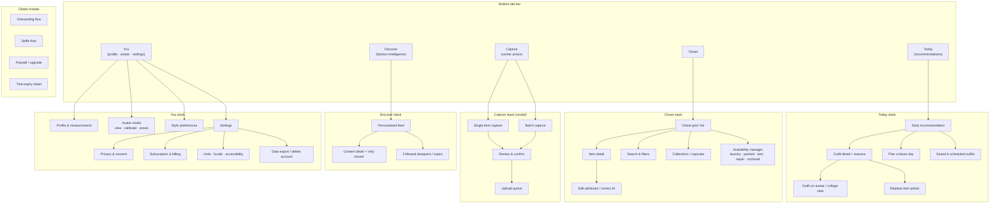
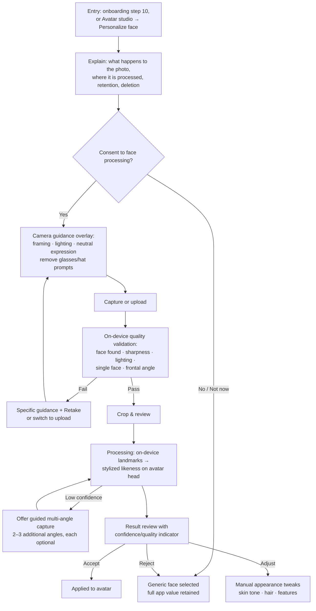

# 02 — User Journeys & Information Architecture

**Status:** Draft for review · **Date:** 2026-08-24
**Conforms to:** [SPINE.md](SPINE.md) (modules §3, capability codes §4, phases §5, tiers §6, terminology §8)
**Owns:** every user-facing journey, screen-level states, navigation map, per-surface accessibility requirements.
**Does not own:** requirement IDs ([01-requirements-and-traceability.md](01-requirements-and-traceability.md)), recommendation pipeline internals ([09-recommendation-engine.md](09-recommendation-engine.md)), media pipeline stages ([06-data-api-and-event-contracts.md](06-data-api-and-event-contracts.md), [07-3d-avatar-and-garment-pipeline.md](07-3d-avatar-and-garment-pipeline.md)), taxonomy details ([08-closet-taxonomy-and-organization.md](08-closet-taxonomy-and-organization.md)), billing mechanics ([12-pricing-entitlements-and-unit-economics.md](12-pricing-entitlements-and-unit-economics.md)), domain state machines ([03-domain-model-and-glossary.md](03-domain-model-and-glossary.md)).

---

## 1. Conventions used in this document

### 1.1 State coverage rule

Every journey section covers, explicitly or by referencing §12 (shared patterns), all of:

| State | Meaning |
|---|---|
| **Empty** | No data exists yet (new user, empty closet, no recommendations) |
| **Loading** | Work in progress; skeletons/progress, never blank screens |
| **Partial** | Some data present, some missing/still processing/low-confidence |
| **Failure** | Operation failed; cause shown in plain language, never a raw error code alone |
| **Retry** | User- or system-initiated retry path with idempotent behavior |
| **Recovery** | Return to a consistent state after crash, kill, or interruption |
| **Offline** | Behavior without connectivity: what works, what queues, what is blocked |

### 1.2 Journey ↔ phase ↔ requirement mapping

Each journey lists the phases (SPINE §5) where it is delivered and the requirement *areas* (SPINE §7) it covers. Exact `REQ-*` IDs are owned by [01-requirements-and-traceability.md](01-requirements-and-traceability.md) and are referenced there, not invented here.

### 1.3 Entitlement gating

Where a step is tier-gated (SPINE §6), the journey notes the gate. Gates are server-side entitlements, never UI-only flags — see [12-pricing-entitlements-and-unit-economics.md](12-pricing-entitlements-and-unit-economics.md).

---

## 2. Information architecture

### 2.1 Top-level navigation

Five-tab bottom navigation. Modal flows (capture, onboarding, paywall) sit above the tabs and always provide an explicit exit that preserves progress.

Design rationale: the daily recommendation is the habit anchor, so **Today** is the launch tab once onboarding is complete. **Capture** is the center action because closet growth is the core input to product value. The 3D avatar is *not* a tab: it appears in context (recommendation viewing, avatar studio) so users who skip 3D never hit a dead surface.

### 2.2 Surface inventory and owning modules

| Surface | Primary module(s) (SPINE §3) | Delivered in phase |
|---|---|---|
| Onboarding flow | `identity`, `profile` | P03 |
| Selfie flow | `media`, `avatar`, `identity` (consent) | P05 |
| Avatar studio (view/calibrate/poses) | `avatar` | P04 |
| Capture (single/batch), upload queue | `media`, `closet` | P06 |
| Closet grid, item detail, filters, collections, availability | `closet` | P07 |
| Today (daily + future-day recommendations) | `recommendation`, `context`, `outfit` | P09–P10 |
| Outfit detail, reasons, feedback | `recommendation`, `outfit` | P09–P10 |
| Try-on views (G2) | `outfit`, `media` | P11 |
| Discover feed | `fashion-intel` | P12 |
| Paywall, subscription management | `billing` | P13 |
| Settings (privacy/consent/export/deletion/units/accessibility) | `identity`, `profile`, `billing` | P03 onward |
| Notifications & their preferences | `notifications` | P09+ |

### 2.3 Deep links and notification entry points

- `today` (daily recommendation ready), `today/<date>` (planned day), `closet/item/<id>` (processing finished / needs review), `discover/<contentId>`, `settings/subscription` (billing issue), `capture/queue` (stalled uploads).
- Every deep link must be safe when the target no longer exists (deleted item, expired recommendation): land on the nearest parent surface with a brief non-blocking explanation.
- Notification taps never bypass authentication or consent gates.

---

## 3. Journey: first launch and progressive onboarding

**Phases:** P03 (walking skeleton), enriched P04+. **Covers ONB requirement area** — see [01-requirements-and-traceability.md](01-requirements-and-traceability.md).

### 3.1 Principles

- The app is useful before every optional field is complete. Only a minimal required core blocks progress; everything else is skippable and editable later from **You → Profile**.
- Each sensitive request explains *why* on the same screen, in one or two sentences, before the input control ("Your measurements adjust your avatar and improve fit advice. They never leave your account and you can delete them anytime.").
- Trial starts at account creation (server-granted Pro-level, SPINE §5 note) — no card, no store sheet during onboarding.

### 3.2 Step sequence

| # | Step | Required? | Notes |
|---|---|---|---|
| 1 | Welcome + value promise | — | One screen; no carousel longer than 3 cards; skippable |
| 2 | Sign in (Apple / Google / email+passkey) | **Required** | Age gate here (see [11-security-privacy-and-compliance.md](11-security-privacy-and-compliance.md)) |
| 3 | Core consents | **Required** | Terms/privacy acknowledgment; granular optional consents (face processing, analytics) are **deferred to the moment of use**, not front-loaded |
| 4 | Units & locale confirmation | **Required** (pre-filled from device) | Metric/imperial toggle; editable later |
| 5 | Presentation & base model selection | **Required** (default offered) | Inclusive options; explicitly decoupled from body geometry (see [07-3d-avatar-and-garment-pipeline.md](07-3d-avatar-and-garment-pipeline.md)) |
| 6 | Height & weight | Optional, encouraged | Enables A1 avatar adjustment; skip → A0 generic base |
| 7 | Additional measurements | Optional | Progressive: bust/waist/hip first, more behind "add more detail"; per-field skip |
| 8 | Fit & style preferences | Optional | Silhouettes, colors, hard exclusions, modesty, comfort, climate tolerance (runs hot/cold) |
| 9 | Lifestyle & common occasions | Optional | No calendar access requested in v1 |
| 10 | Selfie offer | Optional | Links to Journey §4; "use a generic face" is an equally prominent choice |
| 11 | First-capture nudge | Optional | Hands off to Journey §6 (capture); can be skipped to an empty-closet Today tab |

Every optional step has **Skip** in a consistent position with equal visual weight to Continue. Skipping records nothing; no dark-pattern re-asking within the same session.

### 3.3 States

- **Empty:** brand-new account — steps render with sensible defaults; nothing depends on prior data.
- **Loading:** account creation and consent writes show inline progress; total onboarding blocking calls target < 2s each (budgets owned by [13-testing-quality-and-performance.md](13-testing-quality-and-performance.md)).
- **Partial:** user quits mid-flow → progress is persisted server-side per completed step; next launch resumes at the first incomplete required step, or goes straight to Today if all required steps are done. Optional gaps surface later as contextual, dismissible prompts (e.g., "Add measurements for a better-fitting avatar" on the Avatar studio), never modal nags.
- **Failure:** sign-in provider failure → alternative providers offered + retry; consent write failure → block only the affected step, retry with backoff; implausible measurement values (outside validated bounds — bounds owned by [07-3d-avatar-and-garment-pipeline.md](07-3d-avatar-and-garment-pipeline.md)) → inline validation with unit-aware messaging ("Did you mean 176 cm?" when 176 was entered under imperial), never silently clamped.
- **Retry:** all onboarding writes idempotent (client-generated idempotency keys); tapping Continue twice never duplicates a profile.
- **Recovery:** after crash, resume exactly as "partial" above; no step is re-required if its data was persisted.
- **Offline:** onboarding requires connectivity for account creation (step 2). Steps 4–9 buffer locally and sync when online; the flow states plainly which step needs a connection instead of spinning.

### 3.4 Consent, correction, export, deletion

Onboarding links to the full data controls (Journey §11). Every collected field shows in **You → Profile** with edit and clear-field actions. Field-level deletion propagates to derived data (avatar re-derivation) per [11-security-privacy-and-compliance.md](11-security-privacy-and-compliance.md).

---

## 4. Journey: optional selfie and personalized face (A2)

**Phase:** P05. **Covers FAC requirement area.** Capability honesty per SPINE §4: the output is a **stylized likeness**, never marketed as an exact digital twin.

### 4.1 Flow

### 4.2 Key behaviors

- **Consent** (screen S1/S2) is explicit, face-specific, and revocable. Revoking later (Settings → Privacy) deletes the selfie, all face-derived assets, and reverts to the generic face — deletion propagation contract in [11-security-privacy-and-compliance.md](11-security-privacy-and-compliance.md).
- **Generic-face alternative** is presented as a first-class equal option at every decision point, never as a diminished fallback.
- **On-device first** (SPINE §2: ARKit / MediaPipe landmarks). If a documented server-side path is used for heavier reconstruction, the consent screen says so before capture and the upload uses short-lived signed URLs ([06-data-api-and-event-contracts.md](06-data-api-and-event-contracts.md)).
- **Quality validation** failures give *specific* guidance ("Too dark — face a window or lamp"), not generic "try again".
- **Misuse protection:** single-face requirement, liveness-adjacent heuristics, and policy text that the selfie must be of the account holder; abuse-case handling in [11-security-privacy-and-compliance.md](11-security-privacy-and-compliance.md). Detection of a clearly different person on re-capture triggers a confirmation prompt, not a silent accept.
- **Confidence indicator** on the result (e.g., "Good match" / "Approximate — add angles to improve") — never a fabricated accuracy percentage.

### 4.3 States

- **Empty:** no selfie yet → Avatar studio shows generic face with an optional, dismissible "Personalize" affordance.
- **Loading:** landmark processing shows determinate progress where possible; > 10s expected work moves to background with a notification-on-completion option.
- **Partial:** multi-angle flow accepts any subset of angles; result confidence reflects what was provided.
- **Failure:** processing failure → photo retained locally (not uploaded) with Retry and Discard; repeated failure (≥ 2) → offer generic face prominently and log a diagnostic event (no image content in logs — logging rules in [11-security-privacy-and-compliance.md](11-security-privacy-and-compliance.md)).
- **Retry:** re-running processing on the same photo is idempotent (content-hash keyed, see [03-domain-model-and-glossary.md](03-domain-model-and-glossary.md) MediaAsset).
- **Recovery:** app killed mid-processing → job continues server-side if uploaded, or is safely discarded if on-device; on next open the Avatar studio shows the true state.
- **Offline:** capture and on-device validation work offline; anything needing the server queues with a clear "waiting for connection" state and the option to cancel.

---

## 5. Journey: avatar calibration and review (A1)

**Phase:** P04. **Covers AVA requirement area.** Renderer boundary and parametric mapping owned by [07-3d-avatar-and-garment-pipeline.md](07-3d-avatar-and-garment-pipeline.md).

### 5.1 Flow

1. After measurements are saved (or defaults accepted), the app derives an A1 avatar from the selected base model + measurement→morph mapping.
2. **Calibration screen:** side-by-side of avatar in neutral pose with the user's stated measurements; per-region adjustment sliders (torso, hips, shoulders, limbs) within realistic bounds; changes preview live.
3. User accepts, or corrects — corrections are stored as explicit user overrides that survive re-derivation (invariant owned by [03-domain-model-and-glossary.md](03-domain-model-and-glossary.md), AvatarConfig).
4. Pose gallery: 3–4 standardized poses (neutral, walking/casual, seated/occasion, fit-reveal) with rotate/zoom camera controls.
5. Appearance customization: skin tone, hair, optional details — inclusive palette requirements in [07-3d-avatar-and-garment-pipeline.md](07-3d-avatar-and-garment-pipeline.md).

### 5.2 Conflicting or implausible data

- Conflicting measurements (e.g., waist > hip beyond plausible bounds): the calibration screen flags the conflict, shows which inputs conflict, and asks the user to confirm or fix — the system never silently picks one.
- Low-confidence or missing measurements: affected regions display an "estimated" marker; tapping it explains what to add for better accuracy.

### 5.3 States

- **Empty:** no measurements → A0 generic base renders immediately with a dismissible prompt to add measurements. The avatar is never a blank screen.
- **Loading:** first 3D load shows a static preview image, then the interactive scene; first-render budget owned by [13-testing-quality-and-performance.md](13-testing-quality-and-performance.md).
- **Partial:** avatar renders with whatever measurements exist; estimated regions marked as above.
- **Failure:** 3D scene fails to initialize (GPU/memory/driver) → automatic fallback to the **non-3D alternative** (§13.3): 2D posed renders of the same avatar. The failure is recorded for device-capability telemetry; the user sees the fallback, not an error wall.
- **Retry:** "Try 3D again" available from the fallback view; asset re-download resumable.
- **Recovery:** interrupted calibration keeps last-saved slider state; re-derivation after a rig/mesh version upgrade replays user overrides (versioning/migration in [07-3d-avatar-and-garment-pipeline.md](07-3d-avatar-and-garment-pipeline.md)).
- **Offline:** cached avatar assets render offline; calibration edits queue and sync; pose switching works offline once assets are cached.

---

## 6. Journey: closet capture

**Phase:** P06. **Covers CAP and MED requirement areas.** Pipeline stages and the processing state machine belong to [03-domain-model-and-glossary.md](03-domain-model-and-glossary.md) (states) and [07-3d-avatar-and-garment-pipeline.md](07-3d-avatar-and-garment-pipeline.md) / [06-data-api-and-event-contracts.md](06-data-api-and-event-contracts.md) (stages/contracts).

### 6.1 Fast single-item loop

Target: photo → confirmed catalog entry in under ~30 seconds of user attention (measured target owned by [13-testing-quality-and-performance.md](13-testing-quality-and-performance.md)).

1. **Capture screen:** live camera with framing guide, background hint ("plain background works best"), flat-lay or hanging both supported. Front photo is the only required input.
2. **Optional extra views:** back, side, detail, label, material — offered as one-tap chips after the front shot, all skippable.
3. **Instant local feedback:** on-device background removal preview + quality check (blur, lighting, garment fully in frame). Failures → specific retake guidance; user may **keep anyway** (override).
4. **Auto-classification:** category + attributes proposed with confidence; user confirms or corrects in a single compact review card (category, color, season chips). Correction here is the primary taxonomy-quality input — see [08-closet-taxonomy-and-organization.md](08-closet-taxonomy-and-organization.md).
5. **Save:** item appears in the closet immediately in a `processing` visual state while server-side derivation (full segmentation, attribute extraction, dedup) completes in the background.

### 6.2 Batch capture

- Rapid-fire mode: shoot many items consecutively; review happens afterward as a swipeable stack of confirmation cards.
- Import from photo library with multi-select; each import runs the same quality checks.
- Batch review supports "accept all high-confidence, review the rest".
- A batch is resumable: leaving mid-review keeps the remaining stack under **Capture → Pending review**.

### 6.3 Duplicates, corrections, generated views

- **Duplicate detection** is visual/semantic (embedding similarity — see [08-closet-taxonomy-and-organization.md](08-closet-taxonomy-and-organization.md)), surfaced at confirmation time: "Looks like an item already in your closet" with side-by-side compare → *It's the same* (merge/replace photo) / *It's different* (keep both).
- **Wrong segmentation/classification:** item detail → Edit lets the user redraw the crop, re-run background removal, change any attribute. Corrections are canonical and are never overwritten by later automatic reprocessing (invariant in [03-domain-model-and-glossary.md](03-domain-model-and-glossary.md)).
- **AI-completed missing views** (P11, entitlement-gated): generated only for views the user did not supply; every generated view carries a visible **provenance marker** and confidence indicator; a real photo added later replaces the generated view permanently. A real captured view is never replaced by a generated one (SPINE §4).

### 6.4 States

- **Empty:** first capture ever → one-time inline coach marks on the capture screen (dismiss-forever available).
- **Loading:** upload and processing are backgrounded; the closet tile shows a determinate/indeterminate processing badge, never blocks browsing.
- **Partial:** an item may exist with front photo confirmed while attributes are still deriving — usable in the closet immediately, excluded from recommendations only if required attributes are missing (rules in [09-recommendation-engine.md](09-recommendation-engine.md)).
- **Failure:** processing failure per item → tile shows "needs attention" with cause and actions (retry / retake / edit manually / delete). Systemic failures (provider outage) → banner on the queue screen, automatic retry with backoff; user photos are never lost.
- **Retry:** uploads are resumable and content-hash idempotent; retrying a failed processing job never duplicates the item or re-charges metered work ([12-pricing-entitlements-and-unit-economics.md](12-pricing-entitlements-and-unit-economics.md)).
- **Recovery (interrupted upload):** all captures land in a durable local queue first. App kill, crash, or connectivity loss mid-upload → queue resumes automatically on next launch/connectivity; **Capture → Upload queue** shows every pending/failed item with per-item retry/cancel. Nothing is silently dropped; queue items survive app updates.
- **Offline:** full capture loop (photo, local quality check, provisional category pick) works offline; everything queues. The provisional item is visible in the closet marked "waiting to sync". Free-tier item-count limits are enforced at sync time with a clear explanation, not by discarding queued items.

---

## 7. Journey: closet browsing and organization

**Phase:** P07. **Covers ORG requirement area.** Taxonomy, attributes, and search semantics owned by [08-closet-taxonomy-and-organization.md](08-closet-taxonomy-and-organization.md).

### 7.1 Core interactions

- **Views:** grid (default, photo-forward), list (attribute-forward); grouping by category, season, color, formality, recently added, most/least worn.
- **Search & filters:** free-text + structured filters (category, color, season, material, brand, availability state, favorite, tags); saved filters.
- **Collections/capsules:** user-defined sets (e.g., "Work capsule", "Trip to Lisbon"); an item can belong to many.
- **Item detail:** all photos (with provenance markers on generated views), attributes with confidence + edit, wear history, cost-per-wear (if price supplied), notes, availability state control, outfit appearances.
- **Availability management:** one-tap state changes among `available | laundry | packed | lent | repair | archived` (SPINE §8); bulk state change ("all of these are packed"); state machine semantics owned by [03-domain-model-and-glossary.md](03-domain-model-and-glossary.md). Unavailable items are visually muted, filterable, and excluded from recommendation candidates ([09-recommendation-engine.md](09-recommendation-engine.md)).

### 7.2 States

- **Empty:** empty closet → illustrated empty state with a single primary action (Capture) and a secondary "how it works"; never an empty grid.
- **Loading:** cached closet renders instantly; sync deltas apply in place with subtle indicators.
- **Partial:** processing items show badges (§6.4); filters warn when results exclude still-processing items.
- **Failure:** sync failure → non-blocking banner; local view remains browsable; per-item errors surface on the item.
- **Retry:** pull-to-refresh; automatic background retry for sync.
- **Recovery:** conflict between offline edits and server state resolved by field-level last-writer-wins with user corrections always beating automatic derivations (sync design in [04-architecture.md](04-architecture.md)/[06-data-api-and-event-contracts.md](06-data-api-and-event-contracts.md)).
- **Offline:** full browse/search/filter over the cached closet; attribute edits, availability changes, favoriting, collection membership all editable offline and queued.

---

## 8. Journey: daily and future-day recommendations

**Phases:** P09 (engine + explanation), P10 (on-avatar viewing). **Covers REC and CTX requirement areas.** Engine internals, precedence rules, and determinism guarantees owned by [09-recommendation-engine.md](09-recommendation-engine.md).

### 8.1 Daily flow (Today tab)

1. On open, Today shows the current recommendation for today's context: weather summary (with source + freshness), detected holiday (if any, with an "does this matter today?" toggle), selected occasion (default: user's typical day; changeable via occasion picker).
2. The primary card shows the outfit (avatar presentation where available, G0 collage always available), headline reasons (2–3 concise reason chips), and confidence.
3. **Alternatives:** swipe/scroll to ranked alternatives, each with its own reasons.
4. **"Show me something different":** explicit user-controlled mode that deterministically advances through valid candidates (seeded rotation — still honoring all hard constraints; mechanism in [09-recommendation-engine.md](09-recommendation-engine.md)). It is a labeled control, never hidden randomness; the same taps from the same state always produce the same sequence.
5. Actions: wear it (mark as worn), save, schedule, replace an item (§9), full feedback set (§9).

### 8.2 Context transparency and overrides

- Each context fact used (weather, holiday, occasion) is visible with its source, freshness timestamp, and an override control ("Actually I'll be indoors all day", manual city change).
- **Stale context warning:** if weather data is older than its freshness window, the card is labeled ("Based on this morning's forecast") — thresholds owned by [09-recommendation-engine.md](09-recommendation-engine.md).
- Missing context (no location permission, no occasion chosen) → recommendation proceeds with labeled assumptions and a one-tap prompt to supply the missing input. The system never silently invents personal facts.

### 8.3 Future-day planning (Plus tier and above)

- Date picker (bounded by reliable forecast horizon); shows that day's forecast, holidays, and an occasion selector.
- Planned outfits are saved to that date; items in a planned outfit can be optionally soft-reserved (marked so today's recommendations deprioritize them — behavior defined in [09-recommendation-engine.md](09-recommendation-engine.md)).
- Forecast-shift handling: if the forecast changes materially before the planned day, the user gets a notification ("Rain now expected Thursday — review your planned outfit") and the plan is flagged, never silently regenerated.

### 8.4 States

- **Empty (no closet / sparse closet):** Today never shows a blank card. Empty closet → guided capture call-to-action framed by value ("Add 5 items to get your first outfit"). Sparse closet → best-effort partial recommendations labeled as such, plus concrete "what to add" hints (cold-start/sparse strategy in [09-recommendation-engine.md](09-recommendation-engine.md)).
- **Loading:** cached previous recommendation shows immediately with a refresh indicator; fresh computation target latency owned by [13-testing-quality-and-performance.md](13-testing-quality-and-performance.md).
- **Partial:** context provider down (e.g., weather) → recommendation computed from remaining facts, with an explicit banner naming the missing signal and its effect; manual weather entry offered.
- **Failure — no valid outfit:** if hard constraints eliminate everything (all warm layers in laundry on a cold day), Today explains exactly why in constraint terms and offers actionable fixes ("3 items in laundry would unlock outfits — mark any as available?") — never a fabricated unsafe outfit and never a bare error.
- **Retry:** manual refresh recomputes; identical inputs yield identical output (deterministic reproducibility, [09-recommendation-engine.md](09-recommendation-engine.md)).
- **Recovery:** app killed mid-generation → next open resumes from cache and recomputes in background.
- **Offline:** last computed recommendation shown with an "offline — based on data from <time>" label; occasion browsing over cached results works; anything needing fresh context is queued. Free tier (1/day, basic context) gates are enforced server-side and explained in-line with an upgrade path, not a dead end.

---

## 9. Journey: explanation and feedback

**Phase:** P09. **Covers EXP requirement area.** Feedback→effect mapping (hard rule vs preference weight vs session signal vs training data) is owned by [09-recommendation-engine.md](09-recommendation-engine.md); this section owns the interaction surface.

### 9.1 Explanations

- Reason chips on every recommendation, generated from structured reason codes (SPINE §8; registry in `shared-kernel`) — e.g., "Rain-ready", "Matches your Friday dinner occasion", "You haven't worn this jacket in a while", "Colors you favor".
- Tapping a chip expands a plain-language sentence plus the underlying facts (context fact + freshness, or preference reference).
- Explanations never expose sensitive inference in surprising language (no body-shape commentary beyond user-entered fit preferences; tone rules in [11-security-privacy-and-compliance.md](11-security-privacy-and-compliance.md)).

### 9.2 Feedback types (complete set, brief §2.7)

| Feedback | Surface | Immediate effect shown to user |
|---|---|---|
| Like outfit | primary card | Confirmation; preference signal |
| Dislike outfit | primary card | Asks optional "why" (one tap: too warm/cold, too formal/casual, uncomfortable, wrong color, wrong fit, repetitive, unavailable); replaces card with next alternative |
| Replace one item | item chip on outfit | Opens compatible-item picker (only items passing constraints); rest of outfit kept |
| Too warm / too cold | dislike detail or standalone | Adjusts warmth signal; new suggestion offered |
| Too formal / too casual | dislike detail | Formality signal; new suggestion |
| Uncomfortable / wrong color / wrong fit | dislike detail | Item- or attribute-scoped signal |
| Repetitive | dislike detail | Diversity signal |
| Unavailable | item chip | Prompts availability state change (→ laundry etc.) |
| Save outfit | action bar | Saved outfits list |
| Schedule for later | action bar | Future-day planner (§8.3) |
| Mark as worn | action bar | Wear history + wear-frequency signals |
| Compare alternatives | alternatives rail | Side-by-side of 2–3 candidates with differing reasons highlighted |
| "Never suggest this pairing" | overflow menu on outfit | Durable negative constraint, listed and revocable in preference transparency (§9.3) |

### 9.3 Undo, transparency, reset

- **Undo:** every feedback action shows a transient Undo affordance (≥ 5s) and remains reversible afterward from the feedback history in **You → Style preferences → Your feedback**. One accidental tap must never durably distort personalization (guardrails in [09-recommendation-engine.md](09-recommendation-engine.md)).
- **Preference transparency:** a readable list of everything the system has learned or been told — explicit preferences, durable "never" rules, learned weights in human terms ("You usually prefer muted colors") — each entry editable or deletable.
- **Reset personalization:** clearly separated destructive action (with confirmation and a summary of what is kept vs cleared): clears learned weights and session signals; explicitly asks whether durable "never suggest" rules and explicit preferences should also be cleared. Irreversible after confirmation; stated as such.

### 9.4 States

- **Loading/offline:** feedback is optimistic-UI and queued offline; conflicts on sync resolved in favor of the latest user action.
- **Failure:** failed feedback write retries silently; if durable failure, a non-blocking notice with manual retry. Feedback is idempotent (client event IDs).
- **Recovery:** feedback history is server-persisted; device switch preserves it.

---

## 10. Journey: fashion-intelligence feed (Discover)

**Phase:** P12. **Covers TRD requirement area.** Ingestion, licensing, provenance, and moderation owned by the fashion-intel sections of [01-requirements-and-traceability.md](01-requirements-and-traceability.md) and the content pipeline in [04-architecture.md](04-architecture.md) / doc 14 for operations.

### 10.1 Behavior

- Personalized feed of trends, runway collections, seasonal styles, and outfit inspiration, ranked by explicit style preferences, closet composition, region/season/climate, followed designers/brands, and feedback — never a generic content dump.
- Every card carries **"Why you're seeing this"** (same reason-code approach as §9.1) and **source attribution** with provenance.
- Feed controls per card: save, follow source/designer, "show less like this", hide, report. Hide/unfollow are immediate and feed back into personalization.
- Closet connection: where a trend relates to owned items, the card says so ("Pairs with your black wide-leg trousers"); trend influence on recommendations never overrides hard constraints (SPINE / [09-recommendation-engine.md](09-recommendation-engine.md)).
- Tier gating: basic trends at Essentials, personalized trends at Plus+ (SPINE §6) — gated server-side with an explanatory upgrade card, not a blurred tease wall.

### 10.2 States

- **Empty:** before enough signals exist → starter feed seeded from explicit onboarding preferences + region/season, labeled "Getting to know your style"; cold-start improves as closet and feedback grow.
- **Loading:** cached feed instantly; new content merges without scroll-jank.
- **Partial:** a source temporarily unavailable → its content ages out per freshness rules; feed composition rebalances silently; if the feed would fall below a quality floor, a "less new content today" note appears rather than padding with irrelevant items.
- **Failure:** feed fetch failure → cached content + retry banner.
- **Retry/Recovery:** standard pull-to-refresh; read/saved state synced.
- **Offline:** cached feed readable; save/hide/follow queue.

---

## 11. Journey: settings, privacy, and data control

**Phase:** P03 baseline, expanded per feature phase. **Covers PRV, SEC, ONB requirement areas.** Legal/compliance substance owned by [11-security-privacy-and-compliance.md](11-security-privacy-and-compliance.md).

### 11.1 Settings map (You → Settings)

| Section | Contents |
|---|---|
| **Privacy & consent** | Per-purpose consent toggles (face processing, analytics, location precision: precise / coarse / manual city, notifications); each shows what it enables, current status, and date granted; revoking triggers the documented data effect immediately |
| **Data** | Export (machine-readable archive of profile, closet, outfits, feedback, media; async job with notification when ready; available on every tier including Free and after subscription expiry — SPINE §6); Delete account (§11.3) |
| **Units & locale** | Metric/imperial (global, applied everywhere consistently), language (English at launch), region, timezone |
| **Accessibility** | Reduced motion, non-3D mode (§13.3), haptics, text-size note (follows OS dynamic type — no separate in-app size), high-contrast preference |
| **Subscription** | Current plan, trial status, credits remaining, manage/upgrade/cancel (→ §12), restore purchases |
| **Notifications** | Per-category toggles (daily outfit, processing complete, forecast changes, trends, billing) with quiet hours |

### 11.2 Data export

- Requested from Settings → Data; runs as an async job; user notified when the archive is ready via a short-lived signed download link ([06-data-api-and-event-contracts.md](06-data-api-and-event-contracts.md)).
- **States:** in-progress indicator with cancel; failure → retry with support contact; offline → request queues.

### 11.3 Account deletion

1. Entry: Settings → Data → Delete account. Requires re-authentication.
2. Pre-deletion screen states plainly: what is deleted (profile, measurements, selfie and all face-derived assets, closet media and derived assets, avatar assets, recommendations, feedback), the deletion timeline including backup constraints, and the subscription caveat: **deleting the account does not cancel a store subscription** — link to store cancellation (§12.5) with explicit instructions.
3. Offer export first (one tap into §11.2).
4. Grace window (duration = product decision, see open questions in [16-risks-open-questions-and-decision-log.md](16-risks-open-questions-and-decision-log.md)): account deactivated immediately, sign-in during the window offers cancellation of the deletion; after the window, purge cascades per the deletion propagation contract ([11-security-privacy-and-compliance.md](11-security-privacy-and-compliance.md), [06-data-api-and-event-contracts.md](06-data-api-and-event-contracts.md)).
5. Confirmation email/push at request and at completion.
- **Failure/retry:** deletion job failures are retried server-side and surfaced to support/admin; the user-facing promise (completion within stated timeline) is monitored ([14-observability-operations-and-analytics.md](14-observability-operations-and-analytics.md)).
- **Offline:** deletion cannot be requested offline (requires re-auth); the screen says so.

---

## 12. Journey: trial, paywall, and billing

**Phase:** P13 (seams from P06). **Covers BIL requirement area.** Entitlement model, store compliance, webhooks, and reconciliation owned by [12-pricing-entitlements-and-unit-economics.md](12-pricing-entitlements-and-unit-economics.md). All prices are hypotheses (SPINE §6).

### 12.1 Trial start (3-day full access)

- Granted server-side at account creation at **Pro** level; no card, no store interaction, no "start trial" decision screen. Onboarding mentions it in one line ("Everything is unlocked for your first 3 days").
- Persistent, unobtrusive trial indicator (e.g., "Trial · 2 days left" pill on You tab); day-before reminder notification (respects notification settings).

### 12.2 Trial expiry

- On expiry: account transitions to Free tier. **No data is deleted or hidden destructively** (SPINE §6): closet items above the Free cap remain visible and exportable but are read-only for new recommendation composition (exact over-cap behavior is a product decision → [16-risks-open-questions-and-decision-log.md](16-risks-open-questions-and-decision-log.md)); paid-derived assets (G2 try-on images, generated views) remain viewable with provenance intact.
- First open after expiry: a single, dismissible full-screen recap — what the user did during trial (items captured, outfits worn), what changes on Free, and tier options. Dismiss lands on a fully functional Free-tier Today tab.

### 12.3 Paywall and upgrade

- Paywall appears **contextually** at gated actions (e.g., tapping G2 try-on on Free/Essentials, second recommendation of the day on Free, item 41 on Free) and from Settings → Subscription. It always names the specific capability that triggered it.
- Content: tier comparison (SPINE §6 table), monthly/annual toggle with annual savings, restore purchases link, legal links. Purchases run through the platform sheet (StoreKit / Play Billing via RevenueCat).
- **States:** store sheet failure/cancel → return to prior screen, no nagging repeat; purchase success → entitlement refresh with optimistic unlock and server confirmation; **pending/deferred purchases** (family approval, payment pending) → "purchase pending" state that resolves via webhook, UI polls entitlement state; offline → paywall explains purchases need a connection.

### 12.4 Restore, upgrade/downgrade, billing problems

- **Restore purchases:** Settings → Subscription → Restore; also offered on sign-in on a new device and on the paywall. Failure → clear guidance (store account mismatch is the common cause) + support link.
- **Upgrade/downgrade:** immediate entitlement change on upgrade (prorated per store rules); downgrade takes effect at period end with an explicit "until <date> you keep Plus" notice. Credits: remaining monthly generative credits behavior on plan change is defined in [12-pricing-entitlements-and-unit-economics.md](12-pricing-entitlements-and-unit-economics.md).
- **Grace period / billing retry:** store-reported payment failure → entitlements enter grace (unchanged features) with a fix-payment banner deep-linking to store payment settings; if grace lapses → expiry behavior (§12.5).
- **Refunds:** handled by stores; entitlement revocation arrives via webhook and downgrades gracefully like expiry.

### 12.5 Cancellation and expired subscription

- Cancel path: Settings → Subscription → Manage → deep-link to the platform's subscription management (stores own cancellation). The app reflects "cancelled — active until <date>".
- After expiry: same guarantees as trial expiry (§12.2) — data safe, export always available, Free tier functional, paid-derived assets retained and viewable, re-subscribing restores full access to them.

### 12.6 States summary

- **Loading:** entitlement state cached; billing screens show cached plan while refreshing.
- **Partial:** webhook lag → temporary mismatch between store receipt and server entitlement; UI trusts server entitlements, shows "syncing your purchase" for up to the reconciliation window, then offers manual restore.
- **Failure/Retry:** all store interactions retryable; entitlement checks fail-closed for paid capabilities but never block Free-tier functionality or data access.
- **Offline:** cached entitlements honored for their offline validity window (defined in [12-pricing-entitlements-and-unit-economics.md](12-pricing-entitlements-and-unit-economics.md)); purchases and restores require connectivity.

---

## 13. Accessibility requirements per surface

**Covers accessibility slices of ONB/AVA/CAP/REC/PERF areas; test plan owned by [13-testing-quality-and-performance.md](13-testing-quality-and-performance.md).**

### 13.1 Global (every surface)

- Full screen-reader support (VoiceOver/TalkBack): meaningful labels, logical focus order, announced state changes (upload progress, processing completion, recommendation refresh).
- Dynamic type up to the largest OS accessibility sizes without truncation of essential content; layouts reflow, never clip.
- Touch targets ≥ 44×44 pt/dp; WCAG 2.2 AA contrast; no color-only meaning (availability states, confidence, provenance all carry icon/text as well as color).
- Reduced motion: honors OS setting and in-app toggle — disables parallax, auto-rotating 3D, card-transition animations; replaces with cross-fades.
- All time-limited affordances (undo snackbars) have non-timed equivalents (feedback history).
- No flashing content; haptics optional.

### 13.2 Surface-specific

| Surface | Additional requirements |
|---|---|
| **Onboarding** | Each step fully operable by screen reader; consent text real text (not images); measurement inputs support switch access and keyboard; unit labels announced with values |
| **Selfie capture** | Spoken capture guidance ("move phone up", "good lighting") mirrored as captions; volume-button shutter; upload-from-library as full alternative to live camera |
| **Avatar studio / any 3D view** | See §13.3 non-3D alternative; camera controls have button equivalents (rotate left/right, zoom in/out) — never gesture-only; pose switch announced |
| **Capture** | Voice-over capture flow with audible framing feedback; batch review cards navigable sequentially; quality warnings announced |
| **Closet** | Grid navigable by screen reader with item summaries (name, category, color, availability); filters operable without drag; color-view augmented with color names |
| **Today / outfit detail** | Reason chips readable in sequence; the complete outfit announced as a structured list (item by item); feedback actions reachable without gesture shortcuts; "show me something different" a plain labeled button |
| **Try-on images (G2)** | Alt text generated from structured outfit data; provenance marker announced ("AI-generated preview") |
| **Discover** | Cards with full text alternatives; "why shown" reachable per card; hide/report operable via accessibility actions menu |
| **Paywall/billing** | Price and period announced together; tier comparison table navigable cell by cell; no dismiss-blocking |
| **Settings** | Standard platform controls wherever possible (inherit platform accessibility) |

### 13.3 Non-3D alternative (required for every 3D view)

Users who cannot or do not want to use the 3D view (motion sensitivity, screen-reader use, low-end device, personal preference) get an equivalent surface with **no loss of decision-relevant information**:

- Avatar studio → static 2D renders of the avatar in each standardized pose, generated server-side from the same AvatarConfig, with the same calibration controls (sliders operate on the 2D preview via re-render).
- Outfit-on-avatar → G0 collage view plus 2D posed renders of the composed outfit.
- Selection is available as: automatic (device capability / OS reduced-motion), per-session toggle on every 3D surface, and a persistent choice in Settings → Accessibility.
- The recommendation experience is *identical* in content (same outfits, reasons, feedback) regardless of 3D availability — guaranteed by the renderer-independent recommendation contract ([09-recommendation-engine.md](09-recommendation-engine.md), [04-architecture.md](04-architecture.md)).

---

## 14. Cross-journey shared patterns

- **Error language:** cause + effect + action, in product language ("Couldn't reach the weather service — using this morning's forecast. Retry"), no raw codes as the only content; error taxonomy in [06-data-api-and-event-contracts.md](06-data-api-and-event-contracts.md).
- **Queues everywhere:** capture uploads, feedback, profile edits, and settings changes all share the durable local outbox pattern (design in [04-architecture.md](04-architecture.md)); every queue is inspectable somewhere in the UI and survives app restarts.
- **Provenance & confidence:** any AI-generated or AI-inferred content (generated views, extracted attributes, try-on images, stylized face) always carries a visible provenance marker and, where meaningful, a confidence indicator (SPINE §10.5).
- **Never block on optional AI:** every AI-dependent enhancement has a deterministic fallback path that keeps the journey completable (SPINE deterministic-before-AI rule).
- **Interruption safety:** every multi-step flow persists progress at each step boundary and resumes; "Back" never destroys entered data without confirmation.

---

## 15. Open items surfaced by this document

Logged as open questions in [16-risks-open-questions-and-decision-log.md](16-risks-open-questions-and-decision-log.md): Free-tier over-cap closet behavior after downgrade (§12.2); account-deletion grace window duration (§11.3); whether "mark as worn" should ever be inferred (vs strictly explicit); default occasion when none selected; notification defaults (opt-in vs opt-out per category).
