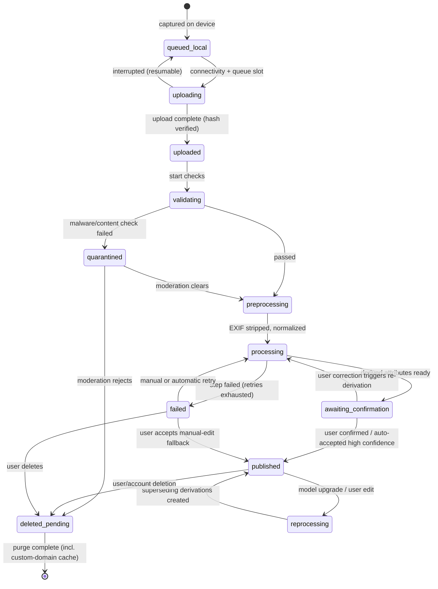
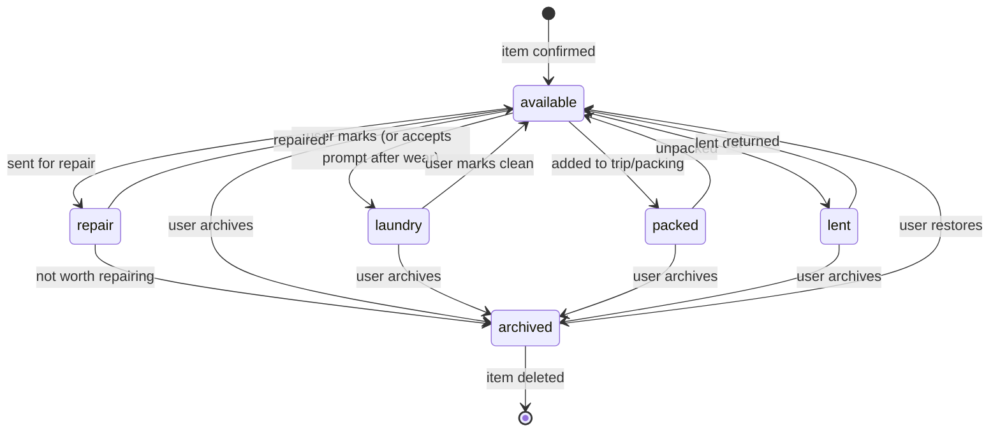
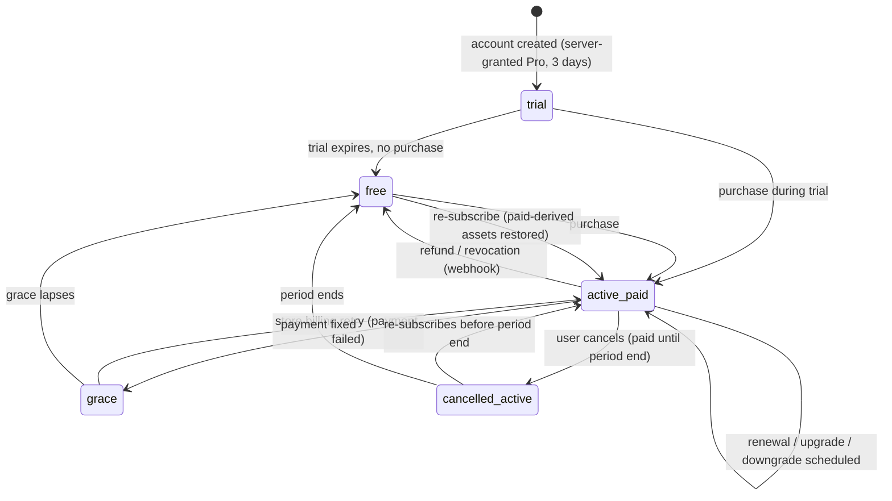
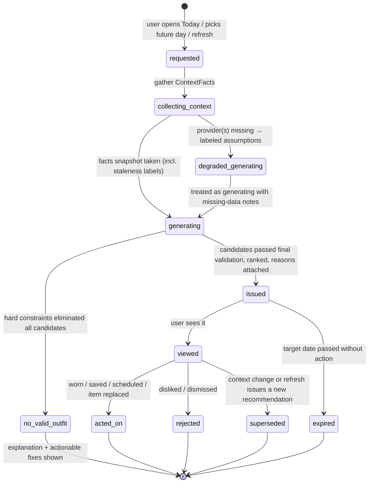

# 03 — Domain Model & Glossary

**Status:** Draft for review · **Date:** 2026-08-24
**Conforms to:** [SPINE.md](SPINE.md) (modules §3, capability codes §4, terminology §8) · **Amended:** 2026-09-13 ([r7](research/r7-third-party-services-and-self-hosting-audit-2026-09-13.md), ADR-0003 — cache-purge wording)
**Owns:** the canonical glossary (full definitions extending SPINE §8), module ownership of every concept, aggregate/entity/value-object sketches, per-aggregate invariants, and the four domain state machines (media processing — domain-level summary; canonical pipeline stage names are owned by [07 §8.1](07-3d-avatar-and-garment-pipeline.md) per SPINE §8 —, closet item availability, subscription/entitlement, recommendation).
**Does not own:** database schemas and API contracts ([06-data-api-and-event-contracts.md](06-data-api-and-event-contracts.md)), pipeline stage implementations ([07-3d-avatar-and-garment-pipeline.md](07-3d-avatar-and-garment-pipeline.md)), taxonomy contents ([08-closet-taxonomy-and-organization.md](08-closet-taxonomy-and-organization.md)), engine mechanics ([09-recommendation-engine.md](09-recommendation-engine.md)), billing mechanics ([12-pricing-entitlements-and-unit-economics.md](12-pricing-entitlements-and-unit-economics.md)).

Every planning document and future code artifact MUST use these terms exactly. If a term here conflicts with SPINE §8, SPINE wins and this document is corrected.

---

## 1. Canonical glossary

Grouped by owning module (SPINE §3). "Owner" = the single module whose data/definitions are the source of truth; all other modules reference, never redefine.

### 1.1 `identity`

| Term | Definition |
|---|---|
| **User (account)** | The authenticated principal. Owns exactly one Profile, zero or one AvatarConfig lineage, one Closet, one Entitlement record. Root for deletion cascade. |
| **Session** | An authenticated device session; revocable individually. |
| **Consent record** | An auditable grant of a specific processing purpose (e.g., `face_processing`, `analytics`, `precise_location`) with scope, timestamp, policy version, and revocation timestamp. Consent is per-purpose, never a blanket flag. |
| **Age gate** | The assertion collected at signup that the user meets the minimum age (policy in [11-security-privacy-and-compliance.md](11-security-privacy-and-compliance.md)). |

### 1.2 `profile`

| Term | Definition |
|---|---|
| **Profile** | Aggregate of user-stated personal data: measurements, presentation settings, preferences, units/locale. Distinct from the account (identity) and from the avatar (derived representation). |
| **Measurement** | A single body dimension: kind (from the shared-kernel measurement definition registry), value, unit, source (`user_entered | estimated | default`), confidence, recorded-at. Stored in canonical SI units; display units are a view concern. |
| **Measurement set** | The current, versioned collection of a user's Measurements. Avatar derivation always references a specific measurement-set version, making avatar↔measurement provenance reproducible. |
| **Preference** | A user's stated or learned styling inclination with a strength. Three durability classes (see Feedback effect, §1.8): **hard exclusion** (never violated), **weighted preference** (influences scoring), **session signal** (expires). |
| **Style identity** | Named style archetypes the user selects/edits (e.g., "minimal", "classic"); an input to soft scoring only. |
| **Climate tolerance** | Runs-hot/runs-cold setting; shifts warmth-related soft scoring, never overrides safety hard constraints. |
| **Presentation setting** | Gender/presentation choice governing defaults (base model offering, style vocabulary). Explicitly decoupled from body geometry: any measurement is valid with any presentation. |

### 1.3 `avatar`

| Term | Definition |
|---|---|
| **Base model** | One of the predefined production body meshes (Anny-derived; SPINE §2) with shared rig and morph conventions. |
| **AvatarConfig** | Aggregate: the parametric definition of a user's avatar — base model ref + version, derived morph parameters, the measurement-set version they were derived from, user calibration overrides, appearance choices (skin tone, hair), face personalization ref (A2, optional). The renderable avatar asset is *derived from* AvatarConfig, never edited directly. |
| **Calibration override** | An explicit user correction to a derived morph parameter. Survives re-derivation and rig migrations. |
| **Pose** | One of the 3–4 standardized, named skeletal poses (`pose.neutral`, `pose.casual-walk`, `pose.seated`, `pose.fit-reveal` — canonical IDs and rig data in [07 §4.1](07-3d-avatar-and-garment-pipeline.md)). |
| **Capability codes A0–A3** | Avatar fidelity ladder per SPINE §4. A3 is an explicit non-goal. |

### 1.4 `closet`

| Term | Definition |
|---|---|
| **Closet item** | Aggregate: one real-world garment/shoe/accessory the user owns. Holds category ref, attributes, media refs, availability state, wear history, user metadata (brand, size, price, notes, tags, favorite). |
| **Category** | A node in the normalized, extensible taxonomy (owned data: `closet`; taxonomy contents defined in [08-closet-taxonomy-and-organization.md](08-closet-taxonomy-and-organization.md)). Referenced by stable ID, never by free string. |
| **Attribute** | A typed, normalized property of an item (color, material, warmth class, formality, layering role, …) with value, source (`user | derived`), confidence, and deriving model/version when derived. |
| **Availability state** | `available | laundry | packed | lent | repair | archived` (SPINE §8). State machine in §4.2. |
| **Wear event** | A dated record that an item/outfit was worn; source values `user-marked | outfit-worn | inferred-prompt` per [08 §7](08-closet-taxonomy-and-organization.md) (v1 is explicit-only — see open question OQ, §6). Drives wear frequency, last-worn, cost-per-wear. |
| **Collection (capsule)** | A user-defined named set of items; many-to-many; no effect on hard constraints. |
| **Duplicate candidate** | A pair of items whose visual/semantic similarity exceeds threshold, pending user resolution (merge or keep-both). |

### 1.5 `media`

| Term | Definition |
|---|---|
| **MediaAsset** | Aggregate: one immutable original upload (photo/selfie) identified by content hash, plus its processing lifecycle and the tree of Derivations produced from it. Originals are never mutated. |
| **Derivation** | An asset produced from a parent asset by a named, versioned processing step (background removal, crop, generated view, thumbnail, try-on render). Carries lineage (parent ref, step, model/prompt version, parameters hash), provenance class, and confidence. |
| **Provenance class** | `original_capture | user_corrected | derived_deterministic | ai_generated`. Every derivation has exactly one. Anything `ai_generated` is user-visibly marked (provenance marker, SPINE §8). |
| **Provenance marker** | The user-facing badge rendered for `ai_generated` assets. |
| **Processing job** | An idempotent unit of pipeline work on a MediaAsset, keyed by (content hash, step, step version). Re-running never duplicates output or spend. |
| **Quarantine** | Holding state for assets failing content/malware/moderation checks; invisible to normal product surfaces pending review. |

### 1.6 `outfit`

| Term | Definition |
|---|---|
| **Outfit** | Aggregate: an ordered composition of closet-item references with role slots (base layer, mid layer, outer layer, bottom, footwear, accessories…). An outfit references items; it never copies item data. |
| **GarmentRepresentation** | The renderable form(s) of one closet item at a capability level G0–G4 (SPINE §4): catalog cutout (G0), 2.5D overlay asset (G1), try-on render input (G2), template 3D garment (G3). One item may hold several representations; each records its level, source derivation, and version. |
| **Saved outfit** | A user-persisted Outfit (from a recommendation or manually composed). |
| **Planned outfit** | A saved outfit scheduled to a future date; flagged (not regenerated) when material context changes. |

### 1.7 `context`

| Term | Definition |
|---|---|
| **Context provider** | A port implementation supplying one signal family (weather, holiday, occasion; future: calendar). Pluggable per [09-recommendation-engine.md](09-recommendation-engine.md). |
| **ContextFact** | Value object: one typed signal instance — type, value, provider, source time, freshness window/expiry, confidence, consent scope, and optional user override. Facts are immutable; an override creates a new fact superseding the provider's. |
| **Freshness** | Whether a fact's source time is within its validity window. Stale facts may be used only with an explicit staleness label downstream. |
| **Occasion** | A user-selected context (work day, dinner, travel, sport…), from a normalized list plus free-text note; never inferred from private data in v1. |

### 1.8 `recommendation`

| Term | Definition |
|---|---|
| **Recommendation** | Aggregate: one structured engine output for (user, target date, occasion, context snapshot): ranked outfits, per-outfit reason codes and confidence, alternatives, missing-data notes, and the engine/rule/model versions that produced it. Independent of any rendering. |
| **ReasonCode** | Stable identifier from the shared-kernel registry (namespaces per [09 §7](09-recommendation-engine.md): `RC-WEATHER-*`, `RC-OCCASION-*`, `RC-COLOR-*`, `RC-RARELY-WORN`, `RC-PREF-*`, …). Produced by the decision process itself — never generated post-hoc. Natural-language explanation text is a rendering of reason codes. |
| **Reason trace** | The internal decision record (constraints evaluated, scores, tie-breaks) enabling reproduction/debugging of a recommendation. |
| **Hard constraint** | A rule that can only eliminate candidates (safety, availability, hard exclusions, dress-code conflicts). Never traded off against scores. |
| **Soft preference** | A weighted scoring input (color harmony, style identity, rotation, trend relevance). |
| **Deterministic tie-break** | The stable ordering rule applied when scores tie; identical inputs always yield identical output. |
| **"Show me something different" mode** | User-controlled deterministic advance through the valid candidate list (seeded rotation); not randomness. |
| **Feedback effect class** | What a feedback action becomes: `hard_rule` (durable, e.g., never-pair), `preference_weight` (bounded learned adjustment), `session_signal` (expires), `training_data` (consented eval/training corpus). Mapping owned by [09-recommendation-engine.md](09-recommendation-engine.md). |

### 1.9 `fashion-intel`

| Term | Definition |
|---|---|
| **Content item** | One ingested trend/runway/seasonal/inspiration piece with source, license record, ingest time, freshness class, and safety/moderation status. |
| **Source** | A licensed/authorized content origin with provenance and attribution requirements. |
| **Trend signal** | A normalized, scoreable extract of content (colors, silhouettes, categories in season) usable as a *soft* input to recommendation scoring only. |

### 1.10 `billing`

| Term | Definition |
|---|---|
| **Plan** | A sellable tier (Free / Essentials / Plus / Pro — SPINE §6) with a versioned capability bundle. |
| **Entitlement** | Server-side grant of one named capability (from the shared-kernel entitlement registry) to a user, with source (`trial | subscription | grant`), validity window, and state. The entitlements table is the source of truth; store receipts and RevenueCat events are inputs to it. |
| **GenerativeCredit** | The metering unit for expensive generative operations: 1 credit = one G2 try-on image or one missing-view synthesis (SPINE §6). Monthly allowance per plan; consumption is idempotent per processing job (a retry never double-spends). |
| **Trial** | The server-granted 3-day Pro-level entitlement starting at account creation; independent of any store transaction. |
| **Grace period** | Store-reported billing-retry window during which entitlements remain active. |
| **Reconciliation** | The scheduled comparison of store/RevenueCat state against the entitlements table, repairing drift. |

### 1.11 `shared-kernel` (registries — types/constants only)

Owns the canonical registries referenced everywhere: measurement definitions & units, color values, category/attribute identifiers' ID scheme, reason-code registry, entitlement-name registry, event envelope, capability codes A0–A3/G0–G4. Registry change process in [06-data-api-and-event-contracts.md](06-data-api-and-event-contracts.md).

---

## 2. Aggregates, entities, value objects

Notation: **Aggregate root** — entities within it — (value objects). Persistence design belongs to doc 06; this section fixes conceptual boundaries and transactional consistency scopes.

| Aggregate root | Contains | Key value objects | Owner |
|---|---|---|---|
| **User** | Sessions, ConsentRecords | AgeAssertion | `identity` |
| **Profile** | MeasurementSet (versioned), Preferences, StyleIdentity | Measurement, UnitPreference, ClimateTolerance, PresentationSetting | `profile` |
| **AvatarConfig** | CalibrationOverrides, FacePersonalization ref | MorphParameterSet, PoseRef, AppearanceChoice | `avatar` |
| **ClosetItem** | Attributes, WearEvents, availability state | CategoryRef, AttributeValue, Tag | `closet` |
| **MediaAsset** | Derivations (tree), ProcessingJobs | ContentHash, ProvenanceClass, Confidence | `media` |
| **Outfit** | Outfit slots (item refs) | SlotRole, GarmentRepresentationRef | `outfit` |
| **Recommendation** | Ranked candidates, ReasonTrace | ReasonCode, Confidence, ContextSnapshotRef, EngineVersion | `recommendation` |
| **ContextFact** *(VO, cached)* | — | FactType, Freshness, ConsentScope, Override | `context` |
| **Entitlement record** | Entitlements, GenerativeCredit ledger | EntitlementName, ValidityWindow, CreditDebit | `billing` |
| **ContentItem** | LicenseRecord, ModerationStatus | SourceRef, FreshnessClass | `fashion-intel` |

Cross-aggregate references are by ID only. No aggregate embeds another's data; e.g., an Outfit that displays item photos resolves them through `closet`/`media` public APIs at read time.

### 2.1 Invariants per aggregate

**User (`identity`)**
- Deleting a User cascades to every owned aggregate; completion is auditable (deletion contract in [06-data-api-and-event-contracts.md](06-data-api-and-event-contracts.md) / [11-security-privacy-and-compliance.md](11-security-privacy-and-compliance.md)).
- No purpose-gated processing (face, precise location, analytics) without an active, unrevoked ConsentRecord for that exact purpose.
- Consent revocation is itself recorded, never deletes the audit trail.

**Profile**
- Every Measurement carries a unit and is stored canonically in SI; conversion is presentation-only (one conversion implementation, `shared-kernel`).
- Values outside validated plausibility bounds are stored only with `user_confirmed_implausible` acknowledgment — never silently clamped, never silently accepted.
- MeasurementSet versions are immutable once referenced by an AvatarConfig derivation.
- Hard exclusions are absolute for the engine; no scoring can override them.

**AvatarConfig**
- Always derived from a specific (base model version, measurement-set version) pair — reproducible.
- Calibration overrides survive re-derivation and rig/mesh migrations; a migration that cannot honor an override flags it for user review rather than dropping it.
- Face personalization exists only while `face_processing` consent is active; revocation deletes it and reverts to generic face atomically with derived-asset cleanup.
- AvatarConfig never stores renderer-specific data (renderer boundary, [07-3d-avatar-and-garment-pipeline.md](07-3d-avatar-and-garment-pipeline.md)).

**ClosetItem**
- CategoryRef must resolve to a taxonomy node; free-text categories are forbidden (taxonomy-drift rule, [08-closet-taxonomy-and-organization.md](08-closet-taxonomy-and-organization.md)).
- A user-sourced AttributeValue always outranks a derived one; automatic reprocessing may add or update `derived` values but never overwrite `user` values.
- An item is recommendation-eligible only in `available` state (see §4.2) and with required attributes present.
- Wear events are append-only.

**MediaAsset**
- The original is immutable; every transformation is a new Derivation with complete lineage.
- Two uploads with the same content hash by the same user converge to one asset (dedup at the asset level; item-level duplicates are a `closet` concern).
- A Derivation of class `ai_generated` can never replace or masquerade as an `original_capture`; replacement flows only go the other way (real photo supersedes generated view).
- Reprocessing after model upgrades creates superseding derivations; superseded ones are retained per retention policy, and user corrections are re-applied, not lost.
- Deletion of an original cascades to its entire derivation tree, including cache purge (custom-domain assets).

**Outfit**
- All item refs must belong to the same user.
- At most one item per exclusive slot role (composition rules in [09-recommendation-engine.md](09-recommendation-engine.md)/[07-3d-avatar-and-garment-pipeline.md](07-3d-avatar-and-garment-pipeline.md)).
- An Outfit remains valid history even if items later become unavailable/archived; deleted items render as placeholders.

**Recommendation**
- Immutable once issued; a change in inputs produces a new Recommendation.
- Must record engine version, rule-set version, model versions, and context snapshot sufficient for reproduction.
- Every ranked candidate passed final hard-constraint validation at issue time; a recommendation violating a hard constraint is a defect, never a degraded mode.
- Reason codes must originate in the reason trace (no post-hoc invention).

**Entitlement record (`billing`)**
- The server-side table is authoritative; clients cache but never decide.
- Credit consumption is idempotent per processing job; failed jobs refund automatically.
- Expiry/downgrade never deletes user data or revokes export (SPINE §6).
- Every entitlement change is an auditable event with its cause (webhook, reconciliation, trial grant, admin action).

---

## 3. Concept ownership quick reference

| Concept | Owner | Everyone else |
|---|---|---|
| Units & conversions | `shared-kernel` | import only |
| Measurement definitions | `shared-kernel` (defs) / `profile` (values) | reference by ID |
| Taxonomy (categories/attributes) | `closet` | reference by ID |
| Reason codes | `shared-kernel` (registry) / `recommendation` (production) | render only |
| Entitlement names | `shared-kernel` (registry) / `billing` (state) | check via billing API |
| Provenance classes | `media` | display only |
| Availability states | `closet` | read via closet API |
| Context fact shape | `context` | consume via engine |
| Capability codes A0–A3/G0–G4 | SPINE §4 (`shared-kernel` constants) | — |

---

## 4. State machines

Canonical domain lifecycles. Implementation (jobs, retries, timeouts) belongs to docs 06/07; transitions and their meaning are fixed here.

### 4.1 Media processing pipeline (MediaAsset lifecycle)

Notes: `queued_local` is the durable on-device queue (journey doc 02 §6.4); every server-side transition is idempotent per (content hash, step, version); `failed` always retains the original photo. This is the domain-level summary; the canonical fine-grained server pipeline states are owned by [07 §8.1](07-3d-avatar-and-garment-pipeline.md) (per SPINE §8): `preprocessing` here rolls up doc 07's `stripping`, and `processing` rolls up `segmenting → extracting` plus the post-confirmation `synthesizing/texturing/proxying/optimizing` stages before `published`.

### 4.2 Closet item availability

Semantics: only `available` items are recommendation candidates. `archived` items keep history/analytics but are hidden from default closet views. All transitions are user-initiated in v1 (no inferred laundry state — open question §6). Transitions are timestamped; unavailability duration feeds "unavailable too long" nudges (doc 08).

### 4.3 Subscription / entitlement lifecycle

Semantics: states describe the **entitlement source of truth**, driven by trial clock, RevenueCat webhooks, and reconciliation — never by client claims. `free` is a functioning tier, not a locked state: data intact, export available, Free capabilities active (SPINE §6). Downgrades apply at period end; upgrades immediately. Idempotent webhook handling and reconciliation in [12-pricing-entitlements-and-unit-economics.md](12-pricing-entitlements-and-unit-economics.md).

### 4.4 Recommendation lifecycle

Semantics: a Recommendation is immutable from `issued` onward (§2.1); `superseded`/`expired` recommendations are retained for reproducibility and feedback attribution per retention policy. `no_valid_outfit` is a first-class, explainable outcome — never silently swallowed. Feedback attaches to the recommendation it was given on, at any post-`issued` state.

---

## 5. Term discipline (anti-drift rules)

- **"outfit" vs "recommendation":** an outfit is a composition; a recommendation is an engine output *containing* ranked outfits. Never interchangeable.
- **"avatar" vs "AvatarConfig" vs "avatar asset":** the concept, the parametric definition, and the derived renderable file, respectively. Code and docs must pick the precise one.
- **"generated" vs "derived":** `derived_deterministic` (crop, background removal) is not `ai_generated`; only the latter gets a provenance marker.
- **"credit" always means GenerativeCredit;** never used for currency or goodwill gestures.
- **"delete" vs "archive" vs "revoke":** delete destroys (with cascade), archive hides (reversible), revoke ends a grant (consent/entitlement). UI copy must match.
- **"trial" vs "free":** trial is a timed Pro-level entitlement; Free is a permanent tier. "Free trial" is forbidden phrasing.

---

## 6. Ambiguous terms needing a product decision

To be logged as open questions in [16-risks-open-questions-and-decision-log.md](16-risks-open-questions-and-decision-log.md); until decided, documents must reference the open question rather than assume an answer.

| # | Term / ambiguity | The decision needed |
|---|---|---|
| 1 | **"Worn"** | Strictly user-marked in v1 (assumed here), or may "scheduled + day passed" auto-suggest a wear confirmation prompt? Affects wear stats integrity. |
| 2 | **"Laundry" auto-transition** | Should marking an outfit worn prompt/auto-move items to `laundry` (per-category)? Assumed prompt-only; needs confirmation. |
| 3 | **"Occasion" default** | What context applies when the user selects nothing — a stored "typical day", a neutral default, or ask-every-time? |
| 4 | **"Item" granularity** | Is a pair (shoes, earrings) one item? A suit two items or one with linkage? Affects taxonomy, counts against Free-tier caps, and slot composition. |
| 5 | **Free-tier over-cap semantics** | Exact behavior of items beyond the 40-item Free cap after downgrade (visible read-only assumed — see doc 02 §12.2). |
| 6 | **"Archive" vs Free cap** | Do archived items count toward the Free-tier item cap? |
| 7 | **GenerativeCredit rollover** | Do unused monthly credits roll over, and what happens on plan change mid-cycle? Owner: doc 12; needs product call. |
| 8 | **Deletion grace window** | Duration of the account-deletion grace period (doc 02 §11.3). |
| 9 | **"Household" / shared closets** | Single-user assumed everywhere; family/shared-wardrobe explicitly out of scope for v1 — needs an explicit non-goal statement in doc 00. |
| 10 | **"Repair" vs "lent" evidence** | Whether these low-frequency states are worth distinct UI in v1 or collapse into "unavailable (reason)". Model keeps them distinct (SPINE §8); UI treatment is the open call. |
