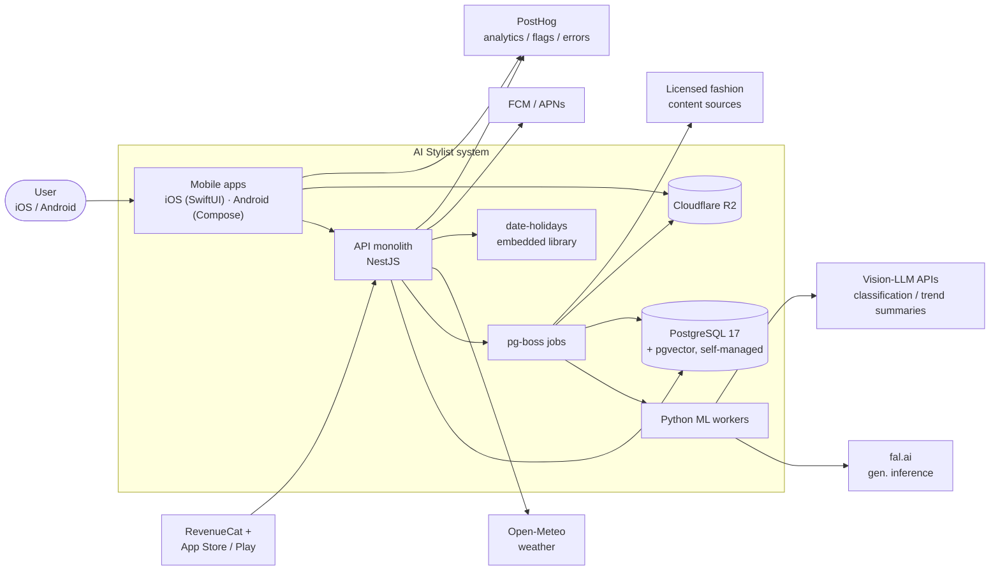
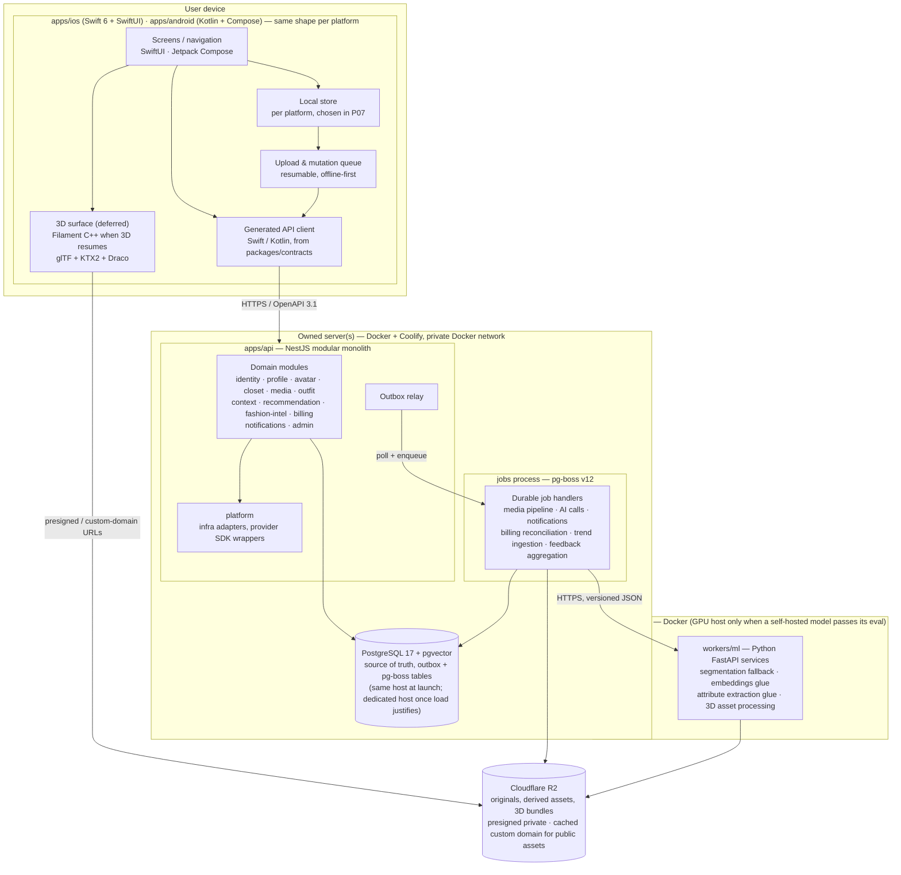
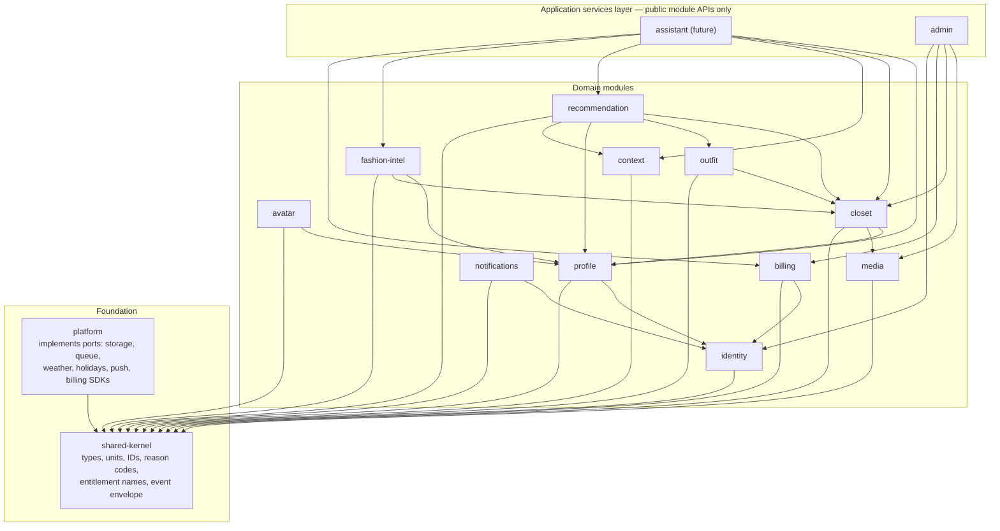
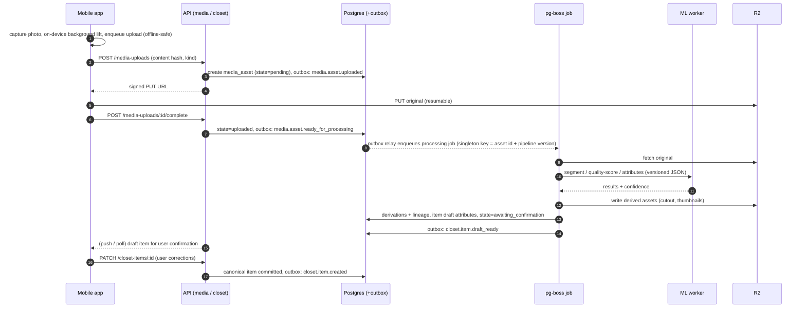
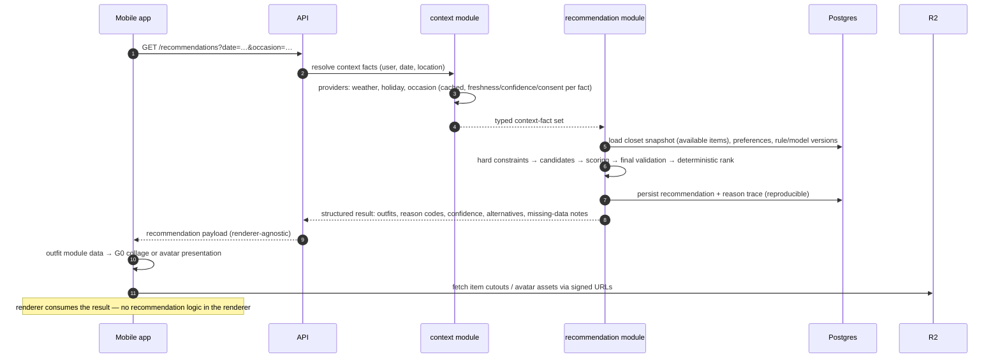
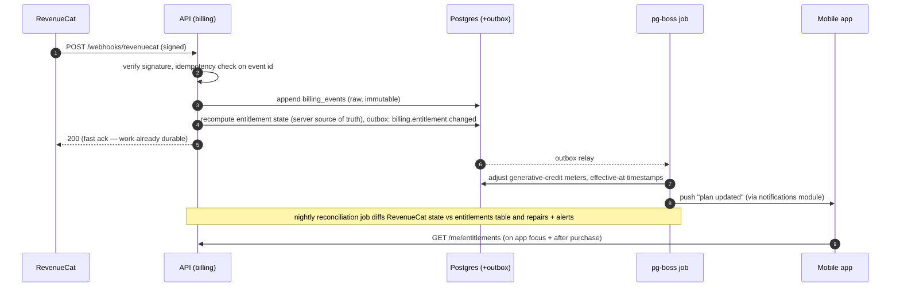

# 04 — Architecture

**Status:** Draft for ratification · **Date:** 2026-08-24 · **Conforms to:** [SPINE.md](SPINE.md) §2–§3 · **Amended:** 2026-09-13 ([r7](research/r7-third-party-services-and-self-hosting-audit-2026-09-13.md), ADR-0003 — pg-boss jobs, owned servers + Coolify, self-managed PostgreSQL, R2 delivery model) · **Amended:** 2026-09-22 ([ADR-0004](../docs/adr/0004-native-ios-and-android-clients.md), DEC-49–53: native iOS/Android clients replace React Native + Expo; §1, §2, §3, §4.3, §5, §6, §8 updated)
**Owns:** system context, containers, module boundaries and dependency rules, composition roots, repo layout, key data flows, sync/offline design, job/event flow (outbox), future chat seam, dependency-enforcement tooling.
**Does not own:** engine internals → [09-recommendation-engine.md](09-recommendation-engine.md) · asset pipeline stages → [07-3d-avatar-and-garment-pipeline.md](07-3d-avatar-and-garment-pipeline.md) · entitlement semantics → [12-pricing-entitlements-and-unit-economics.md](12-pricing-entitlements-and-unit-economics.md) · contract/schema details → [06-data-api-and-event-contracts.md](06-data-api-and-event-contracts.md).

---

## 1. Architecture in one paragraph

A **modular monolith** (NestJS on the Fastify adapter, TypeScript) serves all clients over an OpenAPI-3.1 contract. Durable asynchronous work (media pipeline, AI calls, notifications, billing reconciliation, trend ingestion) runs as **pg-boss v12 jobs** on the application database, fed reliably through a **Postgres outbox**. GPU/CV-heavy steps are delegated by those job handlers to separately deployable **Python FastAPI ML workers** over versioned JSON schemas. **Self-managed PostgreSQL 17** (+ pgvector) is the single transactional source of truth; **Cloudflare R2** holds all original and derived media/3D assets (private user media via presigned URLs; public app assets via a cached custom domain). API, jobs, workers and PostgreSQL run as Docker containers on owned servers deployed with Coolify (ADR-0003). Two **native client apps**, Swift/SwiftUI (`apps/ios`) and Kotlin/Jetpack Compose (`apps/android`), talk to the API only through clients generated from the contract (DEC-49, DEC-53). Each keeps an offline local store (introduced in P07). When 3D resumes, each renders through **Filament's C++ engine** behind a renderer boundary (DEC-50). There is no 3D in the apps today. *(Historical: until 2026-09-22 this was one React Native + Expo app rendering through `react-native-filament`.)* All external providers sit behind ports implemented in the `platform` module. No microservices until measured need (SPINE §2).

## 2. System context



Notes:

- The mobile app reads user media **directly from R2** via presigned GET URLs (uncached, TTL ≤ 10 min); public app/content assets (3D bundles, avatar/garment manifests) are served from the R2 custom domain with Cloudflare cache. It never proxies binaries through the API.
- Holidays come from the embedded `date-holidays` library behind `HolidayProvider` — no network call, no account (DEC-45).
- RevenueCat calls **into** the API (webhooks); the entitlement source of truth is our `billing.entitlements` table (doc 12).
- better-auth runs **inside** the API monolith (`identity` module) — auth is not an external container.
- PostHog receives consented analytics events and errors from both mobile apps and the backend; no raw sensitive payloads (doc 14). The foundation apps ship only a consent-gated no-op analytics port so far; no PostHog SDK is wired yet.

## 3. Container view



Container responsibilities:

| Container | Runtime | Deploy | Responsibility |
|---|---|---|---|
| `apps/ios` | Swift 6 + SwiftUI; XcodeGen project + local SwiftPM packages | GitHub Actions macOS runner → TestFlight / App Store (DEC-51) | All iOS UX; offline store; capture + upload queue; 3D behind the renderer boundary once it resumes |
| `apps/android` | Kotlin + Jetpack Compose; own Gradle root | GitHub Actions Linux runner → Play | All Android UX; same responsibilities as `apps/ios` |
| `apps/api` | NestJS (Fastify), Node, TS | Owned server, Docker + Coolify | All synchronous business logic; auth; OpenAPI surface; outbox writes + relay; provider ports |
| pg-boss jobs | pg-boss v12 (job definitions in `apps/api/src/jobs` — see §6); run in the API process or a dedicated `jobs` process | Owned server, Docker + Coolify | Durable async pipelines; retries/DLQ; orchestrate ML workers |
| `workers/ml` | Python 3.12, FastAPI, Docker | Owned server, Docker + Coolify (GPU host only if a self-hosted model passes its eval) | CV/ML steps needing Python/native tooling; stateless; versioned JSON contracts |
| PostgreSQL | PostgreSQL 17 + pgvector (`pgvector/pgvector:pg17`), PgBouncer, pgBackRest | Owned server, Docker (same host at launch; dedicated host once load justifies) | Transactional source of truth; embeddings; outbox + pg-boss tables; PITR to encrypted off-host R2 bucket |
| R2 | Cloudflare | Cloudflare | All binaries: originals, derivations, 3D delivery assets; presigned URLs for private media, cached custom domain for public app assets |

## 4. Module boundary map

Module names, responsibilities, and owned data are canonical in [SPINE.md](SPINE.md) §3 — not repeated here. This section defines the **allowed dependency graph** and how it is enforced.

### 4.1 Allowed dependencies



### 4.2 Dependency rules (binding, CI-enforced)

1. **Public API only.** Every module exposes a single entry point (`apps/api/src/modules/<name>/index.ts`). Importing `modules/<name>/internal/**` from another module is a build failure.
2. **`recommendation` ⊥ renderer.** `recommendation` never imports `avatar`, any 3D/asset type, or anything from the client renderers. It emits structured results (doc 06 §3.5); `outfit` + the client apps consume them. `recommendation → outfit` is allowed only for the item/composition **types** needed for candidates — never for presentation.
3. **`assistant` → application services only.** The future chat adapter may call the same public application services every client uses (§10). It owns no business logic, no direct table access, no second engine.
4. **Domain ⊥ provider SDKs.** No domain module imports a provider SDK (`pg-boss`, R2/aws-sdk, RevenueCat, fal.ai, Open-Meteo clients, FCM, PostHog). Domains declare **ports** (interfaces in the module's public API or `shared-kernel`); `platform` implements them; the composition root binds them.
5. **`platform` is leaf-only.** `platform` depends only on `shared-kernel` and provider SDKs. No domain module depends on `platform` directly — only on ports, wired at the composition root.
6. **`shared-kernel` depends on nothing** and contains no I/O, no tables, no framework imports. Types, constants, registries, pure functions only.
7. **No cycles.** The graph above is a DAG; dependency-cruiser fails CI on any cycle.
8. **Cross-module writes are forbidden.** A module writes only tables it owns (SPINE §3). Cross-module behavior goes through public application services, commands/queries, or events (§9).
9. **Business logic location.** No business rules in controllers, Drizzle schema files, pg-boss job handlers, provider wrappers, or UI views (SwiftUI/Compose; *were React components*). Controllers/handlers are thin: parse → call application service → map result.

### 4.3 Enforcement tooling

- **ESLint boundaries** (`eslint-plugin-boundaries`): element types `module`, `module-internal`, `shared-kernel`, `platform`, `composition-root`, `job-handler`, `contracts`; rules encode §4.2. Runs in `just lint` and PR CI.
- **dependency-cruiser**: whole-graph validation (`tools/depcruise/rules.cjs`) — cycle detection, forbidden-edge checks (e.g. `recommendation → avatar`, `modules → platform`, `* → **/internal/**`), orphan detection. Runs as `just arch-check` in PR CI; the same config renders the dependency graph SVG for docs.
- Native apps (DEC-49): ESLint and depcruise do not see Swift or Kotlin. **iOS:** SwiftPM target dependencies are the compiler-enforced boundaries (only `Core/APIData` depends on the generated client, and `Core`/`*Model` targets cannot import UI frameworks), backed by `just ios-check-banned` and its fixtures. **Android:** the Gradle module graph plus the `checkModuleGraph` allow-list (only `:core:data` depends on `:core:api-client`, features never depend on each other). When 3D resumes, the renderer gets its own package/module that only designated 3D screens may depend on. *(Historical: the RN app used an ESLint rule for `apps/mobile/src/render/**`.)*
- CI fails on violation; there is no warning tier. Exceptions require an ADR.

### 4.4 No generic `utils` dumping ground

There is no `utils/`, `helpers/`, or `common/` directory anywhere in the repo (lint rule bans creating them). A utility lives either **with the concept it serves** (inside the owning module) or, if genuinely cross-cutting and stable, in `packages/shared-kernel` with an explicit owner and tests. The search-before-write workflow (root `CLAUDE.md`) applies before adding any such function.

## 5. Composition roots

The only places where concrete adapters meet ports:

| Root | Path | Wires |
|---|---|---|
| API | `apps/api/src/main.ts` + `app.module.ts` | NestJS DI: binds every port token to its `platform` adapter; registers module public providers; config/env validation; OpenAPI doc emission |
| Job handlers | `apps/api/src/jobs/index.ts` | pg-boss job definitions importing **public** application services only; binds ports for the job runtime (R2 client, ML-worker HTTP client) |
| iOS | `apps/ios/App/` (`CompositionRoot`) | Config (host-only `API_BASE_URL`), generated API client via `APIData`, analytics port + consent gate; later the local DB, upload queue and renderer |
| Android | `apps/android/app/` (`AppContainer`, built in `Application`) | The same set as iOS; the only place that reads `BuildConfig` or constructs adapters |
| ML workers | `workers/ml/<service>/main.py` | FastAPI app factory; model versions pinned; settings from env |
| Tests | each module's `tests/` support | In-memory/fake port implementations from module-owned test support packages |

Everything else receives dependencies; nothing else constructs adapters.

## 6. Repository layout (pnpm workspaces + Turborepo)

```
.
├── apps/
│   ├── ios/                     # Swift 6 + SwiftUI (DEC-49)
│   │   ├── project.yml          # XcodeGen spec (generated .xcodeproj is gitignored)
│   │   ├── App/                 # @main + CompositionRoot, Info.plist, assets
│   │   └── Packages/
│   │       ├── Core/            # no UI: AppConfig, Analytics, AppServices, APIData (only generated-client user); tests/
│   │       └── Features/        # per screen: <Name>Model (view model) + <Name>Feature (SwiftUI); tests/
│   ├── android/                 # Kotlin + Jetpack Compose, own Gradle root (DEC-49)
│   │   ├── app/                 # :app, AppContainer (composition root), build types dev/preview/prod
│   │   ├── feature/<name>/      # feature modules (ViewModel + Compose screen); src/test
│   │   ├── core/{data,analytics,api-client}/  # pure Kotlin; api-client compiles the generated client
│   │   └── build-logic/         # convention plugins (compiler, lint, detekt, locking)
│   └── api/                     # NestJS modular monolith
│       └── src/
│           ├── main.ts, app.module.ts        # composition root
│           ├── modules/<name>/               # SPINE §3 module names, exactly
│           │   ├── index.ts                  # public API (only importable file)
│           │   ├── internal/                 # implementation, not importable
│           │   └── tests/                    # module-owned tests + test support
│           ├── platform/                     # port implementations, provider wrappers
│           └── jobs/                         # pg-boss job definitions (thin)
├── workers/
│   └── ml/
│       ├── segmentation/        # each: FastAPI service, Dockerfile, tests/
│       ├── attributes/
│       ├── assets3d/
│       └── generated/           # Python models generated from packages/contracts
├── packages/
│   ├── contracts/               # CANONICAL: OpenAPI 3.1, event schemas, generated clients (doc 06)
│   │   └── gen/                 # generated TS client, swift-client/, kotlin-client/ (never hand-edited)
│   └── shared-kernel/           # units, IDs, reason codes, entitlement names, event envelope
├── e2e/                         # shared Maestro flows for both native apps
├── assets/
│   └── 3d/                      # source 3D assets (Git LFS / artifact store), manifests, validation tooling — doc 07
├── tools/
│   ├── depcruise/               # architecture rules
│   ├── codegen/                 # contract generation scripts
│   └── bootstrap/               # Ubuntu setup + doctor
├── docs/ → planning/            # this planning package; ADRs in planning/16 + templates
├── justfile                     # root task runner (SPINE §2)
├── pnpm-workspace.yaml
└── turbo.json
```

Rules: large 3D binaries go through Git LFS or the R2-backed artifact store (doc 07), never raw Git. `packages/contracts` and `packages/shared-kernel` are the only packages both `apps/*` and `workers/*` may depend on — the client apps never import server internals. The native apps consume `packages/contracts` only through the generated Swift/Kotlin clients. They cannot import `shared-kernel` (TypeScript) yet, and a language-neutral emission is open (OQ-15).

## 7. Key request/data flows

### 7.1 Closet capture → processing → catalog

Pipeline stage semantics and state machine are owned by [07-3d-avatar-and-garment-pipeline.md](07-3d-avatar-and-garment-pipeline.md); this shows the container/module hand-offs.



### 7.2 Context → recommendation → render

Engine internals (constraint evaluation, scoring, tie-breaks) are owned by [09-recommendation-engine.md](09-recommendation-engine.md).



Offline: the mobile app caches the last N recommendations with their context timestamps and shows a staleness warning; it never re-ranks locally (doc 09).

### 7.3 Billing webhook → entitlement

Entitlement semantics, plans, and metering are owned by [12-pricing-entitlements-and-unit-economics.md](12-pricing-entitlements-and-unit-economics.md).



## 8. Sync and offline design (mobile)

**Principle:** the closet must be browsable and capturable offline; the server remains the source of truth for canonical and derived data.

- **Local store:** a native store per platform, **to be decided in the phase that introduces the local store (P07)** (DEC-49; *historical: the RN plan used expo-sqlite + Drizzle*). Tables mirror a read-model subset of `closet`, `outfit`, `profile`, plus local-only queues. Item images cached on the file system with an LRU disk budget (default 512 MB, configurable; doc 13 owns budgets).
- **Upload queue:** every capture and mutation is written locally first as an ordered, durable **mutation log** entry (`opId` ULID = idempotency key). A background drain pushes entries when connectivity returns; uploads to R2 are resumable (multipart, content-hash addressed, so retry never duplicates).
- **Pull sync:** delta sync via `GET /sync/changes?since=<cursor>` per module read-model; server assigns monotonically increasing change cursors. Push notifications hint "changes available" but sync never depends on push.
- **Conflict policy (deterministic, per-field class):**
  1. **User-authored fields** (name, tags, notes, availability state, manual attribute corrections): last-writer-wins on server-assigned version; a losing offline edit is preserved as a local "conflicted copy" surfaced for one-tap re-apply — never silently dropped.
  2. **Machine-derived fields** (extracted attributes, embeddings, generated views): server always wins; a user correction (class 1) permanently overrides derivation until the user resets it (doc 08 owns correction semantics).
  3. **Server-owned records** (entitlements, recommendations, media pipeline state): read-only on device; no conflicts possible.
  4. Deletes win over concurrent edits; tombstones retained for sync convergence, purged after 30 days.
- **Offline capture:** full capture loop works offline (photo, on-device background lift, local draft item). Processing states show honest "queued — waiting for connection" status. Recommendations offline = cached results + staleness banner (doc 09).

## 9. Job/event flow: outbox on Postgres + pg-boss

Brief §3.4 compliance: events and an outbox, no distributed event platform.

### 9.1 Shape

1. Every state change that must trigger async work writes a row to the **`outbox` table in the same Postgres transaction** as the domain write (table design: [06-data-api-and-event-contracts.md](06-data-api-and-event-contracts.md) §6).
2. A small **relay** in the API process polls `outbox` (`FOR UPDATE SKIP LOCKED`, batch ≤100, ~250 ms interval) and enqueues each event on the mapped pg-boss queue via `boss.send()`, passing the event envelope; on ack it marks the row dispatched. Outbox and pg-boss tables live in the same PostgreSQL, so the relay is a local write, not a network hop. At-least-once by construction.
3. Consumers are **pg-boss job handlers** (`apps/api/src/jobs/`, run in the API process or a dedicated `jobs` process; or in-process handlers for cheap same-service reactions). Every consumer is idempotent. Self-hosted Trigger.dev is the fallback only if the P02-T08 acceptance suite (kill/retry, idempotency, DLQ, replay, per-user cancellation, deletion/export scenarios) proves pg-boss insufficient (DEC-41).

### 9.2 Semantics (binding defaults)

| Concern | Policy |
|---|---|
| Idempotency keys | pg-boss `singletonKey` = event `id` (ULID) for event-driven jobs; = `entityId + pipelineVersion` for reprocessing jobs. Consumers also guard with a processed-events check where side effects are non-transactional (provider calls). |
| Retries | pg-boss `retryLimit` + `retryBackoff` (exponential, jittered); default max 5 attempts; media/AI pipeline jobs max 3 (expensive), notification sends max 5, billing reconciliation max 8. |
| DLQ | Exhausted jobs land in the queue's pg-boss dead-letter queue **and** the outbox row is marked `failed`; a nightly job sweeps failed rows into an `admin` moderation/ops queue with alerting (doc 14). Nothing is silently dropped. |
| Ordering | **No global ordering guaranteed.** Per-aggregate ordering is achieved by consumers using the envelope `sequence` (per-aggregate monotonic) and ignoring stale events (compare against stored version). Jobs needing strict serial execution per entity use a per-entity pg-boss queue (or `singletonKey` = entity id with a short throttle window) so one handler runs per entity at a time. |
| Replay | Events are facts; replay = re-dispatch from `outbox` (retained 90 days) or re-emit a synthetic `*.reprocess_requested` event. Replays carry the original event id so idempotency holds. Pipeline-version bumps (doc 07) drive bulk reprocessing via explicit reprocess events, never by mutating history. |
| Versioning | Envelope `type` carries a version suffix (`closet.item.created.v1`). Additive changes only within a version; breaking change = new version, consumers support N and N+1 during migration (rules: doc 06 §5). |
| Observability | Relay lag, outbox depth, oldest-unprocessed age, pg-boss queue depth and job failure rate are first-class metrics with alerts (doc 14). Every envelope carries `correlationId` for cross-container tracing. |

### 9.3 What is event-driven (and what is not)

Event-driven: media pipeline, derived-asset generation, notifications, billing webhook fan-out, credit metering, trend ingestion, feedback aggregation, deletion propagation, embedding generation.
Synchronous: auth, profile CRUD, closet reads, recommendation requests (compute inline with cached context), entitlement checks. Recommendations are request/response — never a background job at v1.

## 10. Future chat seam (`assistant`)

Per brief §2.9 and SPINE P15: no chat implementation before P15, but the seams exist earlier because they are the same application services every client uses. **By end of P09** the following public application services exist, are contract-documented, and are sufficient for a future chat adapter without a second engine or direct table access:

| Service (module) | Available from | Chat would use it for |
|---|---|---|
| `identity`: session/consent queries | P03 | authZ, consent gating per tool call |
| `profile`: get/update measurements & preferences | P03 | "make my style more casual" |
| `closet`: query items, availability, wear history | P06–P07 | "what black shoes do I own?" |
| `context`: resolve context facts | P08 | "what's the weather for Saturday?" |
| `recommendation`: request recommendation, submit feedback | P09 | "what should I wear tomorrow?" — same engine, same reason codes |
| `outfit`: compose/save outfits | P09–P10 | "save that second look" |
| `billing`: entitlement check, credit balance | P13 | gating chat itself and G2 credits |
| `fashion-intel`: personalized feed query | P12 | "what's trending in my style?" |

Seam rules established now: these services accept a **caller principal + consent scope** (not "the mobile app") so a chat tool-call is authorized identically; results are structured (reason codes, confidence) so chat explains from the decision trace, never invents. The `assistant` module, when built, is an adapter: prompt/versioning, tool-call limits, model routing, conversation storage — zero business logic (SPINE §3 dependency rules; cost/routing details deferred to P15 planning).

## 11. Cross-references

- Contracts, schemas, event catalog, outbox DDL, migrations, deletion propagation → [06-data-api-and-event-contracts.md](06-data-api-and-event-contracts.md)
- Asset pipeline stages, 3D formats, lineage, reprocessing → [07-3d-avatar-and-garment-pipeline.md](07-3d-avatar-and-garment-pipeline.md)
- Engine design, determinism, evaluation → [09-recommendation-engine.md](09-recommendation-engine.md)
- Entitlements, metering, billing lifecycle → [12-pricing-entitlements-and-unit-economics.md](12-pricing-entitlements-and-unit-economics.md)
- Budgets and reliability targets → [13-testing-quality-and-performance.md](13-testing-quality-and-performance.md)
- Observability of everything above → [14-observability-operations-and-analytics.md](14-observability-operations-and-analytics.md)
