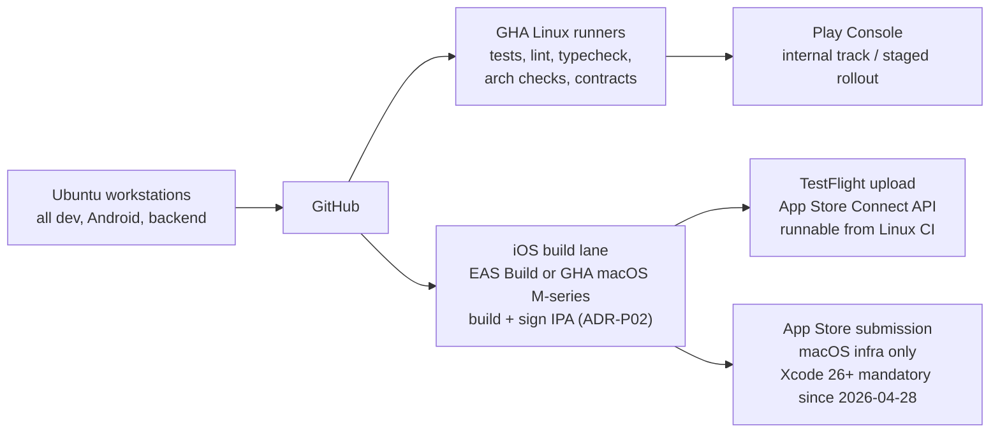

# 05 — Technology Decisions

**Status:** Ratified (mirrors [SPINE.md §2](SPINE.md)) · **Date:** 2026-08-24 · **All prices/versions as of Aug 2026 unless noted.**

This document is the full justification for the decision table ratified in [SPINE.md §2](SPINE.md). It does not change any decision. Evidence base: [r1](research/r1-linux-ios-build.md) (Linux/iOS build), [r2](research/r2-mobile-3d-stack.md) (mobile + 3D stack), [r3](research/r3-ai-providers-costs.md) (AI providers/costs), [r4](research/r4-backend-providers.md) (backend/providers), [r5](research/r5-avatar-garment-3d.md) (avatar/garment 3D). Where this doc and SPINE could ever diverge, SPINE wins; supersessions go through the decision log in [16-risks-open-questions-and-decision-log.md](16-risks-open-questions-and-decision-log.md).

---

## 1. Decision summary

| Area | Decision | Justified in | Prototype gate |
|---|---|---|---|
| Mobile framework | React Native + Expo (SDK 55+, prebuild/dev-client), TypeScript, New Architecture | [§2](#2-mobile-framework-decision) | P01 |
| 3D renderer | Filament via `react-native-filament` (margelo) | [§3](#3-3d-renderer-decision) | P01 |
| 3D asset formats | glTF 2.0 (.glb) canonical · KTX2/Basis textures · Draco or meshopt compression | [§3.4](#34-asset-format-decisions) | P01 |
| Parametric body model | Anny (Naver, Apache 2.0) | [§4](#4-parametric-body-model) | P01/P04 |
| Backend framework | NestJS on Fastify adapter (modular monolith + workers) | [§5.1](#51-backend-framework-nestjs-on-fastify) | — |
| API contract | OpenAPI 3.1 canonical, generated TS client (overrides r4's tRPC lean) | [§5.2](#52-api-contract-adr-openapi-31-over-trpc) | — |
| Database / vectors | PostgreSQL on Neon, Drizzle ORM, pgvector in-database | [§5.3](#53-database-neon-postgres--drizzle--pgvector) | — |
| Jobs/queue | Trigger.dev v4 | [§5.4](#54-jobsqueue-triggerdev-v4) | — |
| ML workers | Python FastAPI in Docker, versioned JSON schemas | [§5.5](#55-ml-workers-python-fastapi) | — |
| Object storage/CDN | Cloudflare R2 (+ image transforms) | [§5.6](#56-object-storagecdn-cloudflare-r2) · [§6](#6-external-provider-evaluation) | — |
| API hosting | Railway | [§5.7](#57-api-hosting-railway) | — |
| Auth | better-auth (self-hosted) | [§6](#6-external-provider-evaluation) | — |
| Subscriptions | RevenueCat + server-side entitlements table | [§6](#6-external-provider-evaluation) | — |
| Push | FCM + APNs direct | [§6](#6-external-provider-evaluation) | — |
| Analytics/crash/flags | PostHog (Sentry optional) | [§6](#6-external-provider-evaluation) | — |
| Weather | Open-Meteo (commercial plan for production) | [§6](#6-external-provider-evaluation) | — |
| Holidays | Nager.Date | [§6](#6-external-provider-evaluation) | — |
| AI/GPU (generative) | fal.ai primary; per-task provider table | [§6.2](#62-aigpu-provider-selection-per-task) | P11 eval gate |
| Fashion content | Licensed APIs/feeds — **open question OQ**, no scraping | [§6](#6-external-provider-evaluation) | P12 |
| iOS build/delivery | 100% Linux dev; EAS Build or GHA macOS lane; TestFlight via App Store Connect API; no Mac purchase | [§7](#7-linux-first-development--the-ios-reality) | ADR-P02 |
| Monorepo/CI | pnpm + Turborepo, `just`, `mise`; GitHub Actions | [§5.8](#58-monorepo-and-ci-tooling) · [§7](#7-linux-first-development--the-ios-reality) | — |

---

## 2. Mobile framework decision

**Decision: React Native + Expo (SDK 55+, prebuild/dev-client), TypeScript, New Architecture.** Rejected: Flutter (3D immaturity), fully native Swift/Kotlin (two codebases ≈ 2× cost for a 2–3 dev team).

### 2.1 Weighted decision matrix (from r2, Aug 2026)

| Criterion | Weight | RN + Filament | Flutter + flutter_filament | Native (RealityKit + Filament) |
|---|---|---|---|---|
| AI agent codegen productivity | 3 | 9/10 (TypeScript, single codebase) | 7/10 (Dart) | 4/10 (two codebases, language variance) |
| 3D integration maturity | 3 | 9/10 (Filament production-proven) | 5/10 (flutter_filament immature) | 10/10 (platform-native) |
| Parametric avatar support | 3 | 9/10 (glTF morph + skeletal full) | 8/10 (bindings newer) | 10/10 |
| Performance (mid-tier phones) | 2 | 8/10 (30–60 FPS achievable with LOD) | 9/10 (Impeller) | 10/10 |
| Type safety | 2 | 10/10 (TypeScript) | 7/10 (Dart) | 8/10 |
| Camera API quality | 2 | 9/10 (Vision Camera) | 8/10 | 10/10 (ARKit native) |
| Offline/storage | 1.5 | 9/10 (WatermelonDB/expo-sqlite) | 9/10 (sqflite) | 8/10 |
| Hiring/ecosystem | 1.5 | 10/10 (6× more US postings) | 6/10 | 7/10 |
| Monorepo tooling | 1 | 10/10 (pnpm + Turborepo) | 8/10 (Melos/Pub Workspaces) | 7/10 |
| OTA update flexibility | 1 | 9/10 (EAS Update) | 9/10 | 6/10 |
| **Weighted score** | — | **8.95** | **7.42** | **7.96** |

Source: [r2 decision matrix](research/r2-mobile-3d-stack.md), Aug 24, 2026.

### 2.2 Why the scores fall this way

- **New Architecture is settled, not speculative.** Expo SDK 55+ makes the New Architecture mandatory ("always enabled and cannot be disabled" — Expo docs); ~83% of SDK 54 EAS-built projects already use it (Shopify 2026 migration report). Shopify production numbers: 86% code shared across platforms, 43% faster cold start, 25% memory reduction (r2, primary source).
- **Flutter's UI story is excellent, its 3D story is not.** Impeller is default since Flutter 3.27 and genuinely fast, but Flutter GPU / flutter_filament remain **experimental/preview** as of Aug 2026 ("might occasionally introduce breaking changes" — Flutter blog). For a product whose core screen is a morphing 3D avatar, that is disqualifying today. Revisit condition recorded in [16-risks…](16-risks-open-questions-and-decision-log.md): flutter_filament reaching stable (r2 estimated late 2026 at the earliest).
- **Fully native scores highest on raw 3D but loses the project.** Two codebases means 2–3× development time and either a second platform hire or a ~50% velocity cut — unaffordable at 2–3 devs. It also scores worst for AI-agent-assisted development (inconsistent generation across Swift/Kotlin). It remains the documented deep-fallback if RN hits a hard ceiling (see pivot path below).
- **Team-fit criteria are weighted deliberately.** Per the product owner's decision (SPINE §1) the stack is chosen on technical merit *for this team*: AI-agent productivity, single TypeScript codebase, and hiring are first-class criteria, not tie-breakers.

### 2.3 P01 prototype gate (go/no-go, real devices only)

The matrix is evidence, not proof. Phase P01 builds a vertical prototype and measures on physical hardware. **No fabricated or emulator numbers are acceptable evidence** (brief §13).

| # | Gate criterion | Pass threshold |
|---|---|---|
| G1 | Avatar with morph targets (≥4 blend shapes animating) | **60 fps on iPhone 13-class**, **50 fps on Galaxy A52-class** |
| G2 | Interactive rotate (360° h / 90° v) + pinch zoom (2–8×) | Touch-to-response latency **< 50 ms** |
| G3 | Pose switching among 3–4 poses | No visible hitch; frame-time budget held |
| G4 | Camera/gallery batch import → local store → SQLite index → survives restart | Works offline, end to end |
| G5 | App package size (baseline + Filament + demo avatar) | **< 100 MB** IPA/APK |
| G6 | Memory footprint incl. 3D engine + assets | **< 300 MB** |
| G7 | Delivery | Same codebase built via EAS to **TestFlight and Play internal track**; zero platform-specific workarounds in the core 3D loop |

**Pivot path if the gate fails** (in order; each is an ADR in the decision log):

1. **Wrapper failure, Filament fine** → keep RN, drop `react-native-filament`, drive native Filament directly behind a JSI bridge (SPINE's named fallback).
2. **RN/3D integration failure on one platform** → platform-native 3D view (RealityKit iOS / Filament Android) embedded in the RN app; renderer boundary contract ([04-architecture.md](04-architecture.md)) makes this a bounded swap.
3. **Systemic RN failure** → fully native Swift/Kotlin, accepting the 2× cost; re-scope phases accordingly.
4. Flutter re-enters consideration **only** if flutter_filament stabilizes before a pivot decision is needed.

The renderer-boundary rule (recommendation engine and domain modules never depend on the renderer — brief §2.3, SPINE §3) is what keeps every one of these pivots affordable.

---

## 3. 3D renderer decision

**Decision: Google Filament via `react-native-filament` (margelo).** Version at decision time: react-native-filament **v1.11.0 (May 27, 2026)**, Filament core **v1.76.0** (r2, primary sources).

### 3.1 Why Filament

- **Feature-complete for our avatar needs:** full glTF 2.0 load path including **morph targets** (MorphHelper in gltfio), **skeletal animation** (`updateBoneMatrices()`), and PBR materials with image-based lighting — exactly the A1 parametric-avatar requirements (SPINE §4).
- **Native GPU backends:** Metal on iOS, Vulkan/OpenGL on Android — no WebGL translation layer.
- **Compression support in-engine:** Draco geometry and KTX2/Basis textures, which the asset budget depends on (§3.4).
- **Maintenance signal:** margelo's wrapper is actively released (v1.11.0 in May 2026); mitigation for wrapper risk includes maintainer relationship/sponsorship and the JSI-bridge fallback (r2, Risk 1).
- Known honest caveat (r2): no major consumer app is publicly proven on `react-native-filament` at scale — this is precisely why P01 is a mandatory gate rather than a formality.

### 3.2 Rejected alternatives

| Alternative | Verdict | Reasons (r2, Aug 2026) |
|---|---|---|
| **Unity as a Library** | Rejected | (a) **Size:** empty project with Unity Library AAR (17 MB) produces a ~60 MB APK — ~3.5× overhead before any product code; blows the <100 MB gate. (b) **Rendering constraint:** full-screen only — "Rendering on a part of the screen isn't supported" (Unity discussions, confirmed 2026), which breaks the embedded-avatar-in-native-UI pattern the product requires. (c) **License/ops:** an entire game-engine toolchain, editor licensing tiers, and a second build system for a 2–3 dev team (brief §4.1 explicitly flags game-engine embedding cost). |
| **react-three-fiber + expo-gl** | Rejected | Broken in practice on mobile as of 2025–2026: Expo SDK 53 ships `expo-gl@15` while R3F v8+ depends on `expo-gl@11`; the mismatch breaks real-device builds ("building and testing code on real devices is not possible at the moment" — r2 source). Works on web only. |
| **Flutter GPU / flutter_filament** | Rejected (for now) | Preview-only, main-channel, breaking changes expected (Flutter blog). Toyota's Fluorite engine signals future promise, not present stability. |
| **RealityKit (iOS) + Filament (Android), native** | Held as pivot #2, not primary | Best per-platform quality (SceneKit is soft-deprecated; RealityKit is the iOS future) but forces the two-codebase problem. Only reachable via the P01 pivot path. |

### 3.3 Renderer isolation contract

The renderer is a leaf. Avatar params, garment representations, outfit compositions, and recommendation results are renderer-independent contracts (owned by [04-architecture.md](04-architecture.md) and [07-3d-avatar-and-garment-pipeline.md](07-3d-avatar-and-garment-pipeline.md)). `recommendation` must never import `avatar`/renderer code (SPINE §3 dependency rules). This is what makes §2.3's pivots and any future renderer upgrade a bounded cost.

### 3.4 Asset format decisions

| Concern | Decision | Rationale (r2, r5) |
|---|---|---|
| Canonical interchange | **glTF 2.0, `.glb` binary** | Universal across Filament/Three.js/RealityKit; `.glb` avoids ~33% Base64 overhead of JSON `.gltf`; carries morph targets + skins + animations natively |
| Textures | **KTX2 + Basis Universal** | Stays compressed on GPU; ~10× GPU memory savings vs PNG/JPG; ~6–8× smaller files |
| Geometry | **Draco or meshopt (gltfpack)** | Draco: 90–95% geometry size reduction; meshoptimizer adds quantization/vertex-cache/LOD. Pipeline: raw GLB → gltfpack → glTF-Transform (KTX2, morph-target pruning) → production GLB; expected 70–85% total size reduction (r5) |
| Manifests | Versioned asset manifests (coordinate system, units, skeleton version, morph-target names, color space) | Brief §3.5; owned by [07-3d-avatar-and-garment-pipeline.md](07-3d-avatar-and-garment-pipeline.md) |
| Large binaries | Git LFS in P01–P05, migrate to DVC when asset experiments scale | r5 §5; keeps repo clean per brief §5.1 |
| USDZ | **Not** canonical; only as a future iOS AR export if ever needed | SPINE §2 |

Budget anchors (r2): single Draco+KTX2 avatar asset 0.5–2 MB; Filament native module ~5–8 MB per architecture; realistic 3D-heavy app 80–120 MB — hence the 100 MB P01 gate with headroom work planned (Expo Atlas, tree-shaking: 30–70% reductions claimed by Expo docs, to be verified in P01, not assumed).

---

## 4. Parametric body model

**Decision: Anny (Naver) — Apache 2.0.** Kept warm: MPFB2/MakeHuman (CC0 assets). Rejected: SMPL/SMPL-X family (licensing), Ready Player Me (license trap), Avaturn (cost), Daz3D (cost/restrictions). Evidence: [r5 §1](research/r5-avatar-garment-3d.md).

| Model | License | Cost | Commercial use | Notes (as of Aug 2026) |
|---|---|---|---|---|
| **Anny (chosen)** | Apache 2.0 | $0 | **Yes, unrestricted** | 11 interpretable shape params (height, weight, age, muscle, waist, cup size, …) + 256 local blend shapes; all-age coverage; differentiable, scan-free, anthropometrically grounded; PyTorch → glTF/GLB export |
| **MPFB2 (warm alternative)** | GPLv3 code / **CC0 assets** | $0 | Yes | Blender 4.2+ plugin; GLB export with morph targets; diverse bodies; mature Blender workflow. Fallback if Anny topology/rig proves unsuitable in P04 |
| SMPL / SMPL-X | Custom commercial | Undisclosed (negotiate) | Only if licensed | **The licensing trap:** research license prohibits commercial use; commercial path runs through Meshcapade — acquired by **Epic Games (announced Feb 2026, closing April 2026)**, so future terms are unknown. Undisclosed pricing + acquisition uncertainty = unacceptable foundation risk for a startup MVP |
| Ready Player Me | CC-BY-NC-SA 4.0 avatars | "Free"* | **No by default** | The non-commercial default on generated avatars is a trap for a paid app; commercial use needs a negotiated partnership. (Note: r3 lists the SDK as free — the *SDK* is; the *avatar assets* are not commercially licensed by default. r5's licensing read governs.) |
| Avaturn | SaaS | $800/mo Pro (6,000 avatars/mo, $0.15 overage) | Yes | Outsourced generation; poor unit economics at consumer scale |
| Daz3D | Custom | $2,500 game-dev license (Daz Originals only) | If licensed | Third-party content separately restricted; ecosystem lock-in |

**Why Anny over MPFB2 specifically:** interpretable parameters map directly from user measurements (bust/waist/hip circumferences → named params), which is the core of the measurement→morph calibration flow (brief §2.3); SMPL-style 10-param PCA spaces are opaque by comparison, and Anny's 11 + 256 local shapes give finer fit control (r5 §2). Measurement mapping design (30+ anthropometric points, 25–30% accuracy gain over simplified sizing per r5) is owned by [07-3d-avatar-and-garment-pipeline.md](07-3d-avatar-and-garment-pipeline.md).

**Selfie→face path** (context, owned by doc 07): on-device landmarks (ARKit 52 blendshapes / MediaPipe Face Landmarker) → stylized likeness (A2); server-side reconstruction (FaceLift-class, cloud-only in 2026) documented as the heavier path; generic face is the default. "Exact digital twin" claims are forbidden (SPINE §2).

---

## 5. Backend decisions

All from [r4](research/r4-backend-providers.md) (Aug 24, 2026) unless noted. Launch infra target: **~$30–35/mo**; ~$150–180/mo at 5k users.

### 5.1 Backend framework: NestJS on Fastify

**Decision: NestJS with the Fastify adapter** — the structure of NestJS at Fastify's speed (both ~15K req/s in r4's comparison).

- `@Module()` boundaries + DI directly express the modular monolith (SPINE §3's 15 modules); boundary enforcement is backed by ESLint boundaries + dependency-cruiser in CI.
- `@nestjs/swagger` emits the OpenAPI document that §5.2 makes canonical.
- Mature ecosystem + heavy documentation = strong AI-agent familiarity (a weighted concern for this team).
- Rejected: bare Fastify/Hono (weaker module/DI story for a 15-module monolith; Hono is edge-optimized, not our shape), AdonisJS (monolithic batteries conflict with separate workers), Go/Elixir (no decisive win to justify a second language for 2–3 TS devs).

### 5.2 API contract ADR: OpenAPI 3.1 over tRPC

> **ADR (ratified 2026-08-24, orchestrator reconciliation).** The r4 report recommended tRPC (+OpenAPI bridge) for its no-schema-duplication DX. **The orchestrator overrode this: OpenAPI 3.1 is the canonical contract**, with generated TypeScript clients for mobile (openapi codegen, e.g. `@hey-api/openapi-ts`), contract files owned by `packages/contracts`.

**Why the override — recorded so later agents do not reopen it without new evidence:**

1. **Multi-client future is a stated requirement, not a maybe.** The brief plans a future AI-stylist chat client that "must call the same profile, closet, context, recommendation, trend, and entitlement services as every other client" (brief §2.9), plus admin/support tooling (brief §3.2's admin module) and potential third-party surfaces. r4 itself concedes GraphQL/schema-first approaches win "for multi-client scenarios"; tRPC's advantage assumes a TypeScript-monoculture client set forever.
2. **Contract-first is mandated by the brief.** §5.5 requires canonical schema owners with generated clients and CI failing on stale generation; §6 requires contract tests for mobile/backend APIs and version compatibility. An explicit, versioned, language-neutral OpenAPI 3.1 document is that artifact. A tRPC router is an implementation, not a contract — its "schema" is the server's TypeScript, which is exactly the coupling brief §5.2 forbids ("how the mobile application shares contracts without sharing server internals").
3. **Decoupling mobile from server internals.** With tRPC, mobile type-imports the server's router types; server refactors leak into the app. With OpenAPI, mobile consumes a generated client from a versioned contract file that reviews as a diff.
4. **The cost of the override is small.** NestJS generates OpenAPI from the same decorators/DTOs we write anyway; `@hey-api/openapi-ts` gives typed RN clients. We lose tRPC's zero-ceremony DX, and accept that as the price of an explicit contract.
5. **Python workers already forced a schema boundary.** ML workers speak versioned JSON schemas (§5.5); one contract discipline (OpenAPI/JSON Schema) covers both seams instead of two mechanisms.

Contract mechanics (versioning, codegen commands, CI staleness checks, event schemas/outbox) are owned by [06-data-api-and-event-contracts.md](06-data-api-and-event-contracts.md).

### 5.3 Database: Neon Postgres + Drizzle + pgvector

- **Neon** (serverless Postgres): scale-to-zero after 5 min idle, 100 CU-hrs + 0.5 GB free, $0.106/CU-hr (Launch tier), branch-per-PR (10 branches) — dev/preview databases without ops. Est. ~$10–15/mo at launch, ~$40/mo at 1k MAU. Rejected: Prisma-style RDS/Supabase floor costs and ops weight at this scale (Supabase $25/mo floor; RDS $30–100+/mo).
- **Drizzle ORM** + drizzle-kit migrations: SQL-shaped, ~5KB, edge-compatible; momentum crossing Prisma in serverless contexts (r4, March 2026 npm data). Prisma remains the named alternative if DX is preferred over footprint.
- **pgvector in the same Postgres** for garment/style embeddings and near-duplicate detection: ~8ms average latency, no second datastore, no API round-trip for joins; pgvectorscale benchmarks at 471 QPS @ 50M vectors. Dedicated vector DB (Pinecone $0.70/hr/index) rejected **until** >10M vectors or <50ms p99 is a measured need (brief §13 rule 8).

### 5.4 Jobs/queue: Trigger.dev v4

Durable pipelines for the media/AI state machine (brief §3.5): built-in idempotency, retries, DLQ semantics, warm starts 100–300ms, tasks running minutes-to-hours. Free tier ($5 credit ≈ ~13,774 small runs/mo) covers launch. v4 GA since Aug 2025.
Rejected: Temporal (ops weight indefensible for 2–3 devs), BullMQ (we'd own Redis + workers + monitoring; also violates "Redis only when justified" — brief §4.3). **pg-boss kept as the self-hosted fallback** (SPINE §2) if Trigger.dev pricing or lock-in becomes a problem — jobs land back in the Postgres we already run.

### 5.5 ML workers: Python FastAPI

Separately deployable Docker services (Railway or Hetzner) for anything needing Python/native tooling (segmentation fallback, embedding jobs, future reconstruction). Interop pattern: Trigger.dev task → HTTP POST with a **versioned JSON schema** payload (Pydantic on the Python side) → result resumes the parent workflow. No gRPC/protobuf at this scale (r4). Satisfies brief §4.3's "workers separately deployable, but don't split every domain."

### 5.6 Object storage/CDN: Cloudflare R2

**Zero egress is the decision.** At r4's model of 1 TB/mo egress for a media-heavy app: R2 ≈ **$15/mo** vs S3+CloudFront ≈ **$170/mo** (~70×+ egress-driven difference at scale; storage $0.015/GB-mo, Class A $4.50/M, Class B $0.36/M). Built-in CDN, signed URLs for private media, Cloudflare Images transforms ($0.50/10k) for responsive variants. Bunny was cost-competitive but adds a vendor without adding capability.

### 5.7 API hosting: Railway

Usage-based, per-second billing, no monthly minimum, private networking to DB; ~$15/mo API at launch. Fly.io the named alternative if global edge placement becomes a measured need; **Hetzner + Coolify is the cost fallback at scale** (SPINE §2) — €7.99/mo CPX22-class VPS — accepted only when the team can afford the ops burden. Kubernetes explicitly not justified (brief §13 rule 8).

### 5.8 Monorepo and CI tooling

pnpm workspaces + Turborepo (the default 2026 stack for this team size per r2; Expo SDK 55 has native monorepo support — note r2's caveat that EAS historically assumed Yarn; the pnpm build-hook workaround is validated in P02). Root task runner **`just`**; toolchain pinned via **`mise`**; one-command bootstrap + doctor script (brief §5.4). CI on GitHub Actions: Linux runners for everything except the iOS build lane (§7).

---

## 6. External provider evaluation

Every provider sits behind an owned port in `platform`/`context` (SPINE §3); **no provider type ever appears in domain code** (brief §4.4). Full 10-dimension evaluation:

| Provider (port) | Data rights | Coverage | Pricing driver | Rate limits | Privacy | Reliability | Lock-in | Fallback | Caching | Replacement cost |
|---|---|---|---|---|---|---|---|---|---|---|
| **Open-Meteo** (`WeatherProvider`) — **commercial API plan for production** (free tier is non-commercial-only; r4 cites a $500/mo production tier as of Aug 2026 — re-verify current commercial tiers at P08 contract time) | Forecast data, no user data sent beyond coordinates | Global, 30+ models, 15-day hourly | API calls/mo (plan tier) | Plan-based | Coarse coords or manual city only — never precise location without consent (brief §3.6) | High (multi-model) | Low — plain REST | **Tomorrow.io** (premium upgrade path); WeatherKit if user base skews Apple | Cache per (geohash, hour); forecasts stale-marked via context-fact freshness | Low — port + normalized context facts |
| **Nager.Date** (`HolidayProvider`) | Free, open-source, self-hostable | 200+ countries | $0 (fair use) | Fair-use public endpoint | No personal data — locale only | Good; self-host removes dependency | None (can self-host) | **Calendarific** ($100/yr, 500 req/mo free) | Holidays cacheable **per country-year** — near-total cache hit rate | Trivial |
| **better-auth** (identity adapter) | Self-hosted — all auth data stays in our Postgres | Apple + Google sign-in, passkeys, MFA, orgs | $0 (OSS; our compute) | Ours to set | Best posture: no third-party processor for credentials | Ours to operate; **risk: security patching burden is ours** | Low (own DB schema) | **Clerk** (50k MAU free, then $0.02/MAU) if maintenance burden proves too high | Session caching internal | Medium — auth migrations are always painful; mitigated by owning the user table |
| **FCM + APNs direct** (`PushProvider`) | Tokens only; no content to 3rd-party beyond Google/Apple (unavoidable) | All Android + iOS | **$0**, unlimited | Practical platform limits | Minimal payloads; no sensitive data in pushes (brief §3.6 logging rules apply) | Platform-grade | Low — both are the base layer every vendor wraps | OneSignal (rejected as unneeded vendor: $9/mo for a wrapper) | Delivery scheduling in `notifications` module | Low |
| **RevenueCat** (billing adapter) | Purchase metadata; **our entitlements table stays source of truth** (SPINE §2) | App Store + Play, cross-platform entitlements | Free < $2.5k MRR, then **1% of tracked revenue** | Generous | Purchase data only; no PII beyond app user ID | High; plus reconciliation job guards against webhook loss | **Medium** — webhook/SDK shapes proprietary; mitigated by idempotent webhook handling into our own table | Direct StoreKit 2 + Play Billing (revisit > $5k MRR when 1% ≈ an infra bill) | Entitlement state cached server-side, pushed to client | Medium — SDK swap + re-verification path |
| **Cloudflare R2** (`StorageProvider`) | Our objects; Cloudflare is processor | Global CDN | Storage GB + operations; **egress $0** | High | Signed URLs, short-lived; EXIF stripped before store (brief §3.5) | High | **Low by design — S3-compatible API** | Any S3-compatible store (S3, Bunny); zero-egress makes exit copies cheap | CDN edge caching built-in; safe invalidation rules in doc 14 | Low (S3 API portability) |
| **PostHog** (analytics/flags/errors) | Event data under our taxonomy; EU/US hosting selectable | Product analytics, session replay, error tracking, feature flags, A/B | Events/mo (1M free), replays (5k free), errors (100k/mo free) | Volume-based | **Consent-gated, no raw sensitive payloads** (brief §7); redaction rules in doc 14 | Good | Medium — event history export possible, flags re-implementable | **Sentry** for mobile crash if PostHog's error tracking proves insufficient; Unleash/Flagsmith for flags | Client-side event batching; flag values cached with TTL | Medium — taxonomy is ours (portable), history is sticky |
| **fal.ai** (AI/GPU — primary generative; see §6.2) | Per-task; face/body media only after privacy review (SPINE §2 AI data policy) | Flux/VTON-class models, warm-pool serverless | Per image (~$0.003–0.025 by model/res) | Plan-based | Provider retention/training terms reviewed per task; default **no training on customer data** | Warm pools: ~100ms-class cold start, ~0.5s platform overhead | Medium — model APIs proprietary but task contracts are ours | **Replicate** for batch (cheap but 10–120s cold starts — rejected for real-time); RunPod/Modal self-host past ~200–300M tokens/mo or ~2M embeddings/mo break-even | **Content-hash dedup: never regenerate the same input** (brief §3.1); results stored with lineage | Medium — provider abstraction + eval suite makes swaps testable |
| **Fashion content sources** (`fashion-intel` ingestion) | **OPEN QUESTION (tracked in doc 16)** — licensed APIs/editorial feeds only; **no scraping as a business foundation** (brief §2.8) | TBD: candidate licensed trend/runway APIs and syndicated editorial feeds to be evaluated in P12 | Licensing fees TBD | TBD | Provenance + attribution mandatory; moderation pipeline required | TBD | TBD — contracts must include source-disappearance terms | Editorial/manual curation at small scale is the honest fallback | Ingested content stored with provenance + freshness | Unknown until sourcing decided — this is a P12 blocking decision, not an implementation detail |

Rejected without ports: OneSignal (above), remove.bg (per-image cost vs $0 on-device — §6.2), Clerk/Firebase auth (cost/lock-in vs better-auth), Expo Push service tier ($99/mo unnecessary given FCM/APNs direct; the Expo notifications *client module* is still used).

### 6.2 AI/GPU provider selection per task (from r3, Aug 2026)

Deterministic-before-AI governs every row (brief §3.1); full AI decision table, budgets, and eval gates are owned by [10-ai-usage-cost-and-evaluation.md](10-ai-usage-cost-and-evaluation.md).

| Task | Primary | Fallback / escalation | Unit cost (Aug 2026) |
|---|---|---|---|
| Background removal | **On-device**: Apple Vision subject lift (iOS) / ML Kit Subject Segmentation (Android) | Server: BiRefNet/RMBG-class on fal.ai (~$0.001/img GPU); remove.bg rejected ($0.20–1.00/img) | **$0** on-device |
| Classification & attributes | Vision-LLM structured extraction with JSON schema (Gemini Flash-class or Claude Haiku); Google Cloud Vision for coarse labels ($1.50/1k img, 1k/mo free) | Ximilar Fashion Tagging (custom quote, est. $0.003–0.01/img) only if eval precision insufficient | ~$0.0015–0.005/img |
| Embeddings / dedup | Multimodal embedding API (Cohere Embed v4-class, $0.47/1M image tokens ≈ $0.0005/img) | Self-hosted SigLIP/CLIP past ~200–300M tokens/mo (A10G ~$0.75/hr break-even) | ~$0–0.0005/img |
| Explanations | **Templates from structured reason codes** (deterministic, $0); Claude Haiku batch + prompt caching for optional NL polish (batch 50% + cache 90% stack ≈ 95% off) | GPT-5.4 Nano-class | ~$0.00001–0.0001/explanation |
| Generative try-on / missing views (G2) | **fal.ai** (Flux/VTON-class; VTON ~$0.003–0.01/img, Flux Schnell $0.025, Flux Pro $0.05) | Replicate or Gemini Batch API for non-realtime batch (50% off) | $0.003–0.025/img (SPINE range) |
| Trend summarization | Claude Haiku batch + cache, server-side, cached across users | Gemini Flash-class | ~$0.0001/user/mo |

Cost anchors carried into [12-pricing…](12-pricing-entitlements-and-unit-economics.md): steady-state AI cost/user/mo ≈ $0.02–0.08 light–medium, $0.10–0.15 heavy; onboarding spike $0.10–0.30/user (r3 §6–7). **Data policy:** default no provider training on customer data; prefer zero/short retention (Anthropic 7-day API retention, never trained; OpenAI 30-day; Google contract-dependent — r3 §1.3). Face/body media goes only to providers passing the privacy review in [11-security…](11-security-privacy-and-compliance.md).

---

## 7. Linux-first development & the iOS reality

**Decision (SPINE §2): develop 100% on Ubuntu; hosted macOS CI for iOS builds/signing; TestFlight upload via App Store Connect API from CI; no Mac purchase. Final EAS-vs-GHA choice = ADR-P02.** Evidence: [r1](research/r1-linux-ios-build.md), Aug 24, 2026.

### 7.1 The explicit, non-negotiable statement

Everything about Android and backend development is excellent on Ubuntu. **The complete iOS release lifecycle cannot be done locally on Ubuntu, and this plan never implies otherwise:**

- **iOS Simulator** — macOS-exclusive; no Linux equivalent exists, and the Simulator doesn't support Metal anyway, so real-device testing is mandatory for our camera + 3D app regardless.
- **Metal shader toolchain** — Metal shader compilation requires Xcode's `metal` toolchain on macOS; no cross-compiler or open-source replacement exists. (For us this is absorbed inside the RN/Expo iOS build on macOS CI runners.)
- **App Store submission** — as of **April 28, 2026, Xcode 26+ is mandatory for App Store uploads** (Apple Developer News). Submission runs on macOS infra (EAS Submit, Xcode Cloud, or a macOS CI step); there is no Linux bypass.
- **Signing/provisioning** — Apple's proprietary chain; managed for us server-side by EAS or by CI-held certificates (fastlane match-style) on macOS runners.

What **does** work from Linux: all coding, Android builds/testing, backend/workers, **TestFlight IPA upload via the App Store Connect API** (fastlane `upload_to_testflight` and GitHub Actions on Linux runners both work — the IPA must already be signed on macOS), and physical-device installs of dev builds.

### 7.2 EAS Build vs GitHub Actions macOS lane (ADR-P02 decides)

| Dimension | **EAS Build** | **GitHub Actions macOS (M-series)** |
|---|---|---|
| Model | Managed RN/Expo build service; signing handled server-side | Raw macOS runners; we own fastlane/signing scripts |
| Pricing (Aug 2026) | Free tier: **15 iOS + 15 Android builds/mo**; paid from **$199/mo** | **$0.12/min** (M-series large), $0.16/min (XL); free-plan included minutes are Linux-oriented |
| Cost at our cadence (~20 builds/mo × ~12 min) | $0 while within free tier; a $199 jump if we exceed it | ~240 min ≈ **$29/mo**, linear thereafter |
| Setup/maintenance | Near-zero; deepest Expo integration (dev-client, EAS Update, EAS Submit) | Days of fastlane/cert setup; ongoing script ownership |
| Signing/cert management | Managed by EAS | Ours (match-style repo or App Store Connect API keys) |
| Lock-in | Medium (Expo services) — but config is `eas.json`, exit path is exactly the GHA lane | Low |
| Flexibility (custom native steps, caching) | Constrained to EAS images | Full control |

**Leaning recorded for ADR-P02:** start on **EAS free tier** during P01–P02 (zero setup, matches the Expo dev-client workflow the prototype needs), and stand up the **GHA macOS lane in P02** as the scale path — at $0.12/min it costs ~$29/mo versus EAS's $199/mo cliff once the free tier is exceeded. Budget envelope either way: **~$30–50/mo** (SPINE §2). Xcode Cloud's free 25 compute-hrs/mo is noted as a supplementary/submission option. Codemagic (500 free M2 min/mo, then $333/mo) and Bitrise ($99+/mo, opaque credit pricing) are documented alternatives, not the plan. Renting (~$85–119/mo) or buying (~$600 one-time) a Mac mini stays a fallback only if cloud lanes prove unreliable — the product owner's no-Mac-purchase decision stands (SPINE §1).

### 7.3 xtool assessment: why it is not in our pipeline

**xtool** (xtool-org/xtool; requires Swift 6.1+, releases built with Swift 6.2, actively maintained through 2026) cross-compiles **SwiftPM packages** into iOS apps from Linux, signs with ad-hoc/dev profiles, and sideloads to devices.

- **Why not viable for us:** xtool is **Swift-only and SwiftPM-based — it cannot build React Native (or Flutter) projects at all** (r1 §1). Our app is RN; xtool is categorically irrelevant to our build pipeline.
- **What it can do** (for the record): build/sign/install SwiftUI apps to physical devices from Linux; programmatic Apple Developer Services access.
- **What it can't do even for native Swift apps:** no Metal shader compilation, no iOS extensions (widgets/clips), no asset catalogs, no Interface Builder, no LLDB, and **no App Store submission**.
- **Residual value for us:** none in the critical path. At most a curiosity if we ever ship a tiny native Swift companion utility.

### 7.4 Ubuntu day-to-day

Android SDK/emulator, Expo dev-client, Metro, backend, workers, Postgres, and all CI-parity checks run natively on Ubuntu (setup owned by [15-team-workflow-and-ai-agent-operations.md](15-team-workflow-and-ai-agent-operations.md)). iOS day-to-day iteration uses the Expo dev-client installed on physical iPhones (built by the macOS lane infrequently), with JS-level changes delivered over the wire — so the macOS lane is exercised on native-dependency changes and releases, not every code edit. Real-device iOS testing uses team-owned test iPhones; cloud device farms (AWS Device Farm-class) are the documented backstop for device-matrix coverage (doc 13).

---

## 8. Prototype gates & assumptions register

Every material assumption below must be validated by a prototype/eval before the phases that depend on it. Failures route to the recorded pivot, not to improvisation. Register also mirrored in [16-risks-open-questions-and-decision-log.md](16-risks-open-questions-and-decision-log.md).

| # | Assumption (currently unproven) | Validation | Phase | Pass criteria | On failure |
|---|---|---|---|---|---|
| A1 | `react-native-filament` renders a morphing avatar at target fps on mid-tier real devices | P01 vertical prototype, §2.3 gates G1–G3 | **P01** | 60 fps iPhone 13-class / 50 fps Galaxy A52-class, <50 ms touch | Pivot ladder §2.3 (JSI-native Filament → native 3D views → full native) |
| A2 | App size and memory stay in budget with Filament + assets | §2.3 G5–G6 | **P01** | <100 MB package, <300 MB memory | Asset diet (LOD/KTX2/Draco tuning); if structural, revisit renderer embedding |
| A3 | EAS delivers the same codebase to TestFlight + Play internal without platform forks | §2.3 G7 | **P01** | Both stores receive builds; zero platform-specific 3D workarounds | Switch lane per §7.2 comparison; escalate to ADR-P02 early |
| A4 | pnpm monorepo + EAS build hooks coexist (r2's Yarn-assumption caveat) | P02 CI bring-up | **P02** | Green iOS+Android builds from pnpm workspace | Yarn workspaces fallback (tooling-local change) |
| A5 | EAS vs GHA macOS lane: cost + reliability at our cadence | Run both lanes 2 weeks | **P02 (ADR-P02)** | Chosen lane ≤ $50/mo, <10% build flake | Adopt the other lane; Mac rental as last resort |
| A6 | Anny topology/rig survives our morph ranges and export path (Anny → glTF → Filament) with stable topology | Measurement→morph spike on Anny GLB in the P01 harness | **P01/P04** | Morphs within realistic bounds, no mesh artifacts across param extremes | MPFB2 (CC0) swap — same glTF contract |
| A7 | Measurement→param mapping produces avatars users recognize | P04 calibration testing, diverse body set | **P04** | Users can correct to satisfaction via calibration screen (metric owned by doc 12/00) | More points/regression work; fall back to slider-first calibration |
| A8 | On-device segmentation (Apple Vision / ML Kit) is good enough for closet cutouts | P06 eval on garment photo set | **P06** | Eval precision threshold set in doc 10; server fallback rate < target | Raise fal.ai BiRefNet fallback share; costs re-checked against r3 model |
| A9 | Vision-LLM structured extraction hits classification precision targets at ~$0.002/img | P06 eval suite (doc 10 dataset) | **P06** | Precision/recall gates from doc 10 | Escalate to Ximilar; re-price unit economics |
| A10 | G2 generative try-on quality is acceptable across body types/garments at $0.003–0.025/img | P11 eval + user testing, provenance-marked | **P11** | Eval + satisfaction gate (doc 10); **kill criteria defined before build** | Ship without G2 (G0 collage remains the always-available fallback — MVP stays valuable, brief §11) |
| A11 | Trigger.dev free tier covers launch job volume; pg-boss migration is a bounded swap | P02 pipeline skeleton + load test in P06 | **P02/P06** | Job cost within infra budget; idempotency/retry/DLQ proven in tests | pg-boss on Neon (self-hosted fallback) |
| A12 | Neon scale-to-zero cold starts don't harm API latency budgets | P02 observability baseline + P03 walking skeleton | **P03** | API p95 within budget (doc 13) with realistic idle patterns | Keep-warm compute floor or Railway Postgres |
| A13 | Licensed fashion-content sourcing exists at viable cost (OQ) | Provider outreach + licensing review | **before P12 build** | Signed/signable licensed source(s) with attribution + takedown terms | Editorial/manual curation at small scale; feed scope reduced — never scraping |
| A14 | RevenueCat webhook→entitlements reconciliation is airtight | P13 contract + replay tests | **P13** | Idempotent webhook tests + reconciliation job green (doc 13 security tests) | Direct StoreKit2/Play Billing path (documented alternative) |
| A15 | On-device face landmarks → stylized likeness (A2) is achievable without server reconstruction | P05 spike (ARKit / MediaPipe) | **P05** | Likeness acceptable per consented user testing; generic-face fallback always offered | Ship generic face + documented server path later; no promise of likeness in marketing until proven |

---

## 9. Version & date notes

All decisions ratified **2026-08-24** against these versions/prices. Re-verify anything load-bearing at the phase that consumes it; the r3 review checkpoint is **Oct 1, 2026** (post-Gemini-2.5 sunset Oct 16, 2026).

| Item | Version / price pin (as of Aug 2026) | Source |
|---|---|---|
| Expo SDK | 55+ (New Architecture mandatory; default since SDK 52) | r2 |
| react-native-filament | v1.11.0 (May 27, 2026) | r2 |
| Filament (core) | v1.76.0 | r2 |
| Flutter | Impeller default since 3.27; Flutter GPU/flutter_filament in preview | r2 |
| Anny | Naver release, Apache 2.0; 11 params + 256 local blend shapes | r5 |
| SMPL/Meshcapade | Epic Games acquisition announced Feb 2026, closing April 2026; terms unknown — monitor quarterly | r5 |
| Xcode requirement | Xcode 26+ mandatory for App Store uploads from **2026-04-28** | r1 (Apple Developer News) |
| GHA macOS M-series | $0.12/min (large), $0.16/min (XL) | r1 |
| EAS Build | Free: 15 iOS + 15 Android builds/mo; paid $199/mo | r1 |
| Trigger.dev | v4 (GA Aug 2025); free $5 credit; $0.0000169–0.00068/sec | r4 |
| Neon | $0.106/CU-hr Launch, $0.222 Scale; free 100 CU-hrs + 0.5 GB | r4 |
| Cloudflare R2 | $0.015/GB-mo storage; $0 egress; $4.50/M writes, $0.36/M reads | r4 |
| Railway | Usage-based, ~$15/mo API at launch | r4 |
| RevenueCat | Free < $2.5k MRR, then 1% | r4 |
| PostHog | Free: 1M events, 5k replays, 100k errors/mo | r4 |
| Open-Meteo | Free tier non-commercial; production tier $500/mo per r4 — **re-verify commercial tiers at P08** | r4 |
| Claude (API) | Opus 5 $5/$25 · Sonnet 5 $2/$10 · Haiku 4.5 $1/$5 per M in/out; batch 50% + cache 90% stack; 7-day retention, never trained | r3 |
| Gemini | 3.1 Flash $0.50/$3.00; 2.5 Flash sunset Oct 16, 2026 | r3 |
| fal.ai | VTON-class ~$0.003–0.01/img; Flux Schnell $0.025; Flux Pro $0.05; ~100ms-class warm starts | r3, r5 |
| Cohere Embed v4 | $0.47/1M image tokens | r3 |
| Google Cloud Vision | $1.50/1k images; 1k/mo free | r3 |
| Infra totals | ~$30–35/mo launch; ~$150–180/mo at 5k users; iOS CI ~$30–50/mo | r4, r1 |

**Hypothesis labeling:** all pricing-tier figures feeding [12-pricing…](12-pricing-entitlements-and-unit-economics.md) are hypotheses requiring market testing (SPINE §6). No benchmark number in this document originates from us; every performance figure is a cited third-party claim to be re-measured at its gate (brief §13 rules 2–4).
