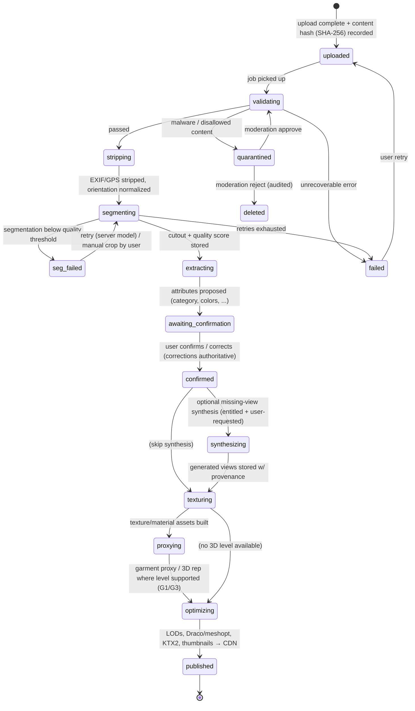

# 07 — 3D Avatar & Garment Pipeline

**Status:** Planning-ratified · **Date:** 2026-08-24
**Owns:** parametric avatar system (A0–A2), selfie→face path, poses/camera/lighting, renderer boundary contract, garment capability ladder (G0–G4), missing-view synthesis rules, media/asset pipeline state machine, asset formats/manifests, GPU/memory budgets, 3D R&D spikes.
**Conforms to:** [SPINE.md](SPINE.md) §2 (Anny, Filament, glTF/KTX2/Draco, fal.ai), §4 (capability codes).
**Evidence:** [research/r5-avatar-garment-3d.md](research/r5-avatar-garment-3d.md) (primary), [research/r2-mobile-3d-stack.md](research/r2-mobile-3d-stack.md) (renderer/formats), [research/r3-ai-providers-costs.md](research/r3-ai-providers-costs.md) (per-image costs).
**Related docs:** schema/event conventions → [06-data-api-and-event-contracts.md](06-data-api-and-event-contracts.md) · how attributes feed the engine → [09-recommendation-engine.md](09-recommendation-engine.md) · AI cost/eval detail → [10-ai-usage-cost-and-evaluation.md](10-ai-usage-cost-and-evaluation.md) · face/body data privacy → [11-security-privacy-and-compliance.md](11-security-privacy-and-compliance.md) · credits/entitlements → [12-pricing-entitlements-and-unit-economics.md](12-pricing-entitlements-and-unit-economics.md).

---

## 1. Honesty contract for this document

Everything below obeys the brief's honesty requirements (§2.2, §2.4). The four avatar fidelity terms are used precisely and must be used the same way in UI copy, marketing, and code comments:

| Term | Meaning | Our capability code | What we may claim |
|---|---|---|---|
| **Parametric avatar** | A base mesh adjusted by measurements/sliders. Shaped *like* the user, not *of* the user. | A1 | "An adjustable 3D model with your proportions." |
| **Personalized likeness** | Parametric avatar + stylized face derived from selfie landmarks. Recognizable style cues (face shape, skin tone, hair), not a reproduction. | A2 | "A stylized avatar that resembles you." Never "looks exactly like you." |
| **Reconstructed head** | Full 3D head geometry regressed from photo(s) (FaceLift-class, server-side). Higher fidelity, still approximate. | A2+ (documented server path, not MVP) | "A 3D reconstruction from your photos — approximate, with a quality score." |
| **Scan-quality digital twin** | Sub-centimeter accurate body/face from multi-camera scanning. | A3 — **explicit non-goal** | We never claim this. The phrase "digital twin" is banned from product copy. |

Equivalent garment honesty: a **catalog photo**, a **2D cutout**, an **inferred texture**, a **garment proxy**, and a **simulation-ready 3D garment** are five different artifacts and are never conflated in UI or schema (§6). Every generated pixel carries a provenance marker and confidence (§7).

---

## 2. Capability ladders (canonical codes from SPINE §4)

**Avatar:** A0 generic base · A1 parametric-adjusted (MVP) · A2 stylized face from selfie (optional, consented) · A3 scan-grade twin (**non-goal**).
**Garment:** G0 2D flat-lay/collage (always-available fallback) · G1 2.5D overlay · G2 generative photo try-on (MVP premium) · G3 template 3D garment + texture projection (later, gated) · G4 reconstructed 3D + cloth sim (**research bet**).

**MVP = A1 + G0 + G2.** The product is valuable if G3/G4 never ship: closet organization ([08](08-closet-taxonomy-and-organization.md)) and recommendations ([09](09-recommendation-engine.md)) do not depend on any 3D garment capability.

---

## 3. Parametric avatar system (A1)

### 3.1 Base mesh set — inclusive by construction

Body model: **Anny** (Naver, Apache 2.0) — 11 interpretable shape parameters + 256 local blend shapes, anthropometrically grounded, all-age support, exportable to glTF (r5 §1). Fallback kept warm: MPFB2 (CC0).

We do **not** ship "one male model and one female model." We ship a small set of **presentation-neutral base meshes** that are starting points in a continuous parameter space:

- `base/anny-adult-v1` — single adult topology; all adult body diversity is reached through shape parameters, not separate stereotyped meshes. Anny's parameter space covers masculine, feminine, and androgynous morphologies continuously.
- Onboarding offers **starting presets** (not "genders"): a handful of preset parameter vectors labeled by silhouette (e.g., "broad-shouldered," "curvy," "straight," "softer") plus "start from my measurements." Presentation/gender identity lives in `profile` and is **not coupled to body geometry** (brief §2.1); pronouns/presentation never constrain which body parameters are reachable.
- Minors: out of scope pending the age policy in [11-security-privacy-and-compliance.md](11-security-privacy-and-compliance.md); child base meshes are not shipped even though Anny supports them.

Rule: **one topology per base mesh version.** Every morph target and every garment attachment references vertex indices of that topology, so topology changes are versioned events (§3.7), never silent edits.

### 3.2 Shape parameters

Anny's 11 interpretable parameters (height, weight/mass, muscularity, age, chest/cup, waist, hips, shoulder breadth, limb proportions, etc.) are the **canonical avatar state**. The 256 local blend shapes are *derived refinement*, driven by the mapping layer and calibration sliders — they are never the source of truth. Persisted state (`avatar_configs`, owned by the `avatar` module) is:

```
AvatarConfig v1 {
  baseMeshId: "anny-adult-v1",
  shapeParams: { height_cm, mass_kg, muscularity, chest, waist, hips, shoulders, inseam_ratio, ... },  // 11 named scalars, SI units
  refinements: { <blendShapeName>: weight },   // sparse; only user-touched sliders
  appearance: { skinToneId, hairStyleId, hairColorId, ... },   // §3.6
  faceAsset?: ref,                              // A2 only, §5
  version: { schema: 1, rig: "anny-rig-v1", topology: "anny-topo-v1" }
}
```

Schema conventions, units, and versioning rules follow [06-data-api-and-event-contracts.md](06-data-api-and-event-contracts.md). Measurements themselves are owned by `profile`; `avatar` consumes them read-only.

### 3.3 Measurement → morph mapping

**Approach** (deterministic before AI, brief §3.1): a fitted **linear/low-order regression from measurements to Anny parameters** — no neural network, no server call. Anny's parameters are interpretable, so most measurements map near-directly (height→height, waist circumference→waist, …); the regression handles cross-terms (e.g., weight given height). Evidence: 30+ anthropometric points yield 25–30% better fit accuracy than size-category approaches (r5 §2), but we must be useful from 2 fields.

**Input tiers** (progressive onboarding, brief §2.1):

| Tier | Inputs | What we can honestly say |
|---|---|---|
| T0 | none (preset only) | "A generic starting avatar." (A0) |
| T1 | height + weight | "Approximate proportions." Confidence: low-medium. |
| T2 | + bust/chest, waist, hips | "Your key proportions." Confidence: medium-high. |
| T3 | + inseam, shoulder, sleeve, thigh, neck… (up to ~20 fields, all optional) | "A close match to your measurements." Confidence: high. Still a parametric avatar, not a scan. |

**Realistic bounds.** Every measurement field has hard bounds (physiological plausibility, e.g., height 120–230 cm for adults) and **conditional plausibility ranges** derived from anthropometric data (e.g., waist given height+weight within a generous corridor). Every Anny parameter is clamped to the model's valid range; clamping is recorded, never silent.

**Incomplete measurements:** missing fields are imputed from provided fields via the same regression (e.g., hips from waist+height), each imputed value flagged `source: "estimated"` with confidence. Estimated values appear in the calibration screen as adjustable *estimates*, visually distinct from user-entered facts. The system never presents an imputed value as something the user told us (brief: never silently invent personal facts).

**Conflicting / implausible measurements:** validation runs at entry time in three severities:
1. **Hard-invalid** (out of physical bounds, unit-confusion patterns like 65 for height with metric selected) → inline rejection with unit hint; value not stored.
2. **Implausible-together** (mutually unlikely combination, e.g., T2 circumferences inconsistent with T1 weight by a wide margin) → non-blocking "please double-check" prompt naming the specific fields; user can confirm ("yes, that's correct") — an explicit confirmation **overrides the check and is stored as authoritative** with a `userConfirmedOutlier` flag; the avatar uses the confirmed values clamped only to Anny's mathematical range.
3. **Low-confidence** (sparse input) → no prompt; confidence shown on the calibration screen with a nudge to add measurements.

The body is not a compliance problem: prompts say "double-check the number/units," never comment on the body itself (brief §3.6: no body shaming; also no health/BMI framing anywhere).

### 3.4 Calibration / review UX contract

After mapping, the user always lands on a **calibration screen** (Phase P04) — the correction loop the brief requires:

- Live 3D preview (rotate/zoom) of the mapped avatar in neutral pose.
- Grouped sliders (overall / torso / limbs) bound to shape params and a curated subset of local blend shapes. Slider edits are stored in `refinements` as deltas so re-running the mapping (new measurements, model upgrade) **never discards user corrections** — mapping output and user delta are composed, and on conflict the user delta wins.
- A visible confidence/quality indicator ("based on 3 of 12 measurements") — never a fake precision claim.
- "Reset to my measurements" (drops refinements, explicit confirm) and per-group undo.
- Accepting the calibration emits `avatar.calibrated` (event conventions in [06](06-data-api-and-event-contracts.md)); the recommendation engine may read *measurements and fit preferences* from `profile` but never reads avatar geometry (§4.3).
- Accessibility: every slider operable via screen reader with value announcements; a non-3D fallback shows a 2D silhouette proxy + numeric fields (§10.3).

Metric: calibration correction magnitude and abandonment are tracked per [14-observability-operations-and-analytics.md](14-observability-operations-and-analytics.md) — large systematic corrections are eval signal for the mapping regression (dataset: consented, anonymized parameter deltas only, no photos).

### 3.5 Skeleton, rig, and topology stability rules

- One canonical rig per base mesh version (`anny-rig-v1`): humanoid skeleton, fixed joint names/hierarchy, exported as glTF skin. Pose clips (§4.1) target this rig only.
- **Topology stability:** morph targets displace vertices; they never add/remove vertices or change triangulation. All morphs for a base mesh are authored against the frozen `anny-topo-v1` vertex order. CI validates every exported GLB: identical vertex count/order across all morph targets, joint-weight sums = 1, morph-target names match the manifest registry.
- Skinning weights are authored once on the base mesh and must remain valid across the whole reachable parameter space; extreme-parameter poses are part of the visual regression suite ([13-testing-quality-and-performance.md](13-testing-quality-and-performance.md)).
- Garment attachment (G1/G3) references **named anchor sets** (semantic vertex groups: neckline, waistline, shoulder seam, wrist, ankle…), not raw vertex indices, so garment assets survive compatible mesh revisions.

### 3.6 Skin tone, hair, and appearance customization

- **Skin tone:** continuous picker over a perceptually spaced ramp covering the full human range (validated against Monk Scale-like coverage in P04 design review — inclusive representation is an acceptance criterion, not a nice-to-have). Implemented as PBR base-color + melanin-aware shading params, not texture swaps, so tone is uniform across LODs. Stored as `skinToneId` + exact value.
- **Hair:** curated library of style meshes (card-based, cheap to render) across textures/curl patterns and lengths, each tintable via a full-range color picker. Library breadth across hair types is an inclusivity acceptance criterion in P04.
- **Optional:** facial-hair, eyewear-as-appearance, and basic face-shape sliders (independent of A2). All appearance choices are user-declared; nothing is inferred from photos except within the consented A2 flow.

### 3.7 Avatar asset versioning & migration

Every avatar-relevant asset is versioned along three axes: `schema` (config shape), `topology`, `rig`. Rules:

- Client bundles declare which `(topology, rig)` versions they can render; the asset manifest (§9) is the compatibility source of truth.
- **Config migrations** (schema bumps) are pure functions, tested with fixture configs, run lazily on read + backfilled by job.
- **Topology/rig bumps** (new base mesh generation) trigger a server-side re-derivation job: re-run measurement mapping on the new base, re-apply stored `refinements` semantically (by named blend shape, with a mapping table for renamed shapes; unmappable refinements are surfaced to the user, not dropped silently). The old rendered avatar remains available until the user reviews the migrated one on the calibration screen. Old assets are kept per retention policy in [11](11-security-privacy-and-compliance.md), then deleted.
- A2 face assets are bound to a head-topology version; incompatible bumps put the face into `needs-recapture` state with an honest explanation, never a degraded silent approximation.

---

## 4. Poses, camera, lighting

### 4.1 Standard poses (4, brief-required)

| Pose ID | Purpose | Notes |
|---|---|---|
| `pose.neutral` | Default A-pose-relaxed; calibration and catalog views | Baseline for garment attachment |
| `pose.casual-walk` | Mid-stride casual stance | Conveys everyday drape/energy |
| `pose.seated` | Seated, occasion-appropriate | Reveals rise/hem behavior seated |
| `pose.fit-reveal` | Arms slightly raised, feet apart | Shows silhouette and fit without distorting garments; tuned in P04 with G-level constraints |

Poses are short skeletal clips (static or subtle idle loops) targeting `anny-rig-v1`, shipped in the base asset bundle. Adding a pose = adding a clip + manifest entry; no code change.

### 4.2 Rotation, camera, lighting

- Free 360° horizontal orbit, clamped ±30° vertical, pinch-zoom 0.5–3×; double-tap resets. Touch response target <50 ms (hypothesis, gate in P01).
- Camera presets per context: full-body, upper-body, detail (shoes/accessories).
- Lighting: one neutral studio IBL (prefiltered KTX2 environment) as default; a small preset set (studio / warm indoor / daylight) later. Color-accuracy rule: the default IBL is neutral-white so garment colors read true; "mood" lighting is opt-in and labeled, since misrepresenting garment color undermines trust.
- Reduced-motion setting disables idle animation and auto-rotate.

### 4.3 Renderer boundary contract

Hard architectural rule (SPINE §3): **`recommendation` never imports the renderer, `avatar`, or any Filament type; renderer code never contains recommendation logic.** The seam is a structured value object owned by `outfit`:

```
OutfitPresentation v1 {
  outfitId, recommendationId?,          // traceability to reason codes (doc 09)
  avatarRef: { configId, version },     // opaque to the engine
  slots: [ { slotId: "top|bottom|dress|outer|shoes|bag|...", itemId,
             representation: { level: "G0|G1|G2|G3", assetRef, provenance, confidence } } ],
  requestedPose: poseId, requestedCamera: presetId,
  fallbackChain: ["G3","G1","G0"]       // renderer degrades gracefully, never blocks on missing 3D
}
```

The mobile renderer module consumes `OutfitPresentation` and resolves the best renderable representation per slot from the asset manifest. Replacing Filament (or adding a web renderer, or the future assistant rendering a collage) touches only consumers of this contract. Contract schema and versioning per [06](06-data-api-and-event-contracts.md).

---

## 5. Selfie → face path (A2, optional, consented)

### 5.1 Primary path (MVP-adjacent, Phase P05): on-device landmarks → stylized likeness

1. Guided capture: framing/lighting/pose guidance, quality validation (blur, exposure, single-face check), retake loop (brief §2.2).
2. **On-device** landmark extraction: ARKit face blendshape coefficients (iOS) / MediaPipe Face Landmarker (Android) (r5 §3). The selfie itself **does not leave the device** in this path.
3. Landmarks + user-confirmed appearance choices drive head blend shapes and appearance params → **stylized likeness** on the avatar head.
4. Review screen with quality/confidence indicator; user can adjust or discard. Honest copy: "a stylized avatar that resembles you" — never "exact," never "twin."
5. Fallback when one selfie is insufficient (low landmark confidence): offer guided multi-angle capture (front + two ¾ views) or keep the generic face. Generic face is always a first-class, zero-shame option.

Derived landmark vectors are face-derived biometric-adjacent data: stored encrypted, classified per [11](11-security-privacy-and-compliance.md), deletable independently of the account.

### 5.2 Documented server path (not MVP; behind its own gate)

For higher fidelity later: consented upload of 1–3 selfies → server-side reconstruction (FaceLift-class 360° head, r5 §3) → **reconstructed head** asset with quality score. Requirements before this ever ships: separate explicit consent (distinct from A2 landmark consent), short-lived signed upload URLs, provider passing the privacy review in [10](10-ai-usage-cost-and-evaluation.md)/[11](11-security-privacy-and-compliance.md) (no training on user data, short retention), server-side deletion propagation into derived assets, and the R&D spike gate in §11. Until then this path exists only as this paragraph and its ADR stub.

### 5.3 Consent, retention, deletion, misuse

- Explicit, revocable consent screen before any face processing; declining leaves a full-featured app with a generic face.
- Retention: original selfies are discarded after derivation by default (user may opt to keep for re-derivation); derived face assets live until user deletion, face-feature deletion, or account deletion — all three propagate to every derived asset and CDN copy (deletion lineage in §8.4).
- **Misuse protections:** capture-first UX (live camera default), liveness-style heuristics on gallery imports (single face, frontal, quality) with an "is this you?" attestation; processing photos of identifiable third parties is prohibited by ToS and enforced by moderation on the server path; no face search, no cross-user face matching, ever. Full abuse-case list in [11](11-security-privacy-and-compliance.md).

---

## 6. Garment capability ladder (G0–G4)

Per-level contract. Costs are provider prices verified 2026-09-09 in [r6](research/r6-pricing-verification-2026-09-09.md) (superseding r3/r5 figures); serving costs and credit pricing are owned by [10](10-ai-usage-cost-and-evaluation.md)/[12](12-pricing-entitlements-and-unit-economics.md).

| | Input required | Output artifacts | Honest quality expectation | Marginal cost | Phase |
|---|---|---|---|---|---|
| **G0 — flat-lay / collage** | 1 front photo (min capture) | segmented 2D cutout + thumbnails | "Your real photos, arranged as an outfit." No body context, no fit info. Always available; the permanent fallback. | ~$0 (on-device segmentation; server fallback ~$0.001/img) | P06/P10 |
| **G1 — 2.5D overlay** | G0 cutout + avatar | warped cutout anchored to avatar in 1–2 poses | "An approximate preview on your avatar." Works for fitted garments; loose garments and complex poses look wrong — labeled approximate. | ~$0 runtime (deterministic warp) | post-P10, optional; may be skipped if G2 quality makes it redundant |
| **G2 — generative photo try-on** (MVP premium) | user photo (or avatar render) + garment photo | photorealistic try-on **image(s)**, provenance-marked | "A realistic AI-generated preview — not a physical fit measurement." Small text/logos may distort; fine patterns may blur; multi-angle costs extra images. | $0.07–0.075/image (fal.ai FASHN/Kling; $0.021/MP FLUX 2 LoRA if it passes eval — SPINE §2); **3 generative credits** (missing view = 1) | P11 |
| **G3 — template 3D garment** | G0 cutout + category → matched template mesh | template glTF garment + projected user texture, attached to avatar, all poses | "Your garment's colors and pattern on a standard 3D shape of that garment type." Shape is the template's, not the item's exact cut. | authoring: template library (outsourced, ~$50–500/template, one-time); runtime ~$0 + texture-projection job ~$0.001–0.01 | later, gated by SPK-3 |
| **G4 — reconstructed 3D + cloth sim** | multi-view capture (aspirational: single view) | simulation-ready garment mesh + physics params | Research bet. Not production-ready in 2025–26 (mobile cloth sim ≈ toy resolutions; single-image reconstruction under-constrained — r5 §4). No user-facing promise until SPK-4 passes. | unknown; bounded by spike budget | research only |

Cross-cutting rules:
- Every item always has G0. Higher levels are *additive representations* recorded per item in `garment_representations` (owned by `outfit`), each with level, asset refs, provenance, confidence, and generation lineage.
- Entitlement gating (G2 credits, G3 access) happens at the application-service layer per [12](12-pricing-entitlements-and-unit-economics.md), never inside the renderer.
- A capability that fails its eval gate ships nothing: the UI simply continues offering the lower level, which is designed to be good on its own.

---

## 7. Missing-view synthesis rules

Applies to G2-era synthesis of garment views (back/side) the user did not capture (Phase P11, `missing-view` credit type):

1. **Only for views the user did not capture.** A successfully captured real view is never replaced, regenerated, or "enhanced" by a generated one. If the user captured a blurry back photo, we offer retake — not silent synthesis.
2. Every generated view stores `provenance: "ai_generated"` (class per [03 §1.5](03-domain-model-and-glossary.md)) with model id/version, prompt/config hash, source-asset lineage, timestamp, and a confidence score; UI renders a visible provenance badge and the confidence indicator (brief §2.4).
3. **Replaceable later:** capturing a real photo of that view supersedes the generated one (state `superseded`, §8.4); the real photo becomes canonical everywhere immediately, and dependent derivatives (textures, G3 projections) are invalidated and requeued.
4. Generated views never feed attribute extraction or embeddings as if they were observations — classification and dedup run on real captures only, so synthesis errors cannot corrupt closet data ([08](08-closet-taxonomy-and-organization.md)).
5. Quality gate before serving: automatic checks (garment-category consistency, color-histogram distance from real views within threshold); failures are discarded and refunded per credit rules in [12](12-pricing-entitlements-and-unit-economics.md), not shown.

---

## 8. Media & asset pipeline (brief §3.5)

Owned by the `media` module; jobs on Trigger.dev with idempotency keys (idempotency/outbox conventions in [06](06-data-api-and-event-contracts.md)). All stages are idempotent and resumable; the mobile upload queue is offline-tolerant (P06).

### 8.1 Pipeline state machine



State names are canonical identifiers (SPINE §8 terminology rule); doc [06](06-data-api-and-event-contracts.md) owns their schema/event encoding. Every transition emits an event with correlation id; queue-age and failure-rate metrics per [14](14-observability-operations-and-analytics.md).

### 8.2 Stage notes

- **Upload + content hash:** original is immutable; SHA-256 hash is the dedup key at byte level (visual/semantic dedup lives in [08 §11](08-closet-taxonomy-and-organization.md)) and the cache key preventing repeated paid processing of the same image (brief §3.1).
- **Validation/moderation:** malware scan + content classification; NSFW/disallowed → `quarantined` with moderation queue in `admin`.
- **EXIF strip:** all metadata including GPS removed before any storage that outlives the job; orientation baked in.
- **Segmentation + quality score:** on-device first (Apple Vision subject lift / ML Kit) at capture time; server fallback BiRefNet/RMBG-class on fal.ai (SPINE §2). Quality score stored; low score → guided retake or manual crop, not silent bad cutouts.
- **Attribute extraction + user confirmation:** vision-LLM structured extraction per [10](10-ai-usage-cost-and-evaluation.md); results are *proposals* until the user confirms in the P06 review UI. **User corrections are authoritative** and versioned (details + eval feedback loop in [08 §10](08-closet-taxonomy-and-organization.md)).
- **CDN publish:** R2 + signed URLs; per-item derivative set: original (private), cutout, thumbnails (2–3 sizes), palette swatch, level-specific assets.

### 8.3 Reprocessing after model upgrades

New segmentation/extraction model versions trigger selective reprocessing (by model-version watermark on derivatives). Rules: reprocessing **never overwrites user-corrected fields** — model output lands as a new proposal; where a correction exists, the correction stands and the disagreement is logged as eval data. Derived-asset invalidation follows lineage edges only (hash-unchanged originals are not re-fetched or re-billed).

### 8.4 Lineage

Every derived asset row records: parent asset(s), producing stage + model/version/config hash, provenance class (`original_capture | derived_deterministic | ai_generated | user_corrected` — canonical values in [03 §1.5](03-domain-model-and-glossary.md)), and status (`active | superseded | deleted`). Supersession (real photo replacing generated view; corrected crop replacing auto crop) links old→new. Deletion propagates down lineage edges (original deleted ⇒ all descendants deleted, including CDN invalidation) — the mechanism backing the privacy guarantees in [11](11-security-privacy-and-compliance.md).

---

## 9. Asset formats & manifests

Per SPINE §2 (evidence r2 §4): **glTF 2.0 (.glb)** canonical scene/mesh format; **KTX2/Basis** textures; **Draco or meshopt** mesh compression; USDZ only as a possible iOS AR export, never internal.

Conventions (locked so every tool agrees): meters, Y-up, right-handed, glTF PBR metal-rough, sRGB for color textures / linear for data maps, morph-target and joint names from the shared-kernel registry, animation clips named `pose.*`.

**Asset manifest** (JSON, schema owned by `packages/contracts` per [06](06-data-api-and-event-contracts.md)) is the unit of delivery: manifest id + semver, compatibility (`topology`, `rig`, min client version), entries (asset id, type, LOD level, byte size, hash, CDN path), and dependency edges. Clients download by manifest, verify hashes, and cache with LRU eviction (target cache ≤ 300 MB, configurable). Source 3D assets live in the artifact store (Git LFS at current scale, r5 §5), not loose in Git; the authoring pipeline is Blender-headless + gltfpack/glTF-Transform in CI with the topology validations from §3.5.

## 10. Performance budgets, fallbacks, accessibility

### 10.1 Budgets — **hypotheses until P01 measures them** (brief §3.7: no fabricated benchmarks)

| Budget | High tier (iPhone 15+/flagship) | Mid tier (iPhone 13 / Galaxy A52-class) | Low tier |
|---|---|---|---|
| Avatar render frame rate | 60 fps | ≥30 fps | 3D off by default (§10.2) |
| First avatar render (cold) | <2 s | <4 s | n/a |
| App memory incl. 3D scene | <300 MB | <300 MB | — |
| GPU texture memory (avatar+outfit) | <150 MB | <100 MB | — |
| Base avatar bundle | ≤2 MB (Draco+KTX2) | same | same |
| Battery: 5 min 3D viewing | <2% (hypothesis) | <3% | — |
| Thermal | no sustained throttle in 10-min session | same | — |

P01 (prototype gate) replaces hypotheses with measurements on real devices; [13](13-testing-quality-and-performance.md) owns the recurring device-lab regression gates. Thermal/battery responses: dynamic resolution scale, capped frame rate on `thermalState >= serious`, idle-animation pause.

### 10.2 Low-end fallbacks

Capability detection at startup (GPU tier, RAM, thermal history) selects a rendering tier: full 3D → reduced 3D (lowest LOD, no idle animation, capped 30 fps) → **static renders** (server- or install-time-rendered avatar images per pose, swiped like a carousel) → **2D silhouette + G0 collage**. Every screen that shows the avatar must define its non-3D layout; no feature may be 3D-only.

### 10.3 Accessibility alternative to 3D (brief §2.3)

A user who cannot or prefers not to use the 3D view gets an equivalent path, not a degraded one: outfit as structured list + G0 collage with full screen-reader labels (item names, colors, attributes from [08](08-closet-taxonomy-and-organization.md)); avatar calibration via numeric fields; recommendation reasons are text-first anyway ([09](09-recommendation-engine.md)). Reduced-motion honored globally; 3D canvas exposes accessibility labels and never traps focus. Test plan in [13](13-testing-quality-and-performance.md).

## 11. R&D spikes (measurable success + kill criteria)

Budgets and datasets detailed per spike in phase files; consent-safe eval datasets per [10](10-ai-usage-cost-and-evaluation.md). Killing a spike is a planned outcome, not a failure: each has a shipping fallback.

| Spike | Question | Success criteria (measured) | Kill criteria | Fallback if killed |
|---|---|---|---|---|
| **SPK-1 single-selfie face (P05 pre-gate)** | Does on-device landmarks → stylized likeness produce a face users accept? | ≥70% of pilot users keep the derived face after review; landmark extraction succeeds on ≥90% of guided captures across skin-tone/lighting slices; on-device processing <3 s | acceptance <50% after two tuning rounds, or material quality gap across demographic slices that tuning doesn't close | generic face + appearance customization (§3.6); server path (§5.2) stays a separate future gate |
| **SPK-2 missing-view synthesis quality (P11 gate)** | Are generated back/side views good enough to charge a credit for? | ≥80% of generated views pass automatic consistency checks; ≥75% user keep-rate; cost ≤$0.05/view; p95 latency ≤20 s | keep-rate <50%, or provider cost/latency breaks the credit economics in [12](12-pricing-entitlements-and-unit-economics.md) | closet works on real views only; G2 try-on unaffected |
| **SPK-3 template-3D garments, G3** | Do ~10 garment templates + texture projection produce previews users prefer over G0/G2? | ≥10 templates covering top categories; projection artifact rate <20% on eval set; A/B preference vs G0 ≥60%; render maintains §10.1 mid-tier budgets; template cost within authoring budget | preference not reached, or per-template cost/coverage math doesn't scale past pilot categories | G2 remains the premium try-on; G1 optional |
| **SPK-4 cloth simulation, G4** | Long-horizon: can any mobile-viable path (on-device PBD, server-side sim renders) reach acceptable drape? | interactive sim ≥30 fps at useful cloth resolution on mid-tier, or server-rendered sim clip <10 s and <$0.05/clip, with drape judged plausible in blinded review | 2025–26 state (r5 §4: 72 fps at 32×32 on Quest 3-class only) persists — expected outcome; re-evaluate no more than annually | G2/G3 ceiling; explicitly acceptable per SPINE (G4 is a research bet, not a roadmap promise) |
