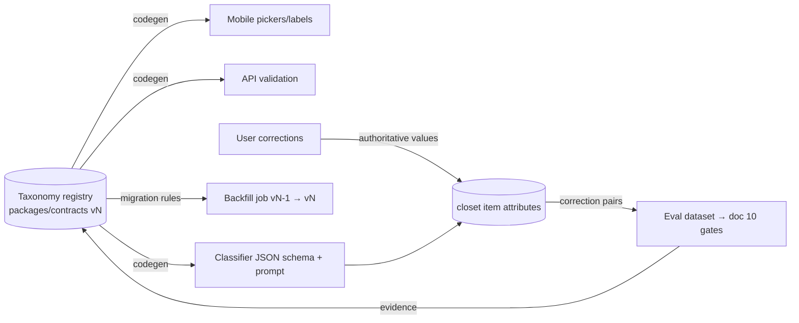

# 08 — Closet Taxonomy & Organization

**Status:** Planning-ratified · **Date:** 2026-08-24
**Owns:** category/subcategory taxonomy + extension mechanism, canonical identifiers, attribute schemas (shared, category-specific, practical), lifecycle metadata, availability states, wear history, tags/filters/search/collections, automatic classification + correction flow, duplicate detection, taxonomy-drift prevention, data-quality metrics.
**Module:** `closet` (SPINE §3) owns items, taxonomy, item states, wear events. Attribute *derivation* runs in the `media` pipeline ([07 §8](07-3d-avatar-and-garment-pipeline.md)); `closet` owns the resulting canonical metadata.
**Related docs:** schema/versioning/event conventions → [06-data-api-and-event-contracts.md](06-data-api-and-event-contracts.md) · how attributes feed recommendations → [09-recommendation-engine.md](09-recommendation-engine.md) · classification/embedding models and costs → [10-ai-usage-cost-and-evaluation.md](10-ai-usage-cost-and-evaluation.md) · closet-size entitlements → [12-pricing-entitlements-and-unit-economics.md](12-pricing-entitlements-and-unit-economics.md).
**Phases:** taxonomy + classification land in P06; organization/search/sync in P07.

---

## 1. Design principles

1. **Normalized, not stringly.** Categories, attributes, and enum values are canonical identifiers from a versioned registry — never free text in structured fields. Free text exists only in explicitly free-text fields (user notes, custom tag labels).
2. **One canonical source per fact.** Item metadata lives in `closet` tables; derived attributes record their derivation lineage; nothing is re-derived when a cached, hash-keyed result exists (brief §3.1).
3. **User corrections are authoritative.** A confirmed or corrected value beats any model output, current or future, and feeds model evaluation (§10).
4. **Extensible without migration pain.** Adding a subcategory, attribute, or enum value is a registry version bump + data-only change — not a schema migration and not a mobile release (§12).
5. **Honesty surfaces in metadata too:** every derived value carries source + confidence; the UI never presents a guess as a fact the user stated.

## 2. Canonical identifiers

- Identifier grammar: dot-namespaced slugs — `cat.tops.tshirt`, `attr.neckline`, `attr.neckline.crew`, `tag.user.<uuid>`. Stable forever once published; renames change display labels (localizable), never ids.
- The registry (categories, attribute definitions, enum values, display labels, category→attribute applicability) is owned by `packages/contracts` / `shared-kernel` (SPINE §3) and versioned per [06](06-data-api-and-event-contracts.md). Mobile, backend, workers, and classification prompts all consume the same generated artifact — the classification prompt's allowed-label list is *generated from the registry*, which is what structurally prevents model-invented labels (§10.1).
- Color values: canonical palette of named colors (id + Lab/hex reference value) in shared-kernel; items store palette ids *plus* the measured raw hex, so re-binning is possible when the palette evolves.

## 3. Category taxonomy

Two levels (category → subcategory) plus attributes; deliberately shallow — depth beyond two levels is modeled as attributes, not deeper trees (a "sleeveless summer maxi dress" is `cat.dresses.maxi` + attributes, preventing combinatorial tree explosion).

| Category (id) | Subcategories (initial set) |
|---|---|
| `cat.tops` | tshirt, shirt, blouse, polo, tank, sweater, cardigan, hoodie, sweatshirt, bodysuit, tunic, vest-knit |
| `cat.bottoms` | jeans, trousers, chinos, shorts, skirt, leggings, joggers, culottes |
| `cat.dresses` *(one-pieces)* | mini, midi, maxi, gown, shirt-dress, sundress, jumpsuit, romper, overall |
| `cat.outerwear` | jacket, blazer, coat, trench, parka, puffer, raincoat, windbreaker, vest, cape |
| `cat.underwear` *(where appropriate; private by default in social/shared surfaces)* | bra, briefs, boxers, undershirt, shapewear, socks, tights, sleepwear, swimwear |
| `cat.shoes` | sneakers, boots, heels, flats, loafers, sandals, oxfords, athletic, slippers |
| `cat.bags` | handbag, tote, backpack, crossbody, clutch, briefcase, duffel, wallet |
| `cat.belts` | casual, dress, statement |
| `cat.hats` | cap, beanie, fedora, sunhat, bucket, beret |
| `cat.jewelry` | necklace, earrings, bracelet, ring, brooch, anklet |
| `cat.watches` | analog, digital, smart |
| `cat.scarves` | scarf, shawl, wrap, bandana |
| `cat.eyewear` | sunglasses, optical |
| `cat.other-accessories` | gloves, ties, pocket-squares, hair-accessories, umbrellas, tech-accessories |

**Extension mechanism:** new subcategories (and rarely, categories) are added by registry version bump with: id, parent, display label, applicable attribute set, layering-role default, and a classifier-mapping note. `cat.<x>.other` exists per category as the honest fallback so classification never forces a wrong specific label; `other`-rate is a data-quality metric (§13) and the promotion signal for new subcategories ("50 users' items in `cat.tops.other` look like rugby shirts" → add the subcategory, migrate by rule, §12).

## 4. Attribute schemas

Attributes are typed, registry-defined, and bound to categories via an applicability map (`attr.neckline` applies to tops/dresses; `attr.heel-type` to shoes). Storage: normalized item-attribute rows (typed value + source + confidence + version), not a schemaless blob — per conventions in [06](06-data-api-and-event-contracts.md).

### 4.1 Shared attributes (all categories)

| Attribute | Type | Notes |
|---|---|---|
| `attr.color.dominant` | palette id + raw hex | measured from segmented cutout, not full photo |
| `attr.color.secondary` | list (0–3) | same |
| `attr.pattern` | enum: solid, stripe, check/plaid, floral, dot, animal, geometric, abstract, colorblock, graphic/logo, other | |
| `attr.material` | enum list: cotton, linen, wool, cashmere, silk, denim, leather (incl. faux flag), suede, synthetic, blend, knit, down, canvas, metal, other | from photo = low confidence; from care label photo or user = high |
| `attr.season` | enum list: spring, summer, autumn, winter, all-season | derived from warmth/material; user-overridable |
| `attr.formality` | ordinal 1–5 (athletic/lounge → casual → smart-casual → business → formal) | key input to doc 09 dress-code constraints |

### 4.2 Category-specific attributes (initial set)

| Applies to | Attributes |
|---|---|
| tops, dresses, outerwear | `attr.sleeve` (sleeveless, short, three-quarter, long, cap), `attr.neckline` (crew, v, scoop, boat, turtleneck, collared, off-shoulder, halter, square), `attr.cut` / `attr.silhouette` (fitted, regular, relaxed, oversized, cropped, longline, a-line, wrap, peplum) |
| bottoms, dresses, skirts | `attr.length` (mini, above-knee, knee, midi, maxi, ankle, full), `attr.rise` (low, mid, high) for bottoms, `attr.leg-cut` (skinny, slim, straight, tapered, bootcut, wide, flare) |
| outerwear | `attr.insulation` (none, light, medium, heavy), `attr.closure` (zip, button, open, wrap) |
| shoes | `attr.heel-type` (flat, low, block, stiletto, wedge, platform), `attr.heel-height-cm` (number), `attr.toe` (open, closed, pointed, round), `attr.shaft` (ankle, mid-calf, knee, over-knee) |
| bags | `attr.carry` (hand, shoulder, crossbody, back), `attr.size-class` (mini, small, medium, large) |
| jewelry/watches | `attr.metal-tone` (gold, silver, rose, mixed, none), `attr.statement-level` (subtle, medium, statement) |

`attr.fit` (how it fits *this user*: tight, true, loose — user-declared only, never inferred from photos) applies to all worn categories.

### 4.3 Practical attributes (recommendation-facing)

These are what [09-recommendation-engine.md](09-recommendation-engine.md) actually consumes for hard constraints; they are **derived by deterministic rules** from material/insulation/length/category (rules versioned in `closet`, not an LLM), then user-overridable:

| Attribute | Type | Example rule |
|---|---|---|
| `attr.warmth` | ordinal 1–5 | puffer + heavy insulation → 5; linen top → 1 |
| `attr.breathability` | ordinal 1–3 | linen/cotton high; leather/synthetic low |
| `attr.water-resistance` | enum: none, splash, waterproof | raincoat/parka default splash+; user confirms waterproof |
| `attr.layering-role` | enum: base, mid, outer, standalone, accent | category default + cut adjustment |
| `attr.dress-code` | enum list: casual, business-casual, business, black-tie-adjacent, athletic, beach | from formality + category |
| `attr.activity` | enum list: everyday, office, sport, hiking, lounge, evening, travel | |

The engine reads only canonical attributes through the `closet` public API — it never re-derives from photos and never imports classification code.

## 5. Lifecycle metadata

Per item: `brand` (normalized brand table + free-text fallback), `size` (label size + region system, e.g., EU/US/UK/alpha; brand-specific fit note optional), `purchaseDate`, `purchasePrice` + currency (optional; enables cost-per-wear), `condition` (new, good, worn, needs-repair), `careState` (clean, worn-wearable, needs-wash, at-cleaners), `careNotes` (free text, e.g., from care label), `favorite` (bool), `archived` (bool + reason: donated, sold, stored, discarded), timestamps per [06](06-data-api-and-event-contracts.md) conventions.

## 6. Availability states (canonical, SPINE §8)

`available | laundry | packed | lent | repair | archived` — single state field with optional metadata (return date for lent/packed, note). Rules:

- Only `available` items are candidates for recommendations ([09](09-recommendation-engine.md) hard constraint); `laundry` items may appear in a "back when washed" hint, never in the outfit itself.
- Transitions are user actions plus assists: "mark worn" can prompt laundry per user-configurable wear-count-per-wash by category (default: 1 for underwear/tops, more for jeans/outerwear — user tunable, never nagging).
- `archived` removes items from all default views and candidate sets but preserves history; unarchive restores fully. Deletion is separate and propagates per [11-security-privacy-and-compliance.md](11-security-privacy-and-compliance.md).
- State changes emit `closet.item.availability_changed` events (outbox per [06](06-data-api-and-event-contracts.md)) so cached recommendation candidates invalidate.

## 7. Wear history & cost-per-wear

- `wear_events`: item id(s), outfit id (if worn as a recommended/saved outfit), date, source (`user-marked | outfit-worn | inferred-prompt`). Never auto-inferred silently; "did you wear this?" prompts are opt-in.
- Derived per item (materialized, recomputed on event): wear count, last-worn date, wear frequency, and **cost-per-wear = purchasePrice / max(wearCount, 1)** — shown only when the user supplied a price, labeled as based on their logged wears.
- Wear history feeds doc 09's repeat-avoidance and rarely-worn-item scoring, and the "closet insights" views (§9). Tone rule: insights are neutral and useful ("worn 2× since January"), never guilt-framed.

## 8. Custom tags, saved filters, collections

- **Custom tags:** user-created labels (`tag.user.<uuid>` + display label). Tag suggestions surface *existing* tags by prefix/similarity before allowing creation, reducing near-duplicate tags ("Work", "work", "office"); a merge tool combines tags and rewrites references.
- **Saved filters:** named, shareable-with-self persisted queries over any combination of category/attributes/state/tags (e.g., "summer office"). Stored as structured query objects (registry ids, not strings) so they survive taxonomy version bumps via the migration rules in §12.
- **Collections/capsules:** explicit ordered item sets (e.g., "travel capsule — Lisbon", "capsule wardrobe autumn"). An item may belong to many collections. Collections can seed recommendation scope ("recommend only from this capsule" — doc 09 context input).
- **Season & color views:** built-in views grouping by `attr.season` and by dominant palette color (with the color wheel ordering from shared-kernel palette); these are just canned saved filters — no separate data model.

## 9. Search & sort

- Search fields: name/notes free text, brand, tag labels, plus structured attribute filters; backed by Postgres (tsvector for text + indexed attribute rows) — no separate search engine until measured need (SPINE §2 discipline).
- Sort options: recency (added), last worn, wear frequency, cost-per-wear, color, formality, alphabetical.
- Offline: P07 syncs the item index (metadata + thumbnails) to the device store; search/filter/sort work offline on that index; mutations queue and sync per the offline design in [04-architecture.md](04-architecture.md).

## 10. Automatic classification + manual correction

### 10.1 Classification flow (runs inside the media pipeline, [07 §8](07-3d-avatar-and-garment-pipeline.md))

1. On-device coarse category hint at capture (cheap, instant UX ordering).
2. Server: vision-LLM structured extraction with a JSON schema whose enums are **generated from the taxonomy registry** — the model can only emit registry ids + per-field confidence; invalid output fails validation and retries/downgrades (providers/costs in [10-ai-usage-cost-and-evaluation.md](10-ai-usage-cost-and-evaluation.md)).
3. Deterministic post-pass: dominant/secondary color from the segmented cutout (pixel statistics, not LLM), practical-attribute derivation rules (§4.3).
4. Everything lands as **proposals** (`source: model@version`, confidence). The item is usable immediately with proposed values, but shows an unconfirmed indicator.

### 10.2 Confirmation & correction UX contract (P06)

- Single review card per item: category + top attributes with confidence; one-tap confirm-all when it looks right (target: most items are one tap); tap any field to correct via registry-driven pickers.
- Batch capture ⇒ batch review queue; low-confidence fields (< threshold per field, tuned in evals) are highlighted for attention rather than blocking.
- Corrections are stored as new attribute values `source: user`, superseding but not deleting the model proposal (both retained for lineage/eval).
- **Corrections are authoritative:** reprocessing after model upgrades ([07 §8.3](07-3d-avatar-and-garment-pipeline.md)) never overwrites a `source: user` value; model-vs-user disagreements are logged to the eval set.

### 10.3 Corrections feed future models

Consented, privacy-reviewed correction pairs (model proposal, user correction, image ref) become the versioned eval dataset for classification model/prompt changes — per-category precision/recall gates before any model swap, with demographic/garment-diversity slices, owned by [10-ai-usage-cost-and-evaluation.md](10-ai-usage-cost-and-evaluation.md). Correction *rate* per field is the primary model-quality KPI (§13). We do not fine-tune on user images in v1; corrections tune prompts, thresholds, and model selection.

## 11. Duplicate & near-duplicate detection

- **Exact:** content hash match at upload ([07 §8.2](07-3d-avatar-and-garment-pipeline.md)) → "already in your closet" with the existing item, zero cost.
- **Near-duplicate:** multimodal embedding per item cutout (Cohere Embed v4-class per SPINE §2), stored in **pgvector** in the same Postgres. At item creation, ANN search over the user's own items; cosine similarity above a tuned threshold + same category ⇒ non-blocking prompt: "Looks similar to [item] — same item, new photo of it, or a different item?" User choice is final: merge (new photo attaches to existing item), keep both, or replace.
- Embeddings computed once per real capture (never on generated views, [07 §7](07-3d-avatar-and-garment-pipeline.md)), keyed by content hash, reused for style-similarity features in [09](09-recommendation-engine.md)/[12](12-pricing-entitlements-and-unit-economics.md) wardrobe analytics. Scope rule: dedup search runs **within one user's closet only** — no cross-user visual matching.
- Duplicate rate (accepted-merge / items captured) is a tracked quality metric (§13); thresholds tuned against a labeled eval set, not guessed.

## 12. Taxonomy-drift prevention & versioning

Drift threats: uncontrolled strings, forked category lists across clients, model-invented labels, near-duplicate user tags, stale prompts. Defenses:

1. **Single canonical registry** (§2) — clients, workers, and prompts consume generated artifacts from one source; CI fails on stale generation ([06](06-data-api-and-event-contracts.md), brief §5.5).
2. **Structured storage** — no enum-like free text columns; DB constraints reference registry ids.
3. **Registry versioning:** semver'd; additive changes (new subcategory/enum value) are minor and safe for old clients (unknown-id tolerant readers per [06](06-data-api-and-event-contracts.md)). Splits/merges/deprecations are major and ship with a **migration rule** in the registry itself: `deprecates: cat.x → cat.y` or a conditional split rule (`cat.tops.shirt` → `shirt|overshirt` by `attr.layering-role`). A backfill job applies rules to stored data; ambiguous cases (rule cannot decide) fall to `.other` + a review nudge, never a silent guess. User-corrected categories migrate by rule but keep `source: user`.
4. **Saved filters/tags survive bumps:** structured queries are rewritten by the same migration rules; a filter referencing a deprecated id keeps working via the mapping.
5. **Prompt/model pinning:** classification prompts embed the registry version; a registry bump requires regenerating the prompt artifact and re-running the eval gate before deploy.
6. Governance: taxonomy changes are lightweight ADRs (template in `templates/adr.md`) reviewed against §13 metrics — additions must cite evidence (`other`-rate, user requests), keeping the tree curated rather than accreting.

## 13. Data-quality metrics

Owned dashboards/alerts per [14-observability-operations-and-analytics.md](14-observability-operations-and-analytics.md); each metric has owner, source event, and the decision it informs (brief §12). Targets are initial hypotheses — baseline first, then set.

| Metric | Definition | Informs |
|---|---|---|
| Classification correction rate | fields corrected / fields proposed, per field & category | model/prompt quality; eval gate thresholds |
| Confirm-all rate | items confirmed with zero edits | review-UX friction; confidence thresholds |
| `other`-rate | items landing in `cat.*.other` | taxonomy gaps → new subcategories |
| Attribute completeness | % items with the doc-09-required attribute set present at ≥medium confidence | recommendation quality ceiling |
| Duplicate rate | accepted merges / items captured | dedup threshold tuning |
| Tag hygiene | near-duplicate user-tag pairs per 100 tags | tag-suggestion UX |
| Availability freshness | % recommended-then-rejected outfits citing "item unavailable" feedback | laundry/availability UX |
| Time-to-cataloged | capture → confirmed, p50/p95 | capture-loop performance budget (brief §3.7) |
| Stale-derivation count | derivatives older than current model version watermark | reprocessing backlog health |
