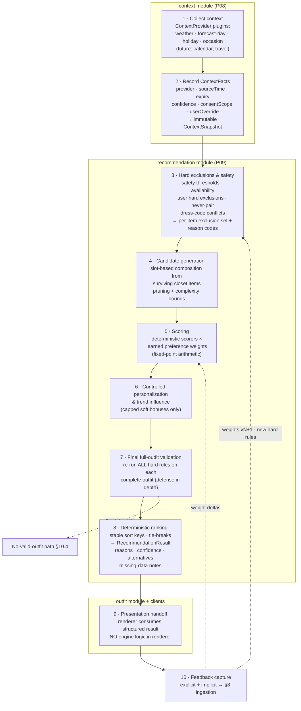

# 09 — Recommendation Engine

**Status:** Draft for ratification · **Date:** 2026-08-24 · **Owning module:** `recommendation` (with `context`, `closet`, `outfit`, `shared-kernel`)
**Delivered in:** P09 (`P09-recommendation-engine-v1`); context providers in P08 (`P08-context-providers`)
**Requirement areas covered:** REQ-REC-\*, REQ-EXP-\*, REQ-CTX-\* (IDs owned by [01-requirements-and-traceability.md](01-requirements-and-traceability.md))
**Related docs:** contracts & events → [06-data-api-and-event-contracts.md](06-data-api-and-event-contracts.md) · item attributes & taxonomy → [08-closet-taxonomy-and-organization.md](08-closet-taxonomy-and-organization.md) · AI usage/cost/eval → [10-ai-usage-cost-and-evaluation.md](10-ai-usage-cost-and-evaluation.md) · presentation → [07-3d-avatar-and-garment-pipeline.md](07-3d-avatar-and-garment-pipeline.md)

---

## 0. Design position

The engine is a **versioned, deterministic, explainable pipeline** — a first-class domain module, not an LLM prompt and not logic scattered across screens. Three invariants govern everything below:

1. **Hard constraints are absolute.** They filter; they never trade off against scores, trends, holidays, experiments, or each other. A soft signal can only re-rank outfits that already satisfy every hard constraint.
2. **Same inputs → same output.** Every recommendation is a pure function of `(closet snapshot, context snapshot, profile, learned weights, ruleset version, seed)`. There is no hidden randomness. "Variety" exists only as the explicit, user-invoked, seeded mode in §6.4.
3. **Reasons are produced by the decision, not about it.** Every rule and scorer emits reason codes as it runs (§7). Natural language is rendered from those codes afterward — never invented afterward.

### AI classification (per brief §3.1)

| Pipeline stage | Implementation class |
|---|---|
| Context collection, fact recording (1–2) | **Pure deterministic code** (provider adapters behind ports) |
| Hard exclusions & safety (3), candidate generation (4), final validation (7), ranking (8) | **Pure deterministic code** (rules engine + data queries) |
| Deterministic scoring (5) | **Pure deterministic code**; color harmony uses precomputed color math, item similarity uses embeddings **precomputed** at capture time by `closet` (embedding/similarity task, see doc 08/10) — the engine only reads stored vectors |
| Learned preference weights (5) | **Ranking/personalization model** — a bounded per-user linear weight vector updated by explicit feedback rules (§8). No neural ranker in v1. |
| Trend influence (6) | **Pure deterministic code** reading `fashion-intel` relevance scores (P12; zero before then) |
| Explanation text (post-8) | **Templates from reason codes** (deterministic). **Optional LLM polish** (Claude Haiku, batch + prompt caching) that may only rephrase template output — budget, eval, and fallback in [10-ai-usage-cost-and-evaluation.md](10-ai-usage-cost-and-evaluation.md) |
| Presentation (9), feedback capture (10) | **Pure deterministic code** |

Net: the engine is ~95% deterministic code. The only paid AI call is optional explanation polish, and the product is fully functional with it disabled.

---

## 1. Pipeline overview

Refines brief §2.6's ten steps. Each stage has a typed input/output contract (schemas owned by `packages/contracts`, see doc 06) and appends to a single `DecisionTrace`.



Stage boundaries are module boundaries where SPINE says so: 1–2 live in `context`, 3–8 in `recommendation`, 9 in `outfit`/clients, 10 back in `recommendation`. The engine never imports `avatar` or renderer code (SPINE §3 dependency rules); stage 9 receives only the structured `RecommendationResult`.

---

## 2. Context facts and providers (`context` module, P08)

### 2.1 `ContextFact` contract

Canonical typed shape (terminology from SPINE §8). Zod schemas per `kind` live in `packages/contracts`; the table `context_facts` caches them.

```ts
type ContextFactKind =
  | 'weather.current'      // temp, feelsLike, precipProbability, precipType, windKph, humidity, uvIndex
  | 'weather.forecast_day' // same shape, for a user-selected future date (hourly buckets)
  | 'holiday'              // localized public holiday for the target date + user's "matters to me" flag
  | 'occasion'             // user-selected: occasion type, dress code, activity, locationType, timeOfDay, indoor/outdoor
  // future providers — added WITHOUT engine redesign (§2.2):
  | 'calendar.event'       // P15+, consent-gated, minimized fields only (doc 11)
  | 'travel.plan';         // P15+

interface ContextFact<K extends ContextFactKind = ContextFactKind> {
  id: string;                       // ULID
  kind: K;
  value: ContextValue[K];           // typed payload, schema-validated per kind
  schemaVersion: string;            // e.g. 'weather.current@2'

  provider: ProviderId;             // 'open-meteo' | 'nager-date' | 'user' | ...
  sourceTime: string;               // ISO — when the provider produced the data
  fetchedAt: string;                // ISO — when we retrieved it
  expiresAt: string;                // ISO — hard expiry
  freshness: 'fresh' | 'stale' | 'expired'; // derived at read time from staleAfter/expiresAt

  confidence: number;               // 0..1 (forecast-day decays with lead days; user input = 1.0)
  consentScope: ConsentScope;       // 'none' | 'coarse-location' | 'precise-location' | 'calendar-read' ...
  userOverride?: {                  // override WINS over provider value; provider value retained for trace
    value: ContextValue[K];
    setAt: string;
    note?: string;                  // e.g. "I'll be indoors all day"
  };
}
```

Rules:

- **Override precedence:** `userOverride.value` is what the engine consumes; the provider value stays in the fact for the decision trace and the "based on…" UI. Overrides never bypass safety rules — a user can say "indoor plans", which legitimately changes the *inputs* to a safety rule; they cannot disable the rule itself (except the explicit per-recommendation acknowledgment in §4.3).
- **Missing ≠ zero:** a provider that fails or lacks consent yields a typed `MissingFact { kind, reason: 'provider_error' | 'no_consent' | 'not_configured' | 'expired' }`, never a default value. Missing facts flow to §10.3.
- **ContextSnapshot:** stage 2 freezes the facts used for one request into an immutable, content-hashed `ContextSnapshot` referenced by the recommendation record (§9). The engine reads only the snapshot, never live providers.

### 2.2 `ContextProvider` plugin interface

Adding calendar/travel later is *implementing this interface + registering it* — no engine change. The engine consumes `ContextFact`s by `kind`; rules that don't know a kind ignore it.

```ts
interface ContextProvider {
  readonly id: ProviderId;
  readonly kinds: ContextFactKind[];               // what it can produce
  readonly requiredConsent: ConsentScope[];        // checked BEFORE collect() is called
  readonly freshness: { ttl: Duration; staleAfter: Duration };  // e.g. weather.current: ttl 3h, stale 1h

  /** Never throws. Returns facts and/or MissingFacts. Must be side-effect free w.r.t. domain state. */
  collect(q: ContextQuery): Promise<Array<ContextFact | MissingFact>>;
}

interface ContextQuery {
  userId: string;
  targetDate: string;              // today or a future planning day
  location?: CoarseLocation;       // coarse by default; precise only with consent (doc 11)
  locale: string;
  requestedKinds?: ContextFactKind[];
}
```

v1 registry: `OpenMeteoWeatherProvider` (`weather.current`, `weather.forecast_day`), `NagerDateHolidayProvider` (`holiday`), `UserOccasionProvider` (`occasion` — reads the user's explicit selection; provider = `'user'`, confidence 1.0). Provider ports live in `context`; SDK adapters in `platform` (SPINE §3).

---

## 3. Hard constraints

### 3.1 Taxonomy and precedence

Hard constraints are **predicates**, evaluated in a fixed precedence order. Order matters only for *which reason code wins the explanation* and for conflict diagnosis — since all are conjunctive filters, an item/outfit must pass **all** of them regardless of order.

| Prec. | Class | Rule IDs (registry) | Examples | Overridable? |
|---|---|---|---|---|
| 1 | **Safety / weather practicality** | `H-SAFE-*` | No bare-legs/shorts/sandals category below feels-like threshold; rain gear required above precip threshold for outdoor plans; heat limits on heavy insulation | Only via explicit per-recommendation acknowledgment (§4.3), never silently |
| 2 | **User hard exclusions** | `H-EXCL-*` | "Never suggest item X", excluded categories/materials (modesty, allergy, dislike marked as hard) | User edits them; engine never relaxes |
| 3 | **Never-pair rules** | `H-PAIR-*` | "Never suggest this pairing" (item×item, item×category, attribute×attribute) from feedback §8 | User edits; engine never relaxes |
| 4 | **Availability** | `H-AVAIL-*` | Item state ∉ `available` (`laundry \| packed \| lent \| repair \| archived`, SPINE §8; owned by doc 08) | No — an unavailable item is not in the closet today |
| 5 | **Dress-code / occasion hard requirements** | `H-DRESS-*` | Occasion with dress code `black-tie` excludes formality < threshold; workplace code excludes flagged categories | The *occasion* is user-chosen; changing it changes the rule inputs |
| 6 | **Composition validity** | `H-COMP-*` | Outfit must fill required slots (§5.1); layering order valid; one one-piece XOR top+bottom; max one item per exclusive slot | No |

Ruleset properties:

- Every rule is a pure function `(item | outfit, ContextSnapshot, Profile) → pass | Violation{ruleId, reasonCode, params}`.
- Thresholds are **data, not code**: `H-SAFE-COLD.shortsFeelsLikeMinC` defaults to a conservative value and shifts within a **clamped safe band** by the user's climate tolerance ("runs hot" may lower it a few degrees; it can never cross the absolute safety floor). All thresholds live in the versioned ruleset (§9).
- Item-level rules run in stage 3 (cheap, prunes the space); **all** rules — item- and outfit-level — run again on each complete outfit in stage 7. Stage 7 is the non-bypassable gate: even a bug in candidate generation cannot ship a violating outfit.

### 3.2 Conflict resolution

- **Hard vs. hard:** never resolved by relaxation. If the conjunction of hard constraints yields zero valid outfits, the engine returns the honest no-valid-outfit result (§10.4) explaining *which* constraints collided (e.g. "black-tie dress code + everything formal is in laundry"). Precedence determines the diagnosis order, not a winner.
- **Hard vs. soft:** no contest — soft signals only ever score survivors. A holiday, a trend, an experiment, or a learned preference cannot resurrect an excluded item.
- **Soft vs. soft:** resolved numerically by weights (§4) with deterministic tie-breaks (§6.3).
- **User override vs. hard rule:** overrides change rule *inputs* (facts), not rules. The single exception is the explicit safety acknowledgment flow (§4.3).

### 3.3 Worked example — holiday must never produce shorts in unsafe cold

Scenario (this is also golden simulation `SIM-01`, §13.2): target date is a public holiday the user marked as "matters"; the holiday's style signal favors casual/festive summer-coded items. Weather: feels-like −5 °C, outdoor plans.

1. **Stage 1–2:** `weather.forecast_day` fact (feels-like −5 °C, confidence 0.9, fresh) and `holiday` fact (confidence 1.0) enter the ContextSnapshot. The holiday fact carries **no constraint power** — by construction it is only readable by soft scorers in stage 6.
2. **Stage 3:** `H-SAFE-COLD` evaluates: feels-like −5 °C < clamped threshold (say 8 °C for this user) ⇒ every item with attribute `legCoverage: none|short` or category `bottoms.shorts`, `footwear.sandals` is marked excluded with reason code `RC-EXCL-COLD-SAFETY{threshold: 8, feelsLike: -5}`.
3. **Stage 4:** candidate generation draws slot candidates **only from the non-excluded set**. Shorts are not in the pool; no composition can contain them.
4. **Stage 6:** the holiday soft scorer adds a *capped bonus* (§4) to festive/casual candidates that survived — e.g. a red knit + jeans. It scores what exists in the pool; it cannot add to the pool.
5. **Stage 7:** every ranked outfit is re-validated against the full hard ruleset, including `H-SAFE-COLD`, as a complete outfit. If any violating outfit appeared through any defect, it is dropped here and an invariant-violation alert fires (this firing in production is a sev-2 bug, metric §13.1).
6. **Trace:** the result's decision trace contains `RC-EXCL-COLD-SAFETY` entries for the shorts, so "why no shorts on the 4th of July?" is answerable from stored data.

Guarantee mechanism, summarized: *holiday is architecturally a soft signal; safety is architecturally a filter; filters run before and after scoring; property tests + the simulation suite assert violation rate = 0* (§13).

---

## 4. Soft preferences and weights

Soft scorers produce `score ∈ [0,1]` per outfit plus reason events. Total = Σ `wᵢ·scoreᵢ` in **fixed-point integer arithmetic** (scores scaled ×10⁶) — no floating-point nondeterminism across platforms.

| Order | Scorer | Reason codes | Default weight w₀ (v1 hypothesis, tuned via eval) | Notes |
|---|---|---|---|---|
| 1 | Weather comfort margin | `RC-WEATHER-*` | 0.25 | Distance from ideal warmth/breathability band *within* the hard-safe region; uses item warmth/water-resistance attributes (doc 08) |
| 2 | Occasion & formality fit | `RC-OCCASION-*` | 0.20 | Soft distance to target formality (hard cutoffs already applied in stage 3) |
| 3 | Color harmony | `RC-COLOR-*` | 0.15 | Deterministic color-wheel + neutral rules over canonical item colors (doc 08); precomputed pair scores §5.3 |
| 4 | Silhouette & fit preference | `RC-FIT-*` | 0.12 | Profile fit preferences × item silhouette/cut attributes |
| 5 | Repeat-avoidance | `RC-REPEAT-*` | 0.10 | Penalty decaying over `wear_events` recency for items and for the exact outfit |
| 6 | Rarely-worn boost | `RC-RARELY-WORN` | 0.08 | Bounded bonus for low wear-frequency items (closet utilization) |
| 7 | Learned preference alignment | `RC-PREF-*` | 0.07 | Per-user weight vector over attributes/pairings, updated only by §8 rules |
| 8 | **Trend relevance — always last, smallest cap** | `RC-TREND-*` | 0.03 (0 before P12) | Reads `fashion-intel` relevance; capped so it can reorder near-ties, never dominate practicality (brief §2.8) |

Weight rules: weights are per-user (`weightsVersion`, §9), start from an onboarding-derived profile (§10.1), and each `wᵢ` is clamped to `[0.2·w₀ᵢ, 3·w₀ᵢ]` for all time (guardrail §8.2). The *base* vector and clamps belong to the versioned ruleset.

### 4.3 Explicit safety acknowledgment (the only hard-rule override)

If the user directly requests something a safety rule excludes ("show me the shorts outfit anyway"), the engine returns the refusal reason with an explicit acknowledgment affordance. Accepting records a consent-stamped, per-request `SafetyAcknowledgment{ruleId, factHash, at}`; the rule is skipped for that single request, the result is visibly labeled, and the acknowledgment is stored in the trace. It never generalizes, never persists, and is never inferrable by the engine on its own.

---

## 5. Candidate generation and performance

### 5.1 Slot-based composition

Outfits are compositions over **layering-role slots** (roles are item attributes owned by doc 08):

`base-top · mid-layer? · outer-layer? · bottom · one-piece (XOR base-top+bottom) · footwear · accessories 0..3`

Required slots per request are derived from context (cold ⇒ outer-layer required; formal occasion ⇒ accessory slots considered) by deterministic `H-COMP-*` rules.

### 5.2 Algorithm and complexity bounds

1. **Stage-3 pruning first:** exclusions remove items before any composition (typically the biggest cut — laundry alone often removes 20–40%).
2. **Per-slot pre-scoring:** score each surviving item *individually* (weather margin, formality distance, repeat penalty — all item-local terms). Keep **top K per slot** (K = 12 default; ruleset parameter).
3. **Beam composition:** compose slot-by-slot in fixed slot order, keeping the best **B partial outfits** (B = 200 default) using item scores + precomputed pair-compatibility (§5.3). Deterministic: ties inside the beam use the stable keys of §6.3.
4. **Bound:** worst case ≈ B × K per slot step ⇒ ≤ ~15k pair evaluations per request regardless of closet size. Unlimited-tier 2,000-item closets cost the same as 300-item closets after step 2's per-slot cap.
5. **Budgets** (hypotheses, measured in P09 perf tests, doc 13): engine compute p95 < 300 ms server-side for a 500-item closet; end-to-end recommendation API p95 < 800 ms with warm context cache (cold weather fetch adds provider latency, mitigated by §11 prefetch).

### 5.3 Precomputed compatibility

Pairwise item compatibility (color harmony, formality distance, pattern-mixing penalty) is precomputed into a `item_pair_scores` structure, maintained **incrementally** by `recommendation` consuming `closet` item-changed events (outbox, doc 06): adding one item computes N new pairs, not N². Pair scores are pure functions of item attributes ⇒ recomputable at any time; the store is a cache with the ruleset version in its key, invalidated on ruleset bump. Style-similarity uses embeddings precomputed at capture time (doc 08/10) — the engine only does vector reads, no inference calls.

---

## 6. Deterministic scoring, ranking, tie-breaks

### 6.1 Determinism requirements

- Fixed-point integer scores (×10⁶); no platform-dependent float ops.
- All inputs snapshotted: ContextSnapshot (§2.1), closet snapshot hash, profile version, weights version, ruleset version (§9).
- No wall-clock reads inside stages 3–8; `targetDate`/`now` are inputs frozen into the request.
- Iteration order everywhere derives from stable sorts on ULIDs, never from hash-map insertion order.

### 6.2 Result contract (renderer-independent)

`RecommendationResult` (schema in doc 06): ranked `outfits[]` — each with `items[]` (slot → itemId), `score`, `confidence` (aggregated from context-fact confidences + data completeness), `reasons[]` (reason-code instances with params, §7), `alternatives[]` (next-ranked distinct outfits + per-slot swap options for "replace item"), `missingDataNotes[]` (§10.3), and the `versions` block (§9). **No** rendering, pose, or asset information — stage 9 (`outfit` module + clients) maps items to garment representations (doc 07). No engine logic exists in any renderer or screen.

### 6.3 Tie-breaks (stable sort key tuple)

Ordered comparison — first difference wins; guaranteed total order:

1. total score (desc)
2. hard-diversity key: fewer items shared with higher-ranked results (desc) — deterministic variety without randomness
3. least-recently-worn aggregate (older first)
4. canonical outfit hash — SHA-256 over sorted item ULIDs (asc) — the final, always-distinct key

### 6.4 "Show me something different" — the only sanctioned exploration

Explicit user action; never engine-initiated. Implementation: a per-request `shuffleCounter` (0 = default). `seed = SHA256(userId ‖ targetDate ‖ contextSnapshotHash ‖ shuffleCounter)` seeds a PRNG that adds a bounded exploration bonus (≤ 0.05 of score range) to candidate scores **after stage 7 filtering** — i.e., over fully constraint-valid outfits only. Same counter ⇒ same result (reproducible, replayable §9); tapping again increments the counter. The seed and counter are stored in the recommendation record. This is the entire extent of randomness in the system.

---

## 7. Reason codes and explanation

- **Registry:** reason codes are stable identifiers in the `shared-kernel` registry (SPINE §3/§8) — single source of truth shared by engine, API contract, clients, analytics, and doc 10's explanation templates. Namespaces: `RC-EXCL-*` (hard exclusions), `RC-WEATHER-*`, `RC-OCCASION-*`, `RC-COLOR-*`, `RC-FIT-*`, `RC-REPEAT-*`, `RC-RARELY-WORN`, `RC-PREF-*`, `RC-TREND-*`, `RC-GAP-*` (sparse closet), `RC-CTX-MISSING-*`, `RC-STALE-*`. Adding a code = versioned shared-kernel change (doc 06 discipline).
- **Produced by the decision process:** each rule/scorer emits `ReasonEvent{code, stage, subject (outfit|itemIds), params, contribution}` into the `DecisionTrace` *while executing*. The result's `reasons[]` is a deterministic selection from the trace (top positive contributions + any user-salient exclusions). Nothing downstream may add a reason that has no trace entry — enforced by contract test.
- **Rendering:** template per code with typed params ("Warm layers for −5 °C with wind", "Your green jacket hasn't been worn in 6 weeks"). Localization-ready. **Optional LLM polish** (Haiku, doc 10) receives *only* the rendered template sentences and may merge/rephrase them; a validation step rejects output introducing facts absent from input (doc 10 owns the eval). Polish off ⇒ templates ship as-is. Sensitive-inference language rules (brief §2.7) are enforced at the template layer: templates never mention body data or private inferences in surprising terms.

---

## 8. Feedback ingestion

### 8.1 Mapping (brief §2.7 — every feedback type classified)

| Feedback | Effect class | Concrete effect |
|---|---|---|
| Like outfit / save / mark worn | Preference weight + eval data | Small positive deltas on the outfit's attribute/pairing features; wear event feeds repeat-avoidance; labeled example for eval sets |
| Dislike outfit | Preference weight + eval data | Small negative deltas; **never** creates exclusions by itself |
| Replace one item (keep rest) | Session signal + preference weight | Immediate: engine returns slot alternatives (already in `alternatives`); repeated replace-outs of the same item (≥3, §8.2) earn it a mild negative weight |
| Too warm / too cold | Preference weight (calibration) | Adjusts the user's personal comfort offset within the clamped band of §3.1 — never moves the absolute safety floor |
| Too formal / too casual | Preference weight | Shifts formality-target calibration for that occasion type |
| Uncomfortable / wrong fit | Preference weight, per-item flag | Item-level negative on comfort; ≥3 occurrences suggests (asks, never assumes) marking the item "uncomfortable" — a user-confirmed hard exclusion |
| Wrong color | Preference weight | Negative on that color-pairing feature |
| Repetitive | Preference weight | Temporarily raises repeat-avoidance weight (within clamp) |
| Unavailable | **Closet state correction** | Prompts availability update in `closet` (laundry/lent/…) — data fix, not a preference |
| "Never suggest this pairing" | **Hard rule** | Creates `H-PAIR-*` immediately (user intent is explicit and durable); listed and deletable in transparency screen |
| Schedule for later / compare alternatives | Session signal + eval data | No weight change |

### 8.2 Guardrails against one-action overfitting

- **Bounded deltas:** any single event changes any weight by at most ε = 0.05·w₀; all weights permanently clamped to `[0.2·w₀, 3·w₀]` (§4).
- **Minimum evidence:** derived negative signals (item avoid-listing, strong pairing penalties) require ≥3 consistent events within 90 days; before that they remain weak weights. Explicit "never pair" is exempt — it's a stated rule, not an inference.
- **Decay:** learned deltas decay toward w₀ with a 90-day half-life; stated rules and explicit exclusions never decay.
- **Undo:** every feedback action is undoable (event-sourced feedback log; undo reverses the exact delta). Standard undo affordance immediately after the action, and per-event delete from the transparency screen.
- **Reset personalization:** one action resets the weight vector to the onboarding-derived baseline; explicitly *keeps* hard exclusions and never-pair rules (they are user statements, not learned) unless the user also clears those.
- **Preference transparency screen:** lists (a) current learned tendencies in plain language with the feedback events behind them, (b) all hard exclusions/never-pair rules, (c) climate-tolerance calibration — each editable/deletable. This screen reads the same weights/rules tables the engine reads: what you see is exactly what runs.

---

## 9. Versioning and reproducibility

Every recommendation persists a complete replay record (table `recommendations` + `reason_traces`, SPINE §3):

```ts
interface RecommendationRecord {
  id: string;
  userId: string;
  targetDate: string;
  engineVersion: string;        // pipeline code version (semver, bumped by release)
  rulesetVersion: string;       // hard rules + thresholds + base weights + K/B params (content-hashed config)
  weightsVersion: string;       // hash of the user's learned weight vector at request time (snapshot stored)
  contextSnapshotId: string;    // §2.1 immutable snapshot (facts incl. overrides, confidences, freshness)
  closetSnapshotHash: string;   // hash over (itemId, attributesVersion, availabilityState) of eligible items
  profileVersion: string;
  seed: { contextHash: string; shuffleCounter: number } | null;   // §6.4
  result: RecommendationResult;
  trace: DecisionTraceRef;      // full reason events incl. exclusions; retention policy in doc 11
  experimentAssignments?: ExperimentRef[];  // §12
}
```

`just rec-replay <recommendationId>` re-runs the pipeline from the stored snapshots and diffs against the stored result — byte-equal output is a CI-enforced invariant for the current engine version, and the debugging entry point for "why did it suggest this?" support tickets (doc 14 audit trail). Ruleset changes ship as new `rulesetVersion` with a changelog entry; old versions remain loadable for replay for the trace-retention window.

---

## 10. Degraded modes

### 10.1 Cold start (new user, closet exists, no feedback)
Weights = onboarding baseline: w₀ adjusted deterministically from stated preferences (colors, silhouettes, formality lean, climate tolerance). No exploration hacks — the deterministic pipeline plus stated preferences is the v1 cold-start strategy; quality measured by the cold-start metric slice (§13.1).

### 10.2 Sparse closet (fewer than N items per required slot)
Thresholds (ruleset params): slot is *sparse* below 3 candidates post-exclusion, *empty* at 0. Behavior:
- Compose the best **partial outfit** from filled slots, explicitly marked `partial: true` with the missing slots named.
- Emit `RC-GAP-*` notes: "You have no weather-appropriate outer layer — a waterproof jacket would complete outfits like this." Framed as **closet-gap information, not shopping links** — commerce is out of scope for v1 (brief §2.1: budget/shopping only if a later commerce feature needs it).
- Onboarding/empty-closet UX (doc 02) drives capture-more-items prompts off the same `RC-GAP-*` data — one source of truth.

### 10.3 Missing context
Missing facts (§2.1) never fabricate defaults. Effects: (a) rules needing the fact are skipped where safe *conservatively* — safety rules assume the cautious branch (unknown weather ⇒ don't recommend weather-extreme categories); (b) `missingDataNotes[]` carries `RC-CTX-MISSING-*` ("No weather data for Tuesday — based on season only"); (c) confidence is reduced; (d) if the missing fact is user-suppliable (occasion, city), the result includes an ask-for-input affordance (brief §1: expose uncertainty, ask when useful).

### 10.4 No valid outfit
When stage 7 yields zero outfits: an honest empty state, never a silently relaxed result. The response carries the **top blocking constraints** from the trace (which rules eliminated the most near-miss candidates) mapped to actionable suggestions: "Everything formal enough for tonight is in laundry — mark something washed, relax the dress code, or see the closest partial match." A near-miss *may* be shown only when explicitly labeled with its specific violated *non-safety* constraint and the user opts in; safety-violating outfits are never shown as near-misses (only the §4.3 acknowledged flow can surface them).

---

## 11. Offline and cached recommendations

The engine runs **server-side only** in v1 (no on-device rules fork — one source of truth; revisit only with measured need, doc 16). Client behavior:

- **Prefetch:** today's recommendation (+ alternatives) is computed on morning app-open or via scheduled prefetch and cached on device with its `contextSnapshot` summary and `expiresAt` (weather TTL-driven, §2.2).
- **Offline reads:** cached results render fully offline — including reasons (template rendering is client-side from reason codes, so explanations need no network).
- **Freshness warnings:** past `staleAfter`, the UI shows a staleness banner ("Based on this morning's forecast"); past `expiresAt`, results are labeled expired and refresh is required for new requests. Freshness state comes from the cached facts' own fields — no separate client logic.
- **Offline feedback:** feedback queues locally and syncs with idempotency keys (doc 06); weight updates apply on sync in event order.
- Cache invalidation triggers a silent refetch on: closet availability change, profile/preference edit, context override — any input-hash change.

---

## 12. Experimentation without corrupting safety

- **Surface area:** experiments (PostHog flags, doc 14) may vary **only** (a) the soft weight vector and scorer parameters within their clamps, (b) candidate-gen tuning (K, B) within bounds, (c) presentation/explanation wording. The experiment config schema has no fields addressing stages 3 or 7 — hard rules, thresholds, and validation are **not parameterizable by experiments** structurally, not just by policy.
- **Enforcement:** experiment definitions reference parameters by namespace; CI rejects any definition touching `hard.*` or `validation.*`. Stage 7 runs identically for every arm.
- **Determinism preserved:** arm assignment is a deterministic hash of `(userId, experimentId)`; the assignment is stored in the recommendation record (§9), so replay reproduces the exact arm behavior.
- **Guardrail metric:** hard-constraint violation rate is monitored per arm and must be 0 (§13.1); any nonzero reading auto-stops the experiment (kill switch, doc 14).

---

## 13. Evaluation

### 13.1 Metrics (owners/events/privacy in [14-observability-operations-and-analytics.md](14-observability-operations-and-analytics.md); targets are initial hypotheses per brief §3.7)

| Metric | Definition | Target |
|---|---|---|
| **Hard-constraint violation rate** | Violating outfits shown / outfits shown (measured by independent post-hoc auditor job re-running stage-7 rules on served results) | **0 — invariant, not a KPI.** Any violation = sev-2 incident |
| Practical validity | % of served outfits rated valid by rubric (weather-appropriate, complete, available) on sampled + simulated traffic | baseline first, then ≥ 95% |
| Acceptance / save / wear | outfit accepted (not immediately regenerated) %, saved %, marked-worn % | baseline first |
| Diversity | distinct items across a user's trailing 7 recommendations / total slots | baseline first |
| Repetition complaints | "repetitive" feedback per 100 recommendations | baseline first, trend down |
| Latency | engine p95 (§5.2), end-to-end p95 | < 300 ms / < 800 ms |
| Cost | paid-AI cost per recommendation (explanation polish only) | ≤ $0.001; $0 with polish off (doc 10) |
| Trust | reason-tap-through rate, "why?"-satisfaction survey, feedback-undo rate (high undo ⇒ overreacting weights) | baseline first |
| Cold-start / sparse-closet success | acceptance within first 5 recommendations; partial-outfit usefulness rating | baseline first |

### 13.2 Simulation suite (CI, deterministic — runs on every `recommendation` change; brief §6)

Fixture closets + synthetic ContextSnapshots, assertions on invariants:

| Sim | Scenario | Must hold |
|---|---|---|
| SIM-01 | **Cold-weather holiday** (§3.3) | 0 shorts/sandals/bare-legs outfits across all ranks and all shuffle counters |
| SIM-02 | **Laundry-unavailable**: all top-ranked items moved to `laundry` | No unavailable item ever appears; ranking degrades gracefully; empty state correct when nothing remains |
| SIM-03 | **Conflicting dress codes**: black-tie occasion, casual-only closet | Honest no-valid-outfit with correct blocking constraints; no silently relaxed formality |
| SIM-04 | **Sparse closet**: 2 tops, 1 bottom, 0 outerwear, cold day | Partial outfit + correct `RC-GAP-*`; no fabricated items |
| SIM-05 | **Future forecast**: 5-day-out planning, low-confidence forecast | Confidence propagates; freshness/lead-time noted; safety uses conservative bounds |
| SIM-06 | Missing weather (provider down) | Conservative behavior + `RC-CTX-MISSING-*`; no defaults invented |
| SIM-07 | Determinism: 100 repeated runs, permuted item insertion order | Byte-identical results |
| SIM-08 | Never-pair + shuffle exhaustion | User's `H-PAIR-*` never violated at any shuffle counter |

Property-based tests (doc 13) generate random closets/contexts and assert the stage-7 invariant, determinism, and clamp bounds hold universally.

### 13.3 Golden test sets
Versioned fixtures in `testdata/recommendation/golden/`: (closet snapshot, context snapshot, profile, weights, seed) → **exact expected ranked output + reason codes**, pinned per `rulesetVersion`. Ruleset changes require regenerating goldens via a reviewed `just rec-golden-update` diff — ranking changes become visible in code review, never silent. Consent-safe synthetic data only (doc 13 fixture policy). Real anonymized eval sets for weight tuning are governed by doc 10.

---

## 14. Phase mapping & open items

- **P08** delivers §2 (context module, four v1 providers, fact caching, overrides, freshness UI). **P09** delivers §§3–10, 13 (engine v1, feedback, transparency screen, replay tooling, sim suite + goldens in CI). **P11+** consumes results for try-on; **P12** activates the trend scorer; **P15** adds calendar/travel providers against the §2.2 interface — engine untouched.
- Open questions tracked in [16-risks-open-questions-and-decision-log.md](16-risks-open-questions-and-decision-log.md): OQ — final default weight vector values (needs P09 eval data); OQ — safety threshold table review (needs domain/UX review, conservative defaults until then); OQ — trace retention duration vs. storage cost (with doc 11 privacy review).
